# Level 0 Data Flow Diagram (DFD)
## University Thesis Management System

**Document Standard:** IEEE 1016-2009  
**Version:** 1.0.0  
**Date:** January 2025  
**System:** University Thesis Management System  
**Author:** Development Team

---

## 1. DFD Overview

This Level 0 Data Flow Diagram represents the highest-level view of the University Thesis Management System, showing the system as a single process with external entities and major data flows. This diagram follows IEEE standards for software design documentation.

---

## 2. DFD Notation

### 2.1 Symbols Used

- **External Entity (Rectangle):** External actors interacting with the system
- **Process (Circle/Rounded Rectangle):** The system process (single process at Level 0)
- **Data Flow (Arrow):** Direction of data movement between entities and process
- **Data Store (Open Rectangle):** Not shown at Level 0 (appears in Level 1+)

### 2.2 Naming Conventions

- External Entities: Noun phrases (e.g., "Student", "Admin")
- Process: Verb phrase describing the system (e.g., "Manage Thesis Operations")
- Data Flows: Noun phrases describing data content (e.g., "Login Credentials", "Thesis Report")

---

## 3. Level 0 DFD Diagram

### 3.1 ASCII Representation

```
┌─────────────────┐
│                 │
│     ADMIN       │                    Login Credentials
│                 │────────────────────────────────────────────┐
└─────────────────┘                                            │
         │                                                     │
         │ System Configuration                               │
         │ Supervisor Data                                    │
         │ Batch Data                                         │
         │ Performance Reports                                │
         │                                                     │
         ▼                                                     ▼
┌─────────────────┐                                    ┌──────────────────────────────┐
│                 │                                    │                              │
│    ADVISOR      │◄───────────────────────────────────┤                              │
│                 │     Group Assignments              │                              │
└─────────────────┘     Student Lists                 │                              │
         │              Supervisor Availability        │                              │
         │                                             │                              │
         │ Group Information                           │          UNIVERSITY          │
         │ Supervisor Assignment Request               │           THESIS             │
         │ Student Group Assignments                   │         MANAGEMENT           │
         │                                             │           SYSTEM             │
         ▼                                             │        (Process 0.0)         │
┌─────────────────┐                                    │                              │
│                 │                                    │                              │
│   SUPERVISOR    │◄───────────────────────────────────┤                              │
│  CO-SUPERVISOR  │     Group Details                  │                              │
│ PANEL MEMBER    │     Meeting Schedules              │                              │
└─────────────────┘     Report Submissions             │                              │
         │                                             │                              │
         │ Meeting Details                             │                              │
         │ Report Feedback                             │                              │
         │ Report Annotations                          │                              │
         │ Attendance Records                          └──────────────────────────────┘
         │                                                     ▲
         ▼                                                     │
┌─────────────────┐                                            │
│                 │                                            │
│    STUDENT      │────────────────────────────────────────────┘
│                 │     Report Submissions
└─────────────────┘     Attendance Confirmation
         │              Meeting Requests
         │
         │ Group Status
         │ Report Feedback
         │ Meeting Schedules
         │ Annotated Reports
         │
         ▼

┌─────────────────┐
│                 │
│    TEACHER      │◄───────────────────────────────────────────┐
│  (MULTI-ROLE)   │     Role-based Dashboard                   │
└─────────────────┘     Notifications                          │
         │                                                     │
         │ Report Comments                                    │
         │ Meeting Participation                              │
         │                                                     │
         └─────────────────────────────────────────────────────┘


                            External Data Sources
                                    │
                                    ▼
                    ┌───────────────────────────────┐
                    │                               │
                    │   EXTERNAL UNIVERSITY API     │◄──────────────┐
                    │   (puc.ac.bd:8012/api)       │               │
                    │                               │               │
                    └───────────────────────────────┘               │
                                    │                               │
                                    │ Student Data                  │
                                    │ Teacher Data                  │ API Sync Requests
                                    │ Batch Information             │ Authentication Requests
                                    │ Authentication Tokens         │
                                    │                               │
                                    └───────────────────────────────┘
```

### 3.2 Mermaid Diagram

```mermaid
flowchart TB
    %% External Entities
    Admin[["ADMIN<br/>External Entity"]]
    Advisor[["ADVISOR<br/>External Entity"]]
    Supervisor[["SUPERVISOR<br/>CO-SUPERVISOR<br/>PANEL MEMBER<br/>External Entity"]]
    Student[["STUDENT<br/>External Entity"]]
    Teacher[["TEACHER<br/>(Multi-Role)<br/>External Entity"]]
    ExtAPI[["EXTERNAL<br/>UNIVERSITY API<br/>External Entity"]]
    
    %% Central Process
    System(("UNIVERSITY<br/>THESIS<br/>MANAGEMENT<br/>SYSTEM<br/>(Process 0.0)"))
    
    %% Admin Flows
    Admin -->|Login Credentials| System
    Admin -->|System Configuration| System
    Admin -->|Supervisor Data| System
    Admin -->|Batch Data| System
    Admin -->|API Sync Requests| System
    System -->|Performance Reports| Admin
    System -->|System Metrics| Admin
    System -->|Assignment History| Admin
    
    %% Advisor Flows
    Advisor -->|Login Credentials| System
    Advisor -->|Group Information| System
    Advisor -->|Student Assignments| System
    Advisor -->|Supervisor Assignment Requests| System
    System -->|Group Lists| Advisor
    System -->|Student Lists| Advisor
    System -->|Supervisor Availability| Advisor
    System -->|Assignment Results| Advisor
    
    %% Supervisor Flows
    Supervisor -->|Login Credentials| System
    Supervisor -->|Meeting Details| System
    Supervisor -->|Report Feedback| System
    Supervisor -->|Report Annotations| System
    Supervisor -->|Attendance Records| System
    System -->|Group Details| Supervisor
    System -->|Meeting Schedules| Supervisor
    System -->|Report Submissions| Supervisor
    
    %% Student Flows
    Student -->|Login Credentials| System
    Student -->|Report Submissions| System
    Student -->|Attendance Confirmation| System
    Student -->|Meeting Requests| System
    System -->|Group Status| Student
    System -->|Report Feedback| Student
    System -->|Meeting Schedules| Student
    System -->|Annotated Reports| Student
    
    %% Teacher Flows
    Teacher -->|Login Credentials| System
    Teacher -->|Report Comments| System
    Teacher -->|Meeting Participation| System
    System -->|Role-based Dashboard| Teacher
    System -->|Notifications| Teacher
    
    %% External API Flows
    System -->|API Sync Requests| ExtAPI
    System -->|Authentication Requests| ExtAPI
    ExtAPI -->|Student Data| System
    ExtAPI -->|Teacher Data| System
    ExtAPI -->|Batch Information| System
    ExtAPI -->|Authentication Tokens| System
    
    %% Styling
    classDef entityStyle fill:#1a1a2e,stroke:#e8e8e8,stroke-width:3px,color:#e8e8e8
    classDef processStyle fill:#0f3460,stroke:#16213e,stroke-width:4px,color:#e8e8e8
    
    class Admin,Advisor,Supervisor,Student,Teacher,ExtAPI entityStyle
    class System processStyle
```



### 3.3 PlantUML Diagram

```plantuml
@startuml Level-0-DFD
!define ENTITY_COLOR #1a1a2e
!define PROCESS_COLOR #0f3460
!define ARROW_COLOR #e8e8e8

skinparam rectangle {
    BackgroundColor ENTITY_COLOR
    BorderColor ARROW_COLOR
    FontColor ARROW_COLOR
    BorderThickness 3
}

skinparam circle {
    BackgroundColor PROCESS_COLOR
    BorderColor ARROW_COLOR
    FontColor ARROW_COLOR
    BorderThickness 4
}

skinparam arrow {
    Color ARROW_COLOR
    Thickness 2
}

title Level 0 Data Flow Diagram\nUniversity Thesis Management System

' External Entities
rectangle "**ADMIN**\n//External Entity//" as Admin
rectangle "**ADVISOR**\n//External Entity//" as Advisor
rectangle "**SUPERVISOR**\n**CO-SUPERVISOR**\n**PANEL MEMBER**\n//External Entity//" as Supervisor
rectangle "**STUDENT**\n//External Entity//" as Student
rectangle "**TEACHER**\n**(Multi-Role)**\n//External Entity//" as Teacher
rectangle "**EXTERNAL**\n**UNIVERSITY API**\n//External Entity//" as ExtAPI

' Central Process
circle "**UNIVERSITY**\n**THESIS**\n**MANAGEMENT**\n**SYSTEM**\n//Process 0.0//" as System

' Admin Data Flows
Admin -down-> System : Login Credentials
Admin -down-> System : System Configuration
Admin -down-> System : Supervisor Data
Admin -down-> System : Batch Data
Admin -down-> System : API Sync Requests
System -up-> Admin : Performance Reports
System -up-> Admin : System Metrics
System -up-> Admin : Assignment History

' Advisor Data Flows
Advisor -right-> System : Login Credentials
Advisor -right-> System : Group Information
Advisor -right-> System : Student Assignments
Advisor -right-> System : Supervisor Assignment\nRequests
System -left-> Advisor : Group Lists
System -left-> Advisor : Student Lists
System -left-> Advisor : Supervisor Availability
System -left-> Advisor : Assignment Results

' Supervisor Data Flows
Supervisor -down-> System : Login Credentials
Supervisor -down-> System : Meeting Details
Supervisor -down-> System : Report Feedback
Supervisor -down-> System : Report Annotations
Supervisor -down-> System : Attendance Records
System -up-> Supervisor : Group Details
System -up-> Supervisor : Meeting Schedules
System -up-> Supervisor : Report Submissions

' Student Data Flows
Student -left-> System : Login Credentials
Student -left-> System : Report Submissions
Student -left-> System : Attendance Confirmation
Student -left-> System : Meeting Requests
System -right-> Student : Group Status
System -right-> Student : Report Feedback
System -right-> Student : Meeting Schedules
System -right-> Student : Annotated Reports

' Teacher Data Flows
Teacher -down-> System : Login Credentials
Teacher -down-> System : Report Comments
Teacher -down-> System : Meeting Participation
System -up-> Teacher : Role-based Dashboard
System -up-> Teacher : Notifications

' External API Data Flows
System -down-> ExtAPI : API Sync Requests
System -down-> ExtAPI : Authentication Requests
ExtAPI -up-> System : Student Data
ExtAPI -up-> System : Teacher Data
ExtAPI -up-> System : Batch Information
ExtAPI -up-> System : Authentication Tokens

legend right
  |= Symbol |= Meaning |
  | Rectangle | External Entity |
  | Circle | Process |
  | Arrow | Data Flow |
endlegend

note bottom of System
  **Core Functions:**
  • Authentication & Authorization
  • Group Management
  • Supervisor Assignment (3 Algorithms)
  • Meeting Management
  • Report Management & Annotation
  • Performance Monitoring
  • External API Integration
end note

@enduml
```



---

## 4. External Entities

### 4.1 Admin
**Description:** System administrator with full system control  
**Interactions:**
- **Inputs:** Login credentials, system configuration, supervisor management, batch management
- **Outputs:** Performance reports, system metrics, assignment history, user management data

### 4.2 Advisor
**Description:** Faculty member responsible for student group management and supervisor assignment  
**Interactions:**
- **Inputs:** Login credentials, group creation/management, student assignments, supervisor assignment requests
- **Outputs:** Group lists, student lists, supervisor availability, assignment results

### 4.3 Supervisor / Co-Supervisor / Panel Member
**Description:** Faculty members supervising thesis groups and evaluating student work  
**Interactions:**
- **Inputs:** Login credentials, meeting schedules, report annotations, feedback, attendance records
- **Outputs:** Group details, meeting schedules, report submissions, student progress data

### 4.4 Student
**Description:** Undergraduate students working on thesis projects in groups  
**Interactions:**
- **Inputs:** Login credentials, report submissions, meeting attendance confirmation
- **Outputs:** Group status, supervisor assignments, report feedback, meeting schedules, annotated reports

### 4.5 Teacher (Multi-Role)
**Description:** Faculty member with multiple roles (may act as advisor, supervisor, or panel member)  
**Interactions:**
- **Inputs:** Login credentials, report comments, meeting participation
- **Outputs:** Role-based dashboard, notifications, aggregated reports

### 4.6 External University API
**Description:** External data source providing student, teacher, and batch information  
**Interactions:**
- **Inputs:** API sync requests, authentication requests
- **Outputs:** Student data, teacher data, batch information, authentication tokens

---

## 5. Process Description

### Process 0.0: University Thesis Management System

**Purpose:**  
Central system for managing all aspects of university thesis projects including user authentication, group formation, supervisor assignment, meeting management, report submission, and performance monitoring.

**Core Functions:**
1. **Authentication & Authorization:** Validate user credentials and manage role-based access
2. **Group Management:** Create and manage student thesis groups
3. **Supervisor Assignment:** Allocate supervisors to groups using intelligent algorithms (AOI-based, Ranking-based, Combined)
4. **Meeting Management:** Schedule and track supervisor-student meetings
5. **Report Management:** Handle thesis report submissions, annotations, and feedback
6. **Performance Monitoring:** Track system health, API performance, and security metrics
7. **External Integration:** Synchronize data with university APIs

**Input Data:**
- User credentials and profile information
- Group and student assignment data
- Supervisor availability and preferences
- Report submissions and annotations
- Meeting schedules and attendance
- System configuration parameters
- External API data (students, teachers, batches)

**Output Data:**
- User dashboards (role-specific)
- Group assignments and status
- Supervisor allocations
- Meeting schedules and reports
- Report feedback and annotations
- Performance metrics and reports
- Notifications and alerts

---

## 6. Major Data Flows

### 6.1 Authentication Flows
| Flow Name | Source | Destination | Data Description |
|-----------|--------|-------------|------------------|
| Login Credentials | All Users | System | Username/email, password, role type |
| Authentication Token | System | All Users | Session token, role permissions |
| External Auth Request | System | External API | Student/teacher credentials |
| Auth Response | External API | System | Validation result, user data |

### 6.2 Administrative Flows
| Flow Name | Source | Destination | Data Description |
|-----------|--------|-------------|------------------|
| System Configuration | Admin | System | Settings, parameters, constraints |
| Supervisor Data | Admin | System | Supervisor profiles, capacity limits |
| Batch Data | Admin | System | Student batch information |
| Performance Reports | System | Admin | System metrics, health status |
| Sync Requests | Admin | System | API synchronization commands |

### 6.3 Advisor Flows
| Flow Name | Source | Destination | Data Description |
|-----------|--------|-------------|------------------|
| Group Information | Advisor | System | Group names, member assignments |
| Student Assignments | Advisor | System | Student-to-group mappings |
| Assignment Requests | Advisor | System | Supervisor assignment parameters |
| Group Lists | System | Advisor | Active groups and status |
| Supervisor Availability | System | Advisor | Available supervisors, capacity |
| Assignment Results | System | Advisor | Completed assignments, history |

### 6.4 Supervisor Flows
| Flow Name | Source | Destination | Data Description |
|-----------|--------|-------------|------------------|
| Meeting Details | Supervisor | System | Schedule, agenda, outcomes |
| Report Feedback | Supervisor | System | Comments, grades, annotations |
| Attendance Records | Supervisor | System | Student attendance status |
| Group Details | System | Supervisor | Assigned groups, student info |
| Report Submissions | System | Supervisor | Student-submitted reports |
| Meeting Schedules | System | Supervisor | Upcoming meetings, history |

### 6.5 Student Flows
| Flow Name | Source | Destination | Data Description |
|-----------|--------|-------------|------------------|
| Report Submissions | Student | System | PDF files, metadata |
| Attendance Confirmation | Student | System | Meeting attendance status |
| Meeting Requests | Student | System | Meeting schedule queries |
| Group Status | System | Student | Group info, supervisor details |
| Report Feedback | System | Student | Annotations, comments, grades |
| Meeting Schedules | System | Student | Scheduled meetings, reports |

### 6.6 External Integration Flows
| Flow Name | Source | Destination | Data Description |
|-----------|--------|-------------|------------------|
| Student Data | External API | System | Student records, batch info |
| Teacher Data | External API | System | Faculty profiles, departments |
| Batch Information | External API | System | Academic year, programs |
| API Sync Requests | System | External API | Data refresh commands |

---

## 7. Data Flow Characteristics

### 7.1 Data Flow Types
- **Continuous:** Real-time authentication, session management
- **Periodic:** API synchronization (scheduled), performance monitoring
- **Event-Driven:** Report submissions, assignment triggers, notifications
- **On-Demand:** User queries, report generation, exports

### 7.2 Data Volume Estimates
- **Authentication:** ~500-1000 requests/day
- **Group Operations:** ~100-200 operations/day
- **Report Submissions:** ~50-100 files/day
- **API Synchronization:** 4-6 sync operations/day
- **Performance Monitoring:** Continuous (1-minute intervals)

### 7.3 Security Considerations
- **Rate Limiting:** All endpoints protected (5-120 req/min based on operation)
- **CSRF Protection:** All state-changing operations
- **Session Security:** Secure cookies, regeneration on login
- **Input Validation:** Server-side validation for all inputs
- **API Authentication:** Token-based external API access

---

## 8. Context Boundary

### 8.1 System Scope
**Included:**
- User authentication and authorization
- Group and supervisor management
- Meeting coordination and tracking
- Report submission and annotation
- Performance monitoring
- External API integration

**Excluded:**
- External university authentication system (consumed as service)
- Email notification system (future enhancement)
- Mobile applications (future enhancement)
- Plagiarism detection (future enhancement)

### 8.2 System Interfaces
1. **User Interface:** Web browser (HTML/CSS/JavaScript)
2. **External API:** RESTful HTTP API (JSON)
3. **Database:** MySQL/PostgreSQL/SQLite (SQL)
4. **File System:** Local/cloud storage for reports

---

## 9. DFD Validation

### 9.1 Completeness Checks
✅ All external entities identified  
✅ All major data flows documented  
✅ Single process at Level 0  
✅ No data stores shown (correct for Level 0)  
✅ Data flow directions consistent  
✅ All inputs have corresponding outputs  

### 9.2 Consistency Checks
✅ External entities match user roles  
✅ Data flows align with system requirements  
✅ Process boundaries clearly defined  
✅ Naming conventions consistent  

---

## 10. Refinement to Level 1

This Level 0 DFD can be decomposed into Level 1 showing major subsystems:
1. **Authentication & Authorization Module**
2. **Group Management Module**
3. **Supervisor Assignment Module**
4. **Meeting Management Module**
5. **Report Management Module**
6. **Performance Monitoring Module**
7. **External API Integration Module**

---

## 11. References

1. IEEE Std 1016-2009: IEEE Standard for Information Technology—Systems Design—Software Design Descriptions
2. DeMarco, T. (1979). Structured Analysis and System Specification
3. Yourdon, E., & Constantine, L. L. (1979). Structured Design: Fundamentals of a Discipline of Computer Program and Systems Design
4. System Architecture Document (SYSTEM_ARCHITECTURE.md)
5. Project Report (PROJECT_REPORT.md)

---

## 12. Revision History

| Version | Date | Author | Description |
|---------|------|--------|-------------|
| 1.0.0 | January 2025 | Development Team | Initial Level 0 DFD |

---

## 13. Approval

**Prepared By:** Development Team  
**Reviewed By:** Project Supervisor  
**Approved By:** Department Head  
**Date:** January 2025

---

*This document conforms to IEEE 1016-2009 standards for software design documentation and represents the highest-level view of the University Thesis Management System.*
