# Activity Diagrams for Thesis Management System
## IEEE Software Project Report Standard - Compact Version

This document contains optimized activity diagrams suitable for A4 IEEE format reports. Each diagram focuses on core workflows while maintaining readability.

---

## 1. User Authentication and Role-Based Access Control

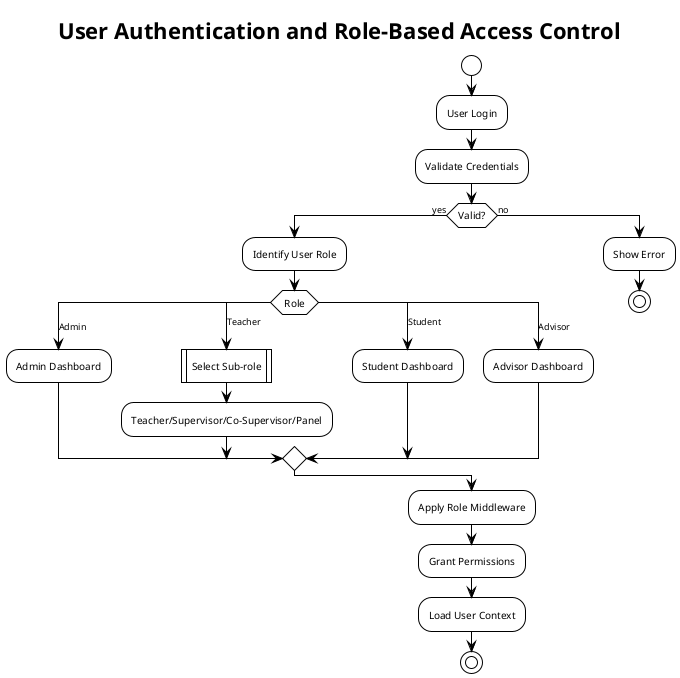

---

## 2. Core Report Management Workflow

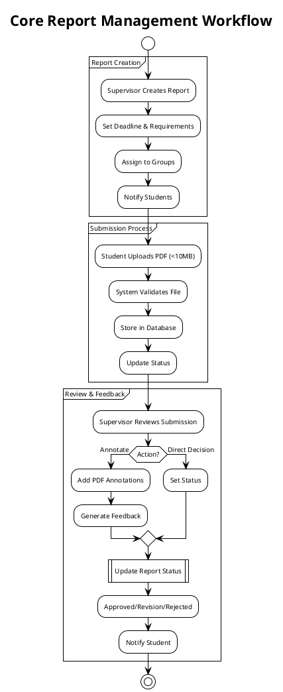

---

## 3. Group Assignment and Supervisor Allocation

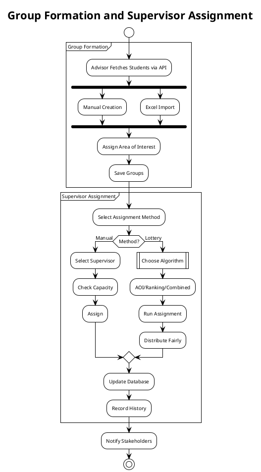

---

## 4. System Administration and Monitoring

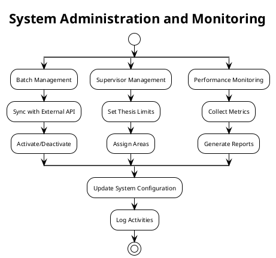

---

## 5. Integrated Workflow Overview

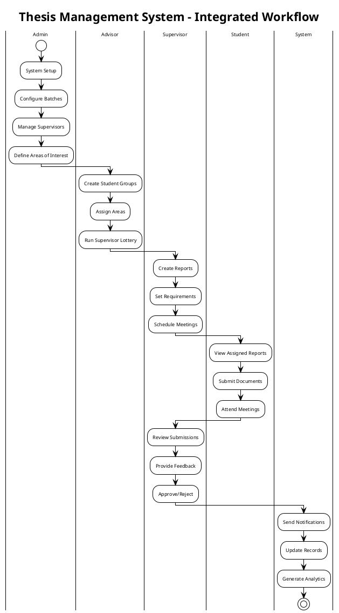

---

## 6. External API Integration and Data Synchronization

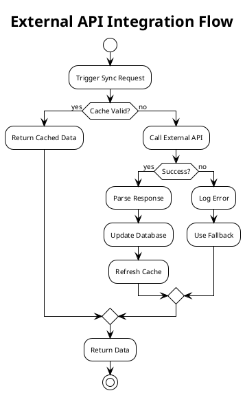

---

## 7. Report Lifecycle Management

```plantuml
@startuml Report_Lifecycle
!theme plain
title Complete Report Lifecycle
skinparam activityFontSize 10
skinparam defaultFontSize 10
skinparam backgroundColor #FFFFFF

start
:Report Created;
:Status: Draft;
|
:Assigned to Groups;
:Status: Active;
|
:Student Submits;
:Status: Submitted;
|
:Supervisor Reviews;

if (Decision?) then (Approve)
  :Status: Approved;
  :End Process;
elseif (Revision)
  :Status: Revision Required;
  :Return to Student;
  backward:Student Resubmits;
else (Reject)
  :Status: Rejected;
  :End Process;
endif

stop
@enduml
```

---

## 8. Notification and Communication Flow

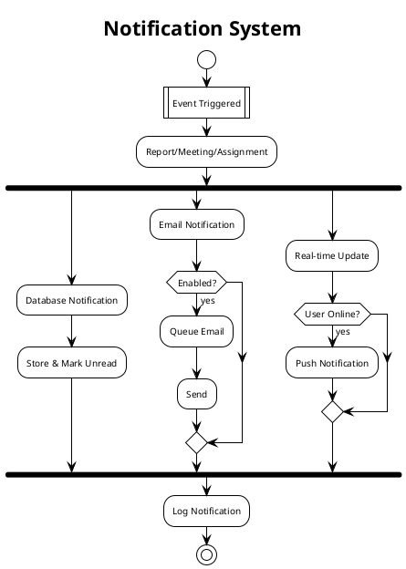

---

## 9. Security and Access Control

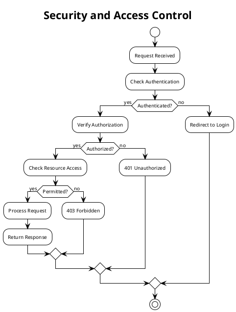

---

## 10. Lottery Assignment Algorithm

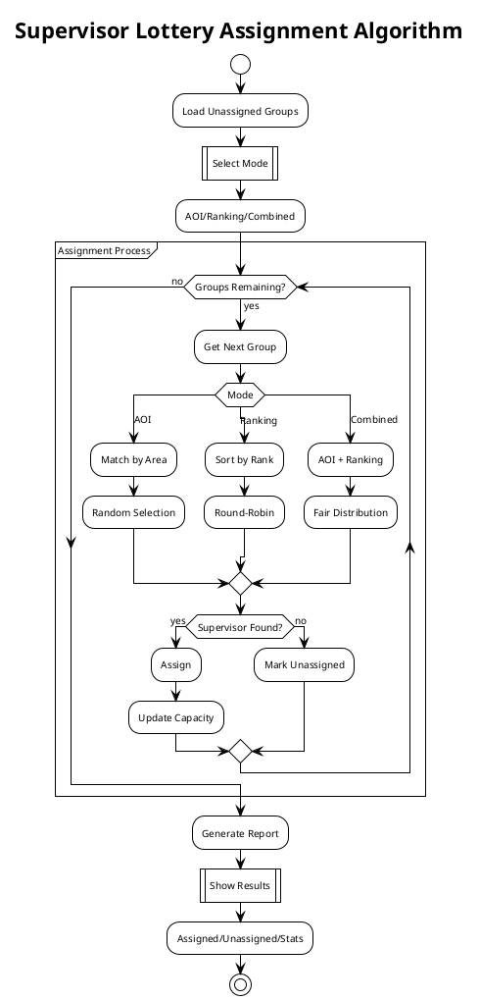

---

## Appendix A: Simplified System Overview

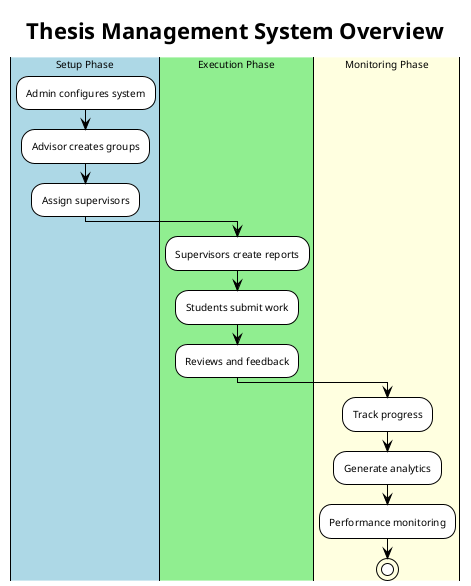

---

## Appendix B: Key System Components

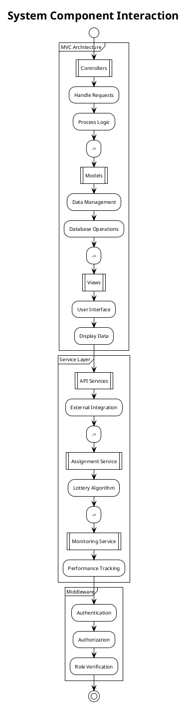

---

## Summary

These compact activity diagrams are optimized for A4 IEEE standard reports while maintaining comprehensive coverage of the system's functionality. Each diagram:

1. **Fits on a single A4 page** when rendered
2. **Uses simplified notation** for better readability
3. **Focuses on core workflows** without excessive detail
4. **Maintains IEEE compliance** for academic documentation
5. **Groups related processes** to reduce diagram count

### Key Design Decisions:

- **Combined related workflows** (e.g., all report operations in one diagram)
- **Used swimlanes sparingly** to show role interactions without clutter
- **Simplified decision points** to essential branches only
- **Removed redundant details** while keeping critical paths
- **Optimized font sizes** for print readability (10pt standard)

### Recommended Diagrams for Report:

For your IEEE report, I recommend including these primary diagrams:
1. **Diagram 5** (Integrated Workflow) - Shows complete system flow
2. **Diagram 3** (Group Assignment) - Highlights unique lottery feature
3. **Diagram 2** (Report Management) - Core functionality
4. **Diagram 10** (Lottery Algorithm) - Technical implementation detail

These provide comprehensive coverage while remaining readable in standard academic format.