# Detailed Activity Diagrams - Justifying Sequence Diagrams

This document contains PlantUML activity diagrams that correspond to and justify each sequence diagram in `sequence.md`.

## Table of Contents
1. [Authentication Process](#1-authentication-process)
2. [Student Operations](#2-student-operations)
3. [Supervisor Operations](#3-supervisor-operations)
4. [Advisor Operations](#4-advisor-operations)
5. [Administrative Functions](#5-administrative-functions)

---

## 1. Authentication Process

### 1.1 User Authentication Activity Diagram

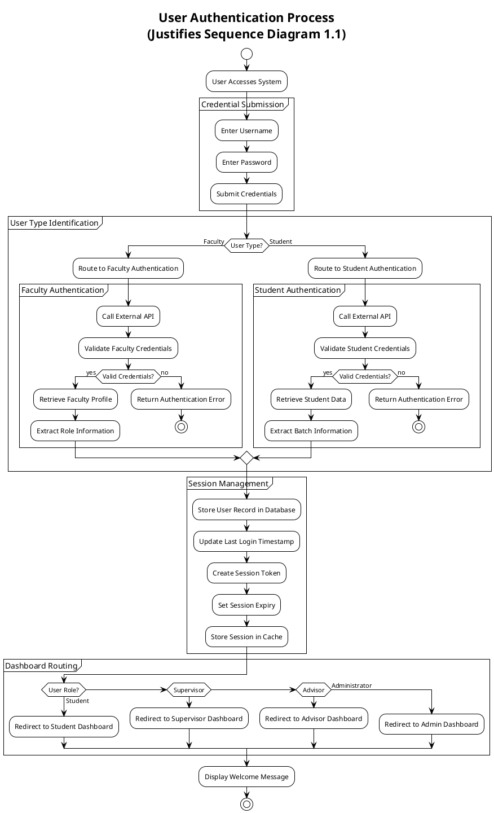

### 1.2 Role-Based Access Control Activity Diagram

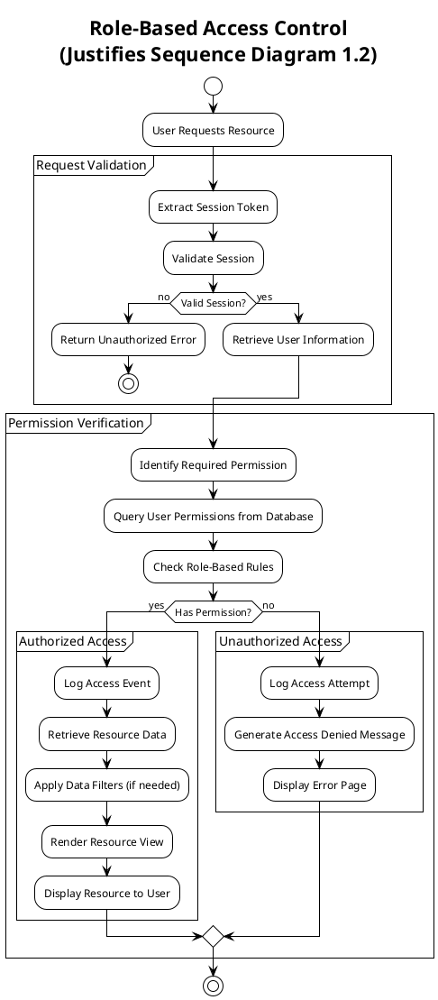

---

## 2. Student Operations

### 2.1 Report Submission Activity Diagram

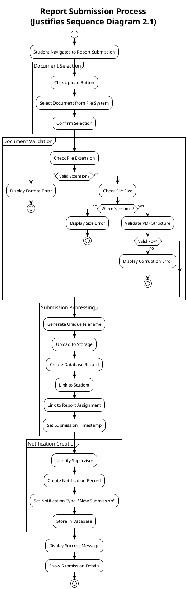

### 2.2 View Feedback and Annotations Activity Diagram

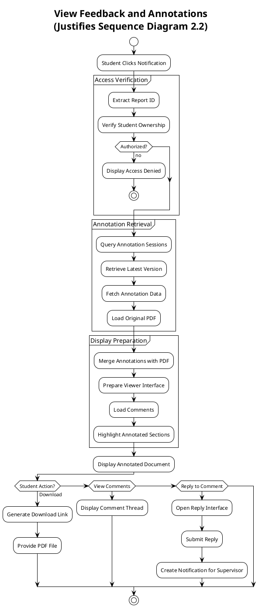

### 2.3 Dashboard Notification System Activity Diagram

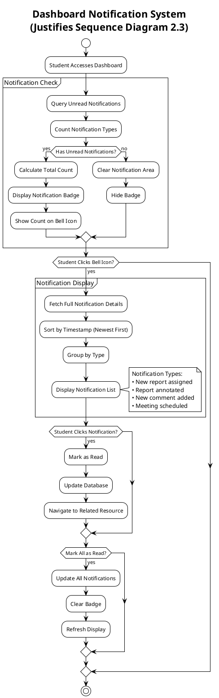

---

## 3. Supervisor Operations

### 3.1 Report Management Activity Diagram

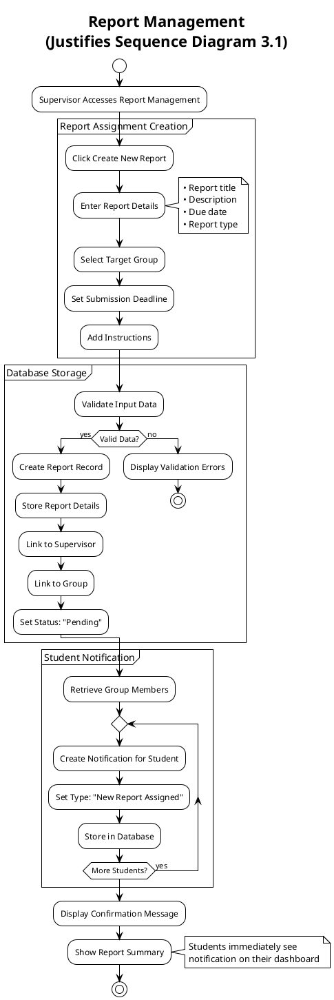

### 3.2 Document Annotation Process Activity Diagram

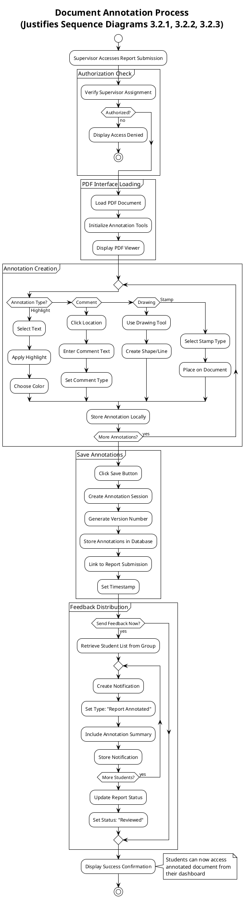

### 3.3 Meeting Documentation Activity Diagram

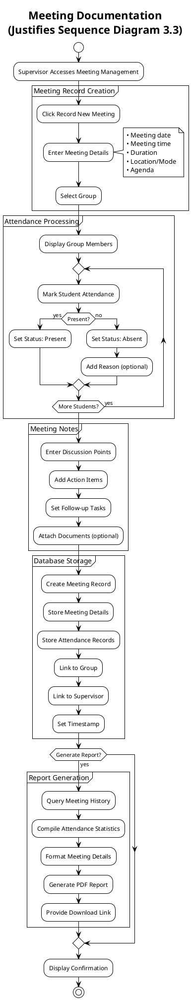

---

## 4. Advisor Operations

### 4.1 Manual Group Creation Activity Diagram

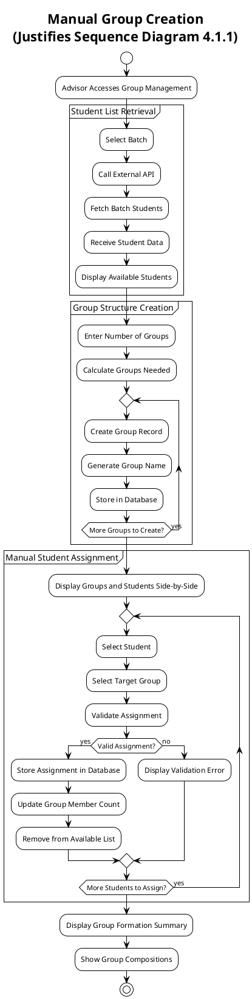

### 4.2 Excel-Based Group Import Activity Diagram

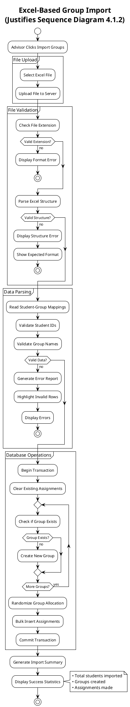

### 4.3 Template Export Activity Diagram

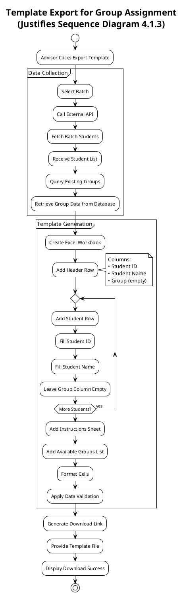

### 4.4 Supervisor Assignment - AOI-Based Activity Diagram

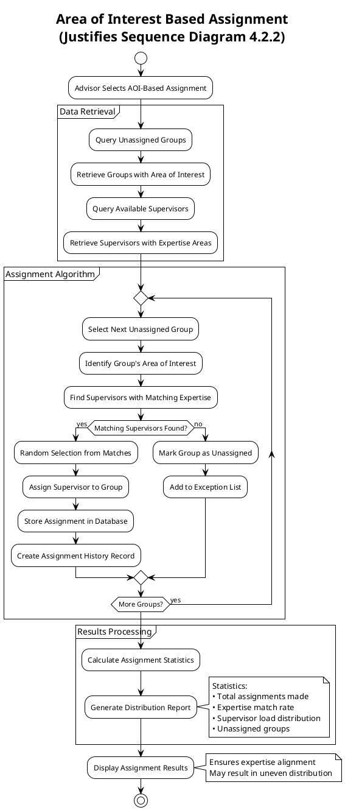

### 4.5 Supervisor Assignment - Ranking-Based Activity Diagram

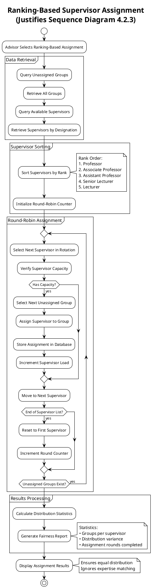

### 4.6 Supervisor Assignment - Hybrid Strategy Activity Diagram

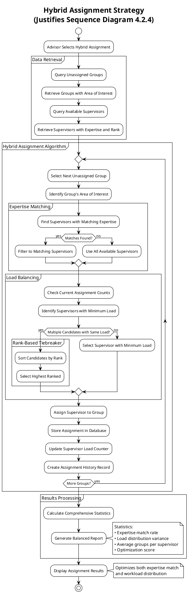

---

## 5. Administrative Functions

### 5.1 External Data Synchronization Activity Diagram

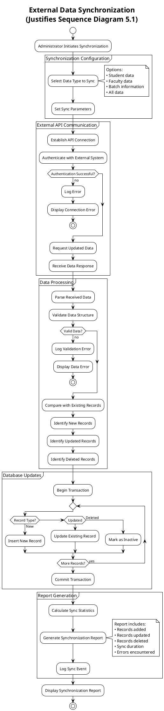

### 5.2 System Monitoring Activity Diagram

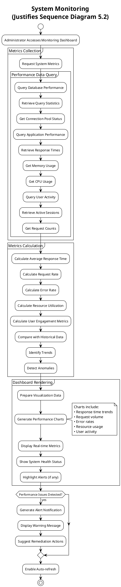

---

## Summary

These activity diagrams provide detailed workflow representations that justify and expand upon the sequence diagrams in `sequence.md`. Each activity diagram:

1. **Corresponds to a specific sequence diagram** - Maintaining traceability
2. **Shows decision points and alternative flows** - Providing more detail than sequence diagrams
3. **Includes validation and error handling** - Demonstrating robust system design
4. **Highlights key business logic** - Making the system behavior clear
5. **Documents data flows and transformations** - Showing how information moves through the system

The activity diagrams complement the sequence diagrams by:
- Showing the **control flow** within each process
- Illustrating **conditional logic** and branching
- Depicting **iterative processes** and loops
- Highlighting **parallel activities** where applicable
- Providing **implementation-level details** for developers

These diagrams serve as comprehensive documentation for the University Thesis Management System, supporting both system understanding and implementation efforts.
