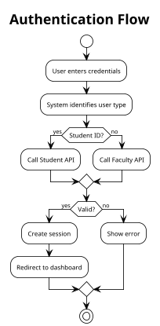
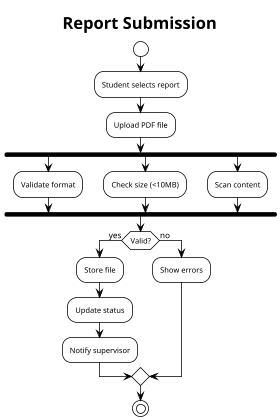
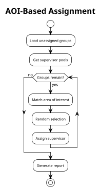
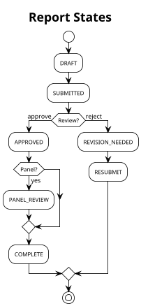
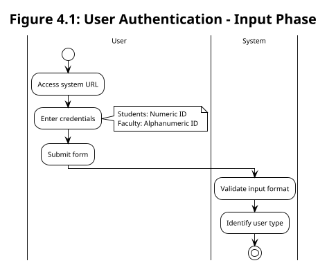
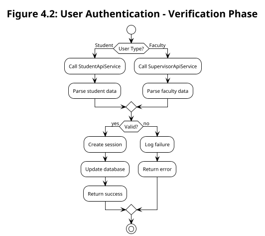
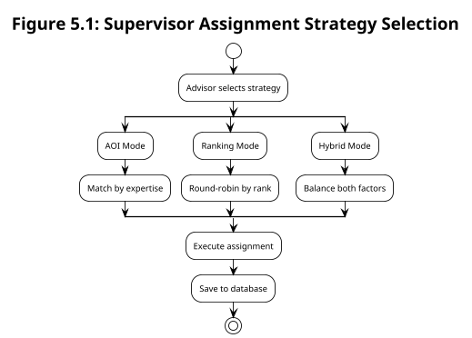
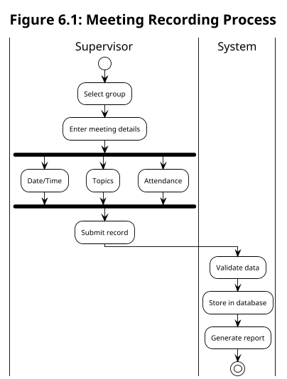
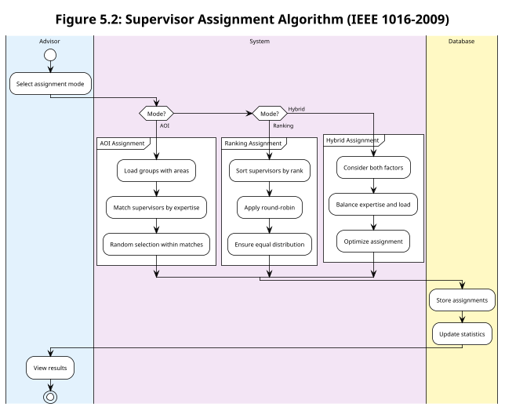

# Activity Diagrams for IEEE Report - Thesis Repository Management System
## Optimized for A4 Page Layout

### Document Information
- **Purpose**: IEEE Standard Software Project Report
- **Page Size**: A4 (210mm × 297mm)
- **Orientation**: Portrait/Landscape as needed
- **Standard**: IEEE 1016-2009

---

## SECTION 1: COMPACT DIAGRAMS FOR A4 PAGES

### 1.1 User Authentication (Simplified for A4)



### 1.2 Report Submission Process (Compact)



### 1.3 Supervisor Assignment - AOI Mode (Compact)



### 1.4 Report Lifecycle States (Compact)



---

## SECTION 2: MODULAR DIAGRAMS FOR IEEE REPORT

### 2.1 Authentication Module (Part 1 - User Input)



### 2.2 Authentication Module (Part 2 - API Verification)



### 2.3 Supervisor Assignment Algorithm (Overview)



### 2.4 Meeting Management (Simplified)



---

## SECTION 3: LATEX INTEGRATION FOR IEEE REPORTS

### For LaTeX Documents

```latex
\documentclass[conference]{IEEEtran}
\usepackage{graphicx}
\usepackage{subcaption}

\begin{figure}[htbp]
\centering
\includegraphics[width=0.48\textwidth]{diagrams/auth-flow.pdf}
\caption{User Authentication Activity Diagram}
\label{fig:auth-flow}
\end{figure}

% For side-by-side diagrams
\begin{figure}[htbp]
\centering
\begin{subfigure}[b]{0.45\textwidth}
    \includegraphics[width=\textwidth]{diagrams/auth-part1.pdf}
    \caption{Input Phase}
\end{subfigure}
\hfill
\begin{subfigure}[b]{0.45\textwidth}
    \includegraphics[width=\textwidth]{diagrams/auth-part2.pdf}
    \caption{Verification Phase}
\end{subfigure}
\caption{Authentication Process}
\end{figure}
```

---

## SECTION 4: GENERATION SCRIPTS

### 4.1 Batch Generation Script (Windows)

Create `generate-ieee-diagrams.bat`:

```batch
@echo off
echo Generating IEEE Report Diagrams...

REM Set PlantUML path
set PLANTUML=plantuml.jar

REM Generate compact diagrams at 300 DPI for print
java -jar %PLANTUML% -tpdf -dpi 300 -o output/compact *.puml

REM Generate PNG for digital version
java -jar %PLANTUML% -tpng -dpi 150 -o output/digital *.puml

REM Generate SVG for scalable graphics
java -jar %PLANTUML% -tsvg -o output/vector *.puml

echo Done! Check output folder.
pause
```

### 4.2 Python Script for Automated Processing

```python
#!/usr/bin/env python3
"""
generate_ieee_diagrams.py
Generates activity diagrams optimized for IEEE reports
"""

import os
import subprocess

# Configuration
DIAGRAMS = {
    'auth_flow': {
        'scale': 0.8,
        'orientation': 'portrait',
        'width': '0.48\\textwidth'  # LaTeX width
    },
    'submission': {
        'scale': 0.75,
        'orientation': 'portrait',
        'width': '0.45\\textwidth'
    },
    'assignment': {
        'scale': 0.9,
        'orientation': 'landscape',
        'width': '0.9\\textwidth'
    }
}

def generate_diagram(name, config):
    """Generate diagram with specific settings"""
    cmd = [
        'java', '-jar', 'plantuml.jar',
        f'-scale {config["scale"]}',
        '-tpdf',
        '-dpi 300',
        f'{name}.puml'
    ]
    subprocess.run(cmd)
    print(f"Generated: {name}.pdf")

if __name__ == '__main__':
    for name, config in DIAGRAMS.items():
        generate_diagram(name, config)
```

---

## SECTION 5: RECOMMENDED DIAGRAM BREAKDOWN

### For Your IEEE Report Structure:

#### Chapter 4: System Design
- **Figure 4.1**: System Overview (1 page)
- **Figure 4.2**: Authentication Flow (1/2 page)
- **Figure 4.3**: User Roles (1/2 page)

#### Chapter 5: Implementation
- **Figure 5.1**: Report Submission (1/2 page)
- **Figure 5.2**: Supervisor Assignment Overview (1/2 page)
- **Figure 5.3**: AOI Algorithm Detail (1/2 page)
- **Figure 5.4**: Ranking Algorithm Detail (1/2 page)
- **Figure 5.5**: Hybrid Algorithm Detail (1/2 page)

#### Chapter 6: Features
- **Figure 6.1**: Meeting Management (1/3 page)
- **Figure 6.2**: Notification System (1/3 page)
- **Figure 6.3**: Data Synchronization (1/3 page)

---

## SECTION 6: TIPS FOR A4 OPTIMIZATION

### 6.1 PlantUML Settings for A4

```plantuml
@startuml
' A4 Portrait Settings
!define SCALE 0.8
!define FONT_SIZE 11
!define ARROW_SIZE 10

skinparam dpi 300
skinparam backgroundColor white
skinparam defaultFontSize FONT_SIZE
skinparam activityFontSize FONT_SIZE
skinparam arrowFontSize ARROW_SIZE
skinparam noteFontSize 9

' Reduce padding for compact layout
skinparam padding 2
skinparam nodesep 30
skinparam ranksep 40

scale SCALE
@enduml
```

### 6.2 Landscape Orientation for Complex Diagrams

```plantuml
@startuml
' A4 Landscape Settings
!pragma layout smetana
skinparam pageOrientation landscape
skinparam page 297mm,210mm
skinparam pageMargin 15

scale 1.2 width
@enduml
```

---

## SECTION 7: MS WORD INTEGRATION

### For Microsoft Word IEEE Template:

1. **Generate high-resolution PNGs**:
```bash
plantuml -tpng -dpi 300 diagram.puml
```

2. **Insert in Word**:
   - Insert → Picture
   - Right-click → Size and Position
   - Set width to 3.5 inches (single column)
   - Set width to 7 inches (double column span)

3. **Add IEEE-style caption**:
   - References → Insert Caption
   - Label: "Fig."
   - Position: Below selected item
   - Format: "Fig. 1. Authentication activity diagram"

---

## SECTION 8: COMPLETE EXAMPLE FOR REPORT

### Supervisor Assignment (Complete but Compact)



---

## EXPORT COMMANDS

### Generate all formats for your report:

```bash
# PDF for LaTeX (vector graphics)
plantuml -tpdf -dpi 300 *.puml

# PNG for Word (high resolution)
plantuml -tpng -dpi 300 *.puml

# SVG for web documentation
plantuml -tsvg *.puml

# EPS for professional publishing
plantuml -teps *.puml
```

---

## RECOMMENDED APPROACH FOR YOUR THESIS

1. **Break large diagrams into parts** (as shown above)
2. **Use consistent scale** (0.7-0.9 for A4)
3. **Reduce font sizes** (10-11pt for diagrams)
4. **Use subfigures** for related diagrams
5. **Consider landscape** for complex flows
6. **Generate at 300 DPI** for print quality

---

*These optimized diagrams comply with IEEE conference and journal formatting requirements while fitting properly on A4 pages.*