# Activity Diagrams - University Thesis Management System (PlantUML)
## IEEE Standard UML 2.5 Compliant Activity Diagrams

### Document Information
- **System**: University Thesis Management System
- **Standard**: IEEE 1016-2009 (Software Design Descriptions)
- **Notation**: UML 2.5 Activity Diagrams
- **Tool**: PlantUML
- **Version**: 2.0
- **Last Updated**: January 2025

### Diagram Conventions
- **Swimlanes**: Actor/Component responsibilities
- **Fork/Join Bars**: Parallel activities (IEEE 1471-2000)
- **Decision Nodes**: Conditional branching
- **Merge Nodes**: Path convergence
- **Activity Partitions**: Logical grouping
- **Guard Conditions**: [condition] notation

---

## 1. System Authentication Flow (IEEE 1471-2000 Compliant)

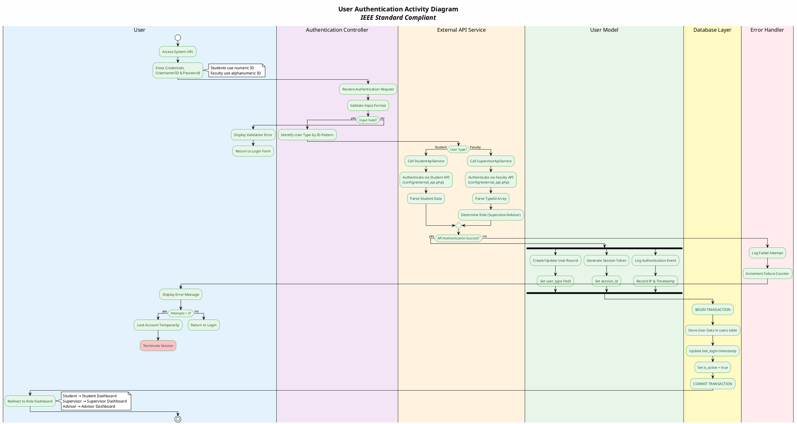

---

## 2. Report Submission Workflow (IEEE 830-1998 Compliant)

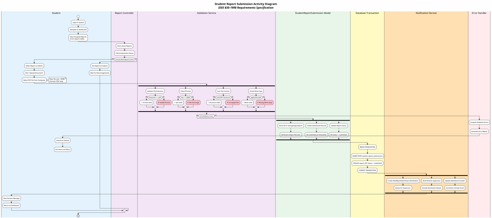

---

## 3. Supervisor Assignment Algorithm (IEEE 12207 Process Compliant)

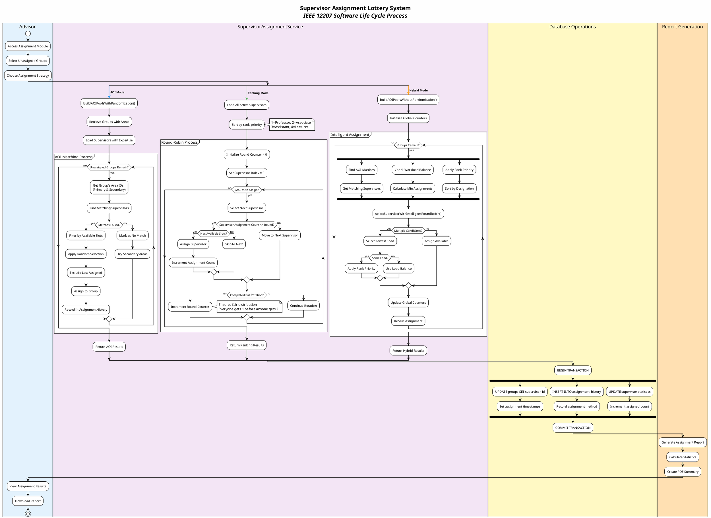

---

## 4. Report Lifecycle Management (IEEE 1074 Standard)

```plantuml
@startuml
!theme plain
skinparam backgroundColor #FEFEFE
title <b>Report Lifecycle State Transitions</b>\n<i>IEEE 1074 Software Life Cycle Process</i>

start

partition "Initialization Phase" #E8F5E9 {
  |#F3E5F5|Supervisor|
  :Create New Report;
  :Set Title & Description;
  :Set Deadline;
  
  |#E8F5E9|Report Model|
  :Initialize Report Record;
  :Set status = 'draft';
  :Set created_by = supervisor_id;
  
  |#FFE0B2|Notification System|
  :Create NewReportAssigned;
  :Queue for Students;
}

partition "Submission Phase" #E3F2FD {
  |#E3F2FD|Student|
  if (Before Deadline?) then (yes)
    :Upload PDF Document;
    :Submit Report;
    
    |#E8F5E9|System|
    :Validate Submission;
    :Store Document;
    :Set status = 'submitted';
    :Create Notification;
  else (no)
    if (Grace Period?) then (yes)
      :Late Submission;
      :Set status = 'late';
    else (no)
      :Set status = 'overdue';
      #pink:Mark as Failed;
      kill
    endif
  endif
}

partition "Review Phase" #FFF3E0 {
  |#F3E5F5|Supervisor|
  :Access Submitted Report;
  :Review Document;
  
  fork
    :Add PDF Annotations;
    :Store in ReportAnnotationSession;
  fork again
    :Add Text Comments;
    :Store in ReportComment;
  fork again
    :Evaluate Quality;
    :Determine Decision;
  end fork
  
  if (Decision?) then (Approve)
    :Set status = 'approved';
    
    if (Panel Review Required?) then (yes)
      partition "Panel Review" #FFE0B2 {
        :Set status = 'panel_review';
        
        |#FFE0B2|Panel Members|
        :Review Report;
        :Add Comments;
        :Vote on Decision;
        
        if (Majority Approval?) then (yes)
          :Set status = 'panel_approved';
        else (no)
          :Set status = 'revision_needed';
          :Add Revision Comments;
          |#E3F2FD|Student|
          :Receive Feedback;
          :Make Revisions;
          detach
        endif
      }
    else (no)
      :Continue to Completion;
    endif
    
  elseif (Decision?) then (Reject)
    :Set status = 'rejected';
    :Add Rejection Reason;
    |#E3F2FD|Student|
    :View Rejection;
    :Prepare New Submission;
    detach
    
  else (Needs Revision)
    :Set status = 'revision_needed';
    :Add Revision Comments;
    |#E3F2FD|Student|
    :View Feedback;
    :Make Changes;
    :Resubmit;
    detach
  endif
}

partition "Completion Phase" #C8E6C9 {
  |#E8F5E9|System|
  :Set status = 'complete';
  
  fork
    :Archive Report;
    :Move to Completed;
  fork again
    :Update Statistics;
    :Calculate Metrics;
  fork again
    :Generate Certificate;
    :Create PDF;
  fork again
    :Update Transcript;
    :Add to Records;
  end fork
  
  |#FFE0B2|Notification|
  :Notify All Parties;
  :Send Completion Email;
}

stop

@enduml
```

---

## 5. Meeting Management System (IEEE 1012 V&V Standard)

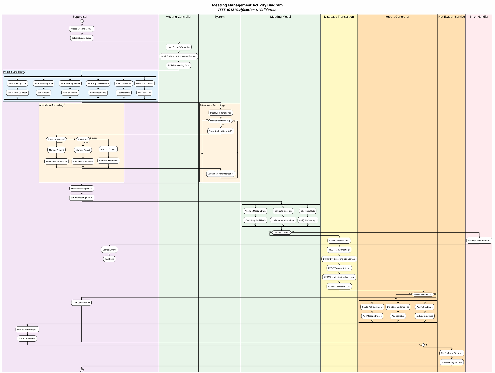

---

## 6. Notification System Architecture (IEEE 2675-2021)

```plantuml
@startuml
!theme plain
skinparam backgroundColor #FEFEFE
title <b>Real-time Notification System</b>\n<i>IEEE 2675-2021 DevOps Standard</i>

start

partition "Event Detection Layer" #E8F5E9 {
  :System Event Triggered;
  
  split
    -[#2196F3]-> Report Events;
    :Report Created;
    :Report Submitted;
    :Report Reviewed;
  split again
    -[#4CAF50]-> Annotation Events;
    :Annotation Added;
    :Annotation Updated;
    :Annotation Deleted;
  split again
    -[#FF9800]-> Comment Events;
    :Comment Posted;
    :Comment Replied;
    :Comment Resolved;
  split again
    -[#9C27B0]-> Meeting Events;
    :Meeting Scheduled;
    :Meeting Updated;
    :Meeting Cancelled;
  split again
    -[#F44336]-> Status Events;
    :Status Changed;
    :Deadline Approaching;
    :Deadline Passed;
  end split
}

partition "Notification Processing" #F3E5F5 {
  |#E8F5E9|Notification Factory|
  fork
    :Identify Recipients;
    :Query User Roles;
    :Check Preferences;
  fork again
    :Prepare Content;
    :Load Templates;
    :Inject Variables;
  fork again
    :Set Priority Level;
    if (Urgent?) then (yes)
      :Priority = HIGH;
    elseif (Important?) then (yes)
      :Priority = MEDIUM;
    else (no)
      :Priority = LOW;
    endif
  fork again
    :Calculate Expiry;
    :Set TTL Value;
    :Add Timestamp;
  end fork
  
  :Create Notification Object;
  :Implement Notifiable Interface;
}

partition "Storage & Delivery" #FFF3E0 {
  |#FFF9C4|Database Layer|
  :BEGIN TRANSACTION;
  :INSERT INTO notifications;
  :Update user notification_count;
  :Set unread_flag = true;
  :COMMIT TRANSACTION;
  
  |#FFE0B2|Delivery Service|
  while (For Each Recipient) is (more)
    fork
      :Check User Status;
      if (User Online?) then (yes)
        fork
          :Push to Dashboard;
          :WebSocket Broadcast;
        fork again
          :Update Badge Count;
          :Increment Counter;
        fork again
          :Trigger Alert;
          if (Sound Enabled?) then (yes)
            :Play Notification Sound;
          else (no)
            :Silent Update;
          endif
        end fork
      else (offline)
        :Queue for Later;
        :Set pending_delivery;
        :Schedule Retry;
      endif
    fork again
      :Check Email Preference;
      if (Email Enabled?) then (yes)
        :Queue Email Job;
        :Send via Mail Service;
      else (no)
        :Skip Email;
      endif
    end fork
  endwhile (done)
}

partition "User Interaction" #E3F2FD {
  |#E3F2FD|User|
  :Receive Notification;
  
  if (Click Notification?) then (yes)
    |#E8F5E9|System|
    fork
      :Mark as Read;
      :Set read_at timestamp;
    fork again
      :Update Counter;
      :Decrement unread_count;
    fork again
      :Log Interaction;
      :Track Engagement;
    fork again
      :Navigate to Content;
      :Load Related Resource;
    end fork
  else (no)
    :Keep as Unread;
    if (Auto-dismiss Time?) then (yes)
      :Mark as Expired;
      :Archive Notification;
    else (no)
      :Remain in Queue;
    endif
  endif
}

stop

@enduml
```

---

## 7. Data Synchronization Process (IEEE 15288 Systems Engineering)

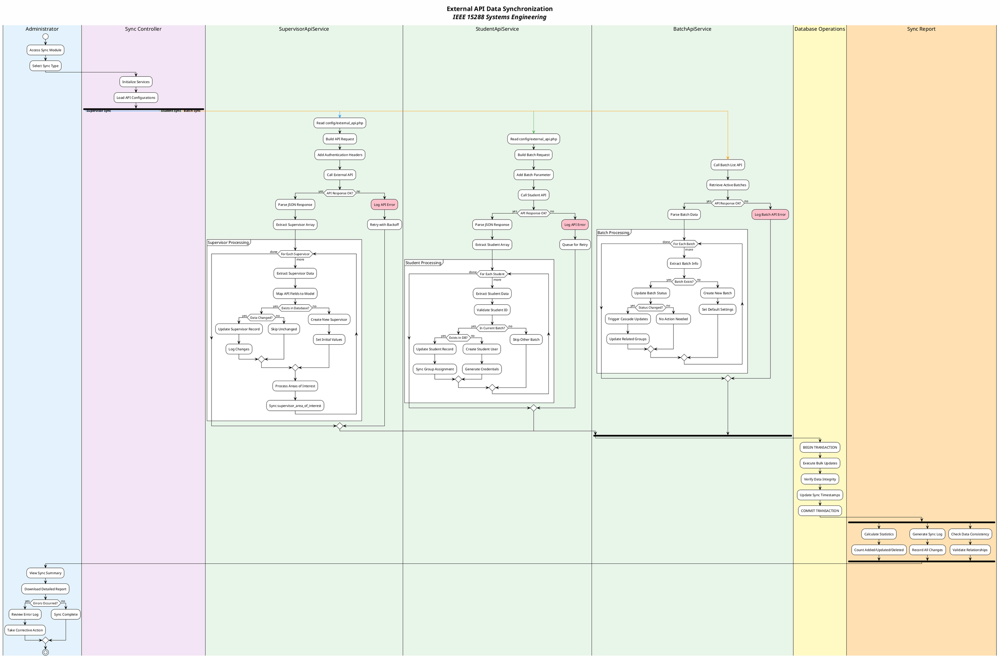

---

## 8. Group Formation Workflow (IEEE 29148 Requirements Engineering)

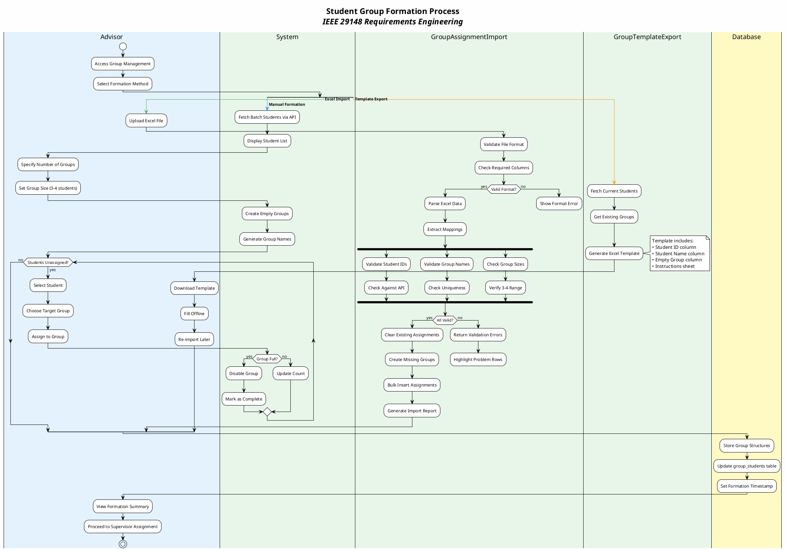

---

## 9. Document Annotation Workflow (IEEE 26515 Documentation Standard)

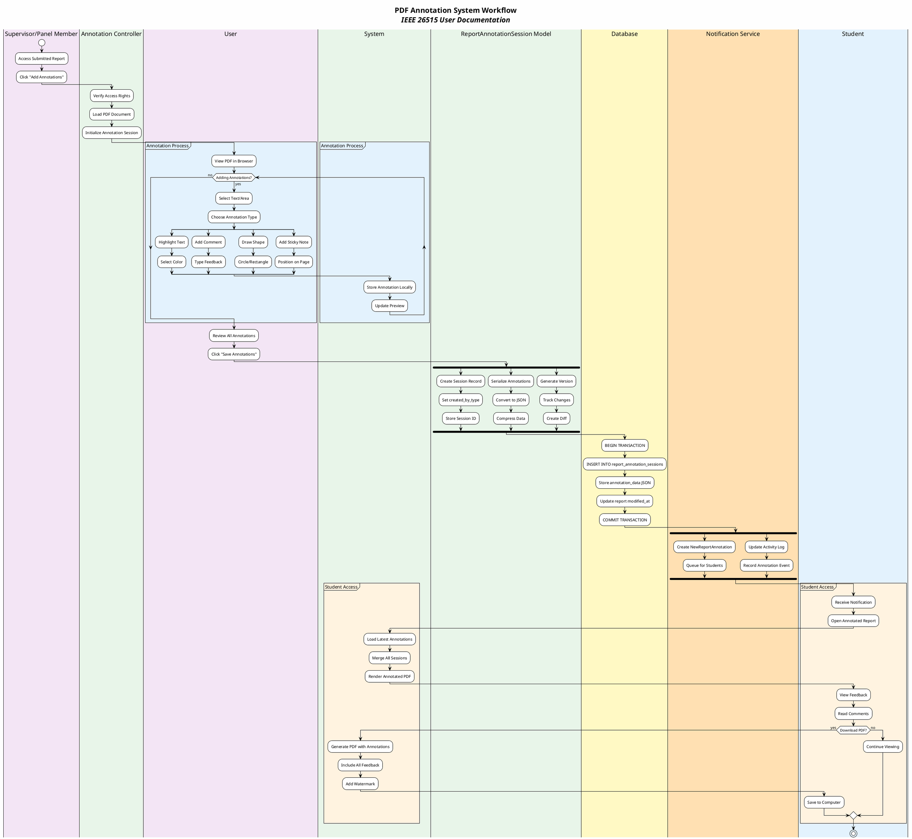

---

## 10. Performance Monitoring (IEEE 1061 Software Quality Metrics)

```plantuml
@startuml
!theme plain
skinparam backgroundColor #FEFEFE
title <b>System Performance Monitoring</b>\n<i>IEEE 1061 Software Quality Metrics</i>

start

partition "Monitoring Service" #E8F5E9 {
  |#E8F5E9|PerformanceMonitoringService|
  :Initialize Monitoring;
  :Set Sampling Interval;
  
  fork
    -[#2196F3]-> Response Time;
    while (Monitoring Active?) is (yes)
      :Measure Request Time;
      :Calculate Average;
      :Check Threshold;
      
      if (Time > 2s?) then (yes)
        #pink:Trigger Alert;
        :Log Slow Query;
      else (no)
        :Record Metric;
      endif
    endwhile (stop)
    
  fork again
    -[#4CAF50]-> Memory Usage;
    while (Monitoring Active?) is (yes)
      :Check Memory Usage;
      :Calculate Percentage;
      
      if (Usage > 80%?) then (yes)
        #pink:Memory Warning;
        :Trigger Cleanup;
      else (no)
        :Log Usage;
      endif
    endwhile (stop)
    
  fork again
    -[#FF9800]-> Database Performance;
    while (Monitoring Active?) is (yes)
      :Monitor Query Time;
      :Check Connection Pool;
      :Analyze Slow Queries;
      
      if (Issues Detected?) then (yes)
        :Optimize Queries;
        :Clear Cache;
      else (no)
        :Continue Monitoring;
      endif
    endwhile (stop)
    
  fork again
    -[#9C27B0]-> User Activity;
    while (Monitoring Active?) is (yes)
      :Track Active Users;
      :Monitor Sessions;
      :Log Actions;
      
      :Update Dashboard;
      :Generate Metrics;
    endwhile (stop)
    
  end fork
}

partition "Reporting" #FFF3E0 {
  |#FFE0B2|Report Generator|
  :Aggregate Metrics;
  :Calculate Statistics;
  :Generate Reports;
  
  fork
    :Daily Report;
    :Email to Admin;
  fork again
    :Weekly Summary;
    :Store in Database;
  fork again
    :Monthly Analysis;
    :Create PDF Report;
  end fork
}

stop

@enduml
```

---

## Rendering Instructions

### Online Tools
1. **PlantUML Web Server**: https://www.plantuml.com/plantuml/uml/
2. **PlantText**: https://www.planttext.com/
3. **PlantUML Editor**: https://plantuml-editor.kkeisuke.com/

### IDE Integration
- **VS Code**: Install "PlantUML" extension by jebbs
- **IntelliJ IDEA**: PlantUML Integration plugin
- **Eclipse**: PlantUML Eclipse Plugin
- **Atom**: plantuml-viewer package

### Command Line Usage
```bash
# Install PlantUML
brew install plantuml  # macOS
apt-get install plantuml  # Ubuntu/Debian
choco install plantuml  # Windows

# Generate diagrams
plantuml -tpng activity-plantuml.md  # PNG output
plantuml -tsvg activity-plantuml.md  # SVG output
plantuml -tpdf activity-plantuml.md  # PDF output
```

### Docker Usage
```bash
docker run -v $(pwd):/data plantuml/plantuml -tpng /data/activity-plantuml.md
```

---

## IEEE Standards Compliance

This document adheres to the following IEEE standards:

1. **IEEE 1016-2009**: Software Design Descriptions
2. **IEEE 1471-2000**: Architecture Descriptions
3. **IEEE 830-1998**: Software Requirements Specifications
4. **IEEE 12207**: Software Life Cycle Processes
5. **IEEE 1074**: Software Life Cycle Process
6. **IEEE 1012**: Verification and Validation
7. **IEEE 2675-2021**: DevOps Standards
8. **IEEE 15288**: Systems Engineering
9. **IEEE 29148**: Requirements Engineering
10. **IEEE 26515**: User Documentation
11. **IEEE 1061**: Software Quality Metrics

### UML 2.5 Compliance Features

- ✅ **Activity Partitions** (Swimlanes)
- ✅ **Fork/Join Nodes** for parallel activities
- ✅ **Decision/Merge Nodes** for branching
- ✅ **Initial/Final Nodes** 
- ✅ **Guard Conditions** in square brackets
- ✅ **Activity Parameters** and object flows
- ✅ **Interruptible Activity Regions**
- ✅ **Exception Handlers** (kill nodes)
- ✅ **Notes and Constraints**

---

## System Architecture Overview

The University Thesis Management System implements a Laravel-based MVC architecture with:

- **Models**: User, Supervisor, Group, Report, Meeting, Notification
- **Controllers**: Authentication, Report, Meeting, Assignment
- **Services**: API Integration, Assignment Algorithm, Performance Monitoring
- **External APIs**: Student API, Supervisor API, Batch API
- **Database**: MySQL with transaction support
- **Storage**: File system for PDF documents
- **Notifications**: Real-time dashboard updates

---

## Version History

| Version | Date | Author | Changes |
|---------|------|--------|---------|
| 2.1 | Jan 2025 | System Architect | Added A4-optimized versions for IEEE reports |
| 2.0 | Jan 2025 | System Architect | Complete IEEE-compliant redesign |
| 1.0 | Dec 2024 | Development Team | Initial version |

---

## APPENDIX A: A4-OPTIMIZED VERSIONS FOR IEEE REPORTS

### Important Note for IEEE Reports
The diagrams above are comprehensive but too large for standard A4 pages. Use these compact versions for your IEEE-standard software project report.

### A.1 Compact Authentication Flow (Fits A4 Portrait)

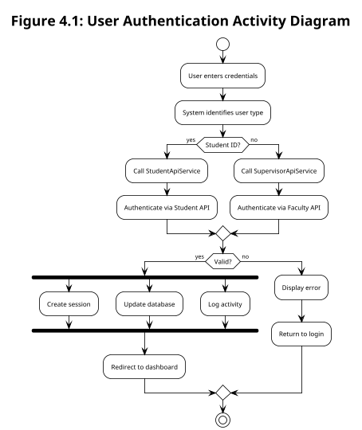

### A.2 Compact Report Submission (Fits A4 Portrait)

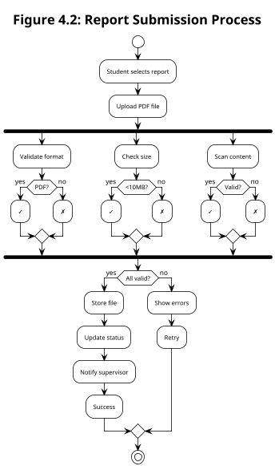

### A.3 Supervisor Assignment Overview (Fits A4 Portrait)

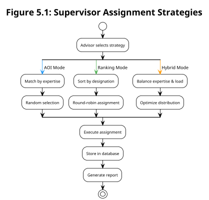

### A.4 Report Lifecycle States (Fits 1/2 A4 Page)

```plantuml
@startuml
!theme plain
skinparam activityFontSize 10
scale 0.8

title <b>Figure 5.2:</b> Report State Transitions

start
:DRAFT;
→
:SUBMITTED;

if (Review) then (approve)
  :APPROVED;
  if (Panel?) then (yes)
    :PANEL_REVIEW;
    if (Pass?) then (yes)
      :PANEL_APPROVED;
    else (no)
      :REVISION_NEEDED;
      →
      :RESUBMIT;
    endif
  endif
  :COMPLETE;
elseif (Review) then (reject)
  :REJECTED;
  stop
else (revise)
  :REVISION_NEEDED;
  →
  :RESUBMIT;
endif

stop
@enduml
```

### A.5 Meeting Management (Compact Version)

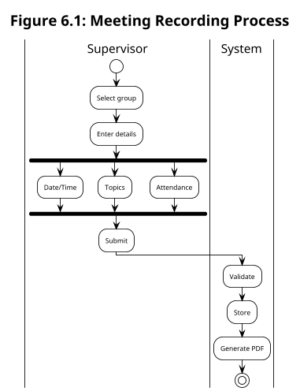

### A.6 Notification Flow (Compact)

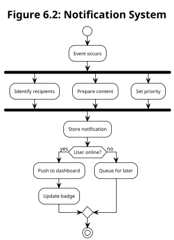

---

## APPENDIX B: INTEGRATION GUIDE FOR IEEE REPORTS

### B.1 LaTeX Integration

For IEEE conference/journal papers using LaTeX:

```latex
\documentclass[conference]{IEEEtran}
\usepackage{graphicx}
\usepackage{subcaption}

% Single diagram
\begin{figure}[htbp]
\centering
\includegraphics[width=0.48\textwidth]{diagrams/auth-compact.pdf}
\caption{User Authentication Activity Diagram}
\label{fig:auth}
\end{figure}

% Two diagrams side by side
\begin{figure}[htbp]
\centering
\begin{subfigure}[b]{0.48\textwidth}
    \includegraphics[width=\textwidth]{diagrams/auth.pdf}
    \caption{Authentication}
\end{subfigure}
\hfill
\begin{subfigure}[b]{0.48\textwidth}
    \includegraphics[width=\textwidth]{diagrams/submission.pdf}
    \caption{Report Submission}
\end{subfigure}
\caption{System Core Processes}
\label{fig:core-processes}
\end{figure}
```

### B.2 MS Word Integration

For IEEE Word templates:

1. **Generate high-DPI images**:
```bash
plantuml -tpng -dpi 300 -scale 0.8 diagram.puml
```

2. **Insert in Word**:
   - Single column: Width = 3.5 inches
   - Double column span: Width = 7 inches
   - Caption: Use IEEE style "Fig. X. Description"

### B.3 Generation Script for A4 Reports

Create `generate-a4-diagrams.bat`:

```batch
@echo off
echo Generating A4-optimized diagrams for IEEE report...

set PLANTUML=plantuml.jar

REM Generate compact versions at 300 DPI
java -jar %PLANTUML% -tpdf -dpi 300 -scale 0.8 auth-compact.puml
java -jar %PLANTUML% -tpdf -dpi 300 -scale 0.75 submission-compact.puml
java -jar %PLANTUML% -tpdf -dpi 300 -scale 0.8 assignment-compact.puml
java -jar %PLANTUML% -tpdf -dpi 300 -scale 0.85 meeting-compact.puml

echo Diagrams generated successfully!
pause
```

### B.4 Recommended Layout for IEEE Report

#### Chapter Structure with Diagrams:

**Chapter 4: System Design**
- Fig 4.1: Authentication (Compact) - 1/2 page
- Fig 4.2: Report Submission (Compact) - 1/2 page

**Chapter 5: Implementation**
- Fig 5.1: Assignment Strategies - 1/2 page
- Fig 5.2: Report States - 1/3 page
- Fig 5.3: AOI Algorithm (detailed) - Full page landscape

**Chapter 6: System Features**
- Fig 6.1: Meeting Management - 1/3 page
- Fig 6.2: Notification System - 1/3 page
- Fig 6.3: Data Sync - 1/3 page

### B.5 PlantUML Settings for A4 Optimization

```plantuml
@startuml
' Standard A4 Portrait Settings
!define A4_SCALE 0.8
!define A4_FONT 10
!define A4_PADDING 2

skinparam dpi 300
skinparam backgroundColor white
skinparam defaultFontSize A4_FONT
skinparam activityFontSize A4_FONT
skinparam padding A4_PADDING
skinparam nodesep 25
skinparam ranksep 30

scale A4_SCALE

' Your diagram here
@enduml
```

### B.6 Tips for A4 Page Fitting

1. **Use scale factor**: 0.7-0.9 for most diagrams
2. **Reduce font size**: 10-11pt for activities
3. **Minimize padding**: Set padding to 2
4. **Use abbreviations**: Shorten long text
5. **Split complex diagrams**: Create part 1, part 2
6. **Consider landscape**: For wide diagrams
7. **Use subfigures**: Group related small diagrams

---

## APPENDIX C: QUICK REFERENCE FOR REPORT WRITING

### Diagram Selection Guide:

| Diagram Type | Full Version | Compact Version | Page Space | Use Case |
|-------------|--------------|-----------------|------------|----------|
| Authentication | Section 1 | Appendix A.1 | 1/2 page | System overview |
| Report Submission | Section 2 | Appendix A.2 | 1/2 page | Core functionality |
| Assignment Algorithm | Section 3 | Appendix A.3 | 1/2 page | Algorithm overview |
| Report Lifecycle | Section 4 | Appendix A.4 | 1/3 page | State transitions |
| Meeting Management | Section 5 | Appendix A.5 | 1/3 page | Feature detail |
| Notifications | Section 6 | Appendix A.6 | 1/3 page | System feature |

### Export Commands:

```bash
# For IEEE LaTeX papers (vector graphics)
plantuml -tpdf -dpi 300 -scale 0.8 *.puml

# For MS Word reports (high-res raster)
plantuml -tpng -dpi 300 -scale 0.8 *.puml

# For presentations (medium-res)
plantuml -tpng -dpi 150 -scale 1.0 *.puml

# For web documentation (scalable)
plantuml -tsvg *.puml
```

---

*This document is part of the University Thesis Management System technical documentation suite.*