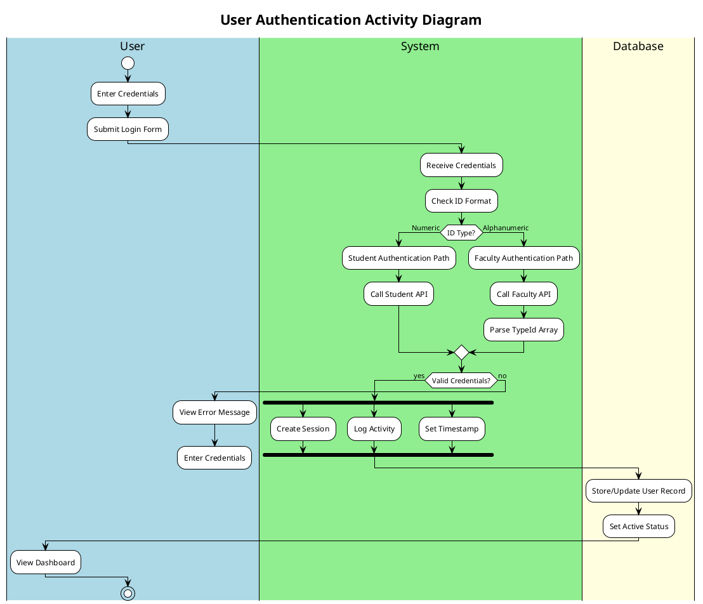
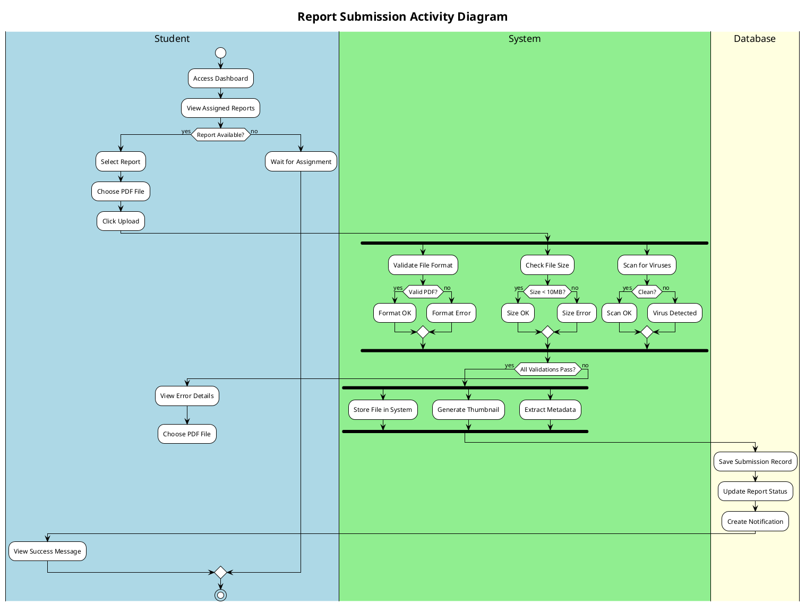
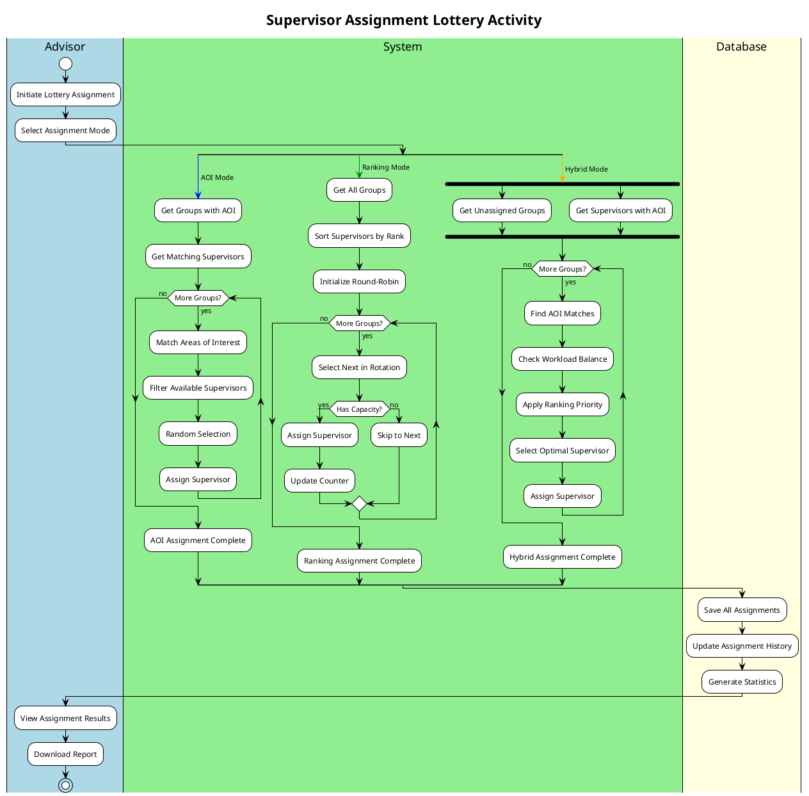
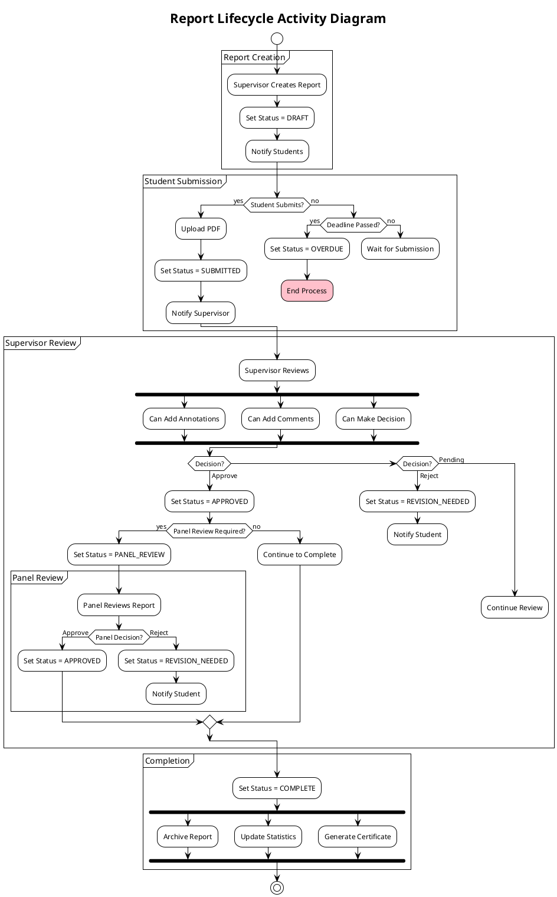
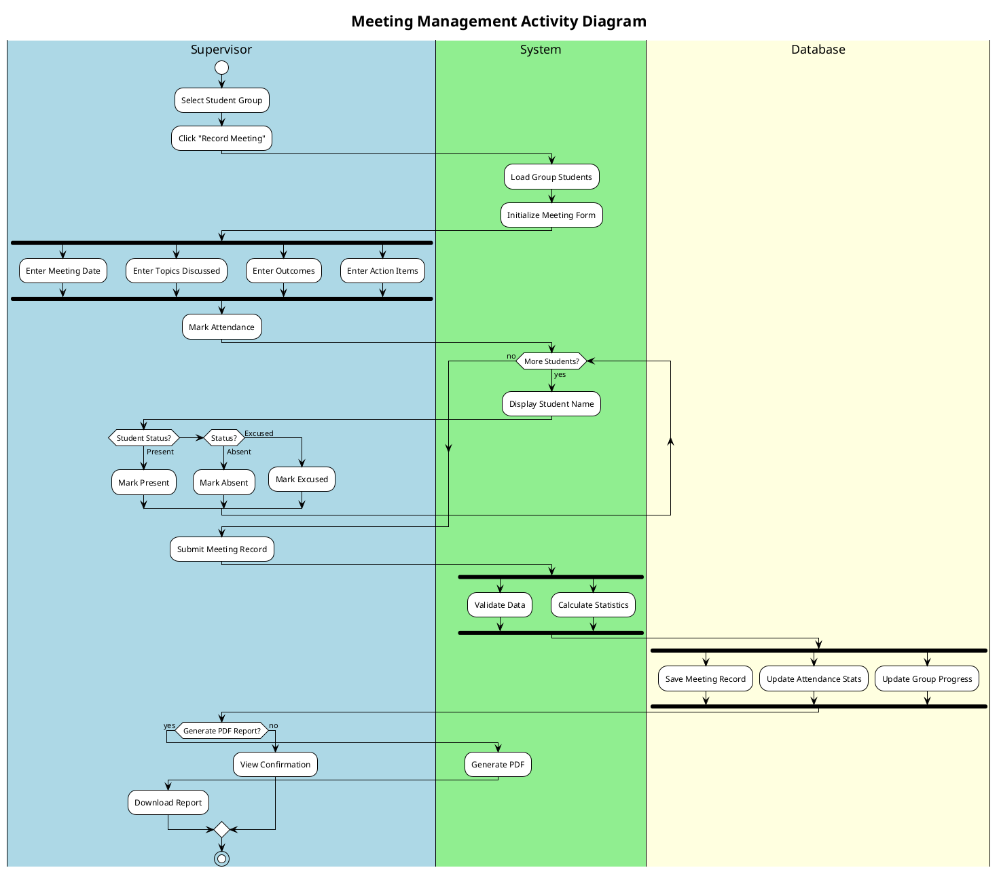
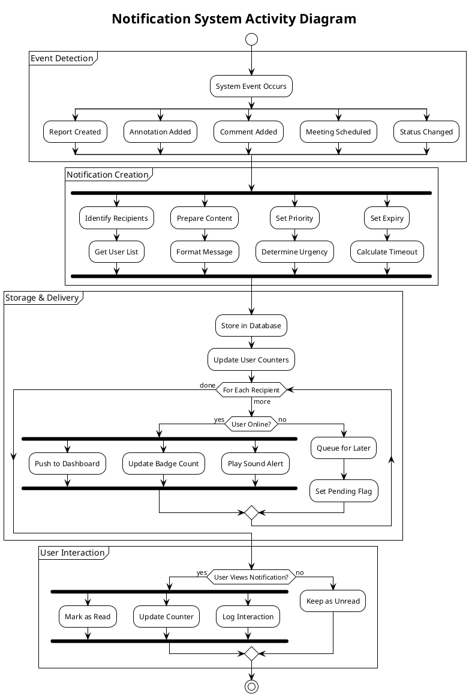
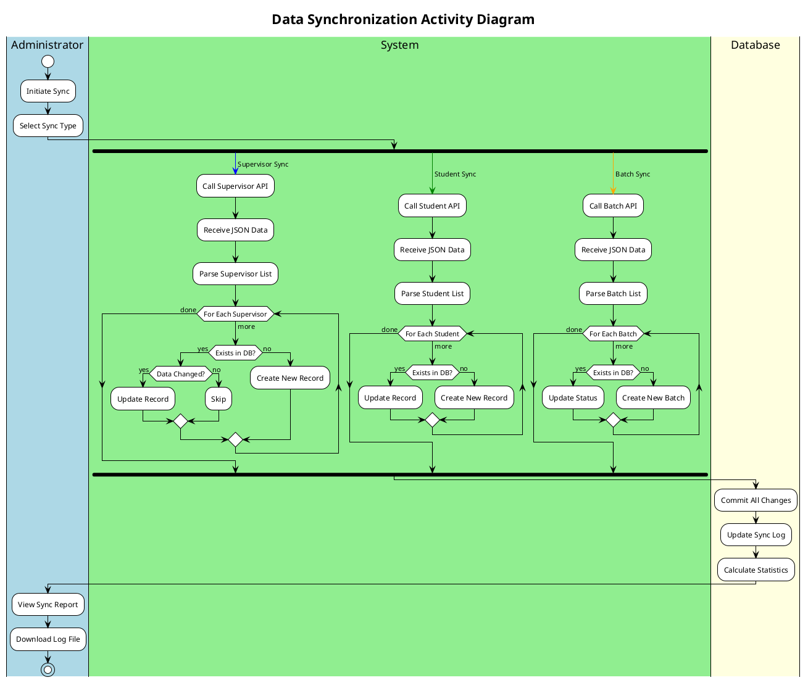

# Activity Diagrams - Thesis Repository Management System (PlantUML)

## Important Note
These diagrams use PlantUML syntax which generates proper UML 2.5 activity diagrams with:
- Swimlanes
- Fork/Join bars for parallel activities
- Proper start/end nodes
- Decision nodes
- Merge nodes

To render these diagrams:
1. Use PlantUML online editor: https://www.plantuml.com/plantuml/uml/
2. Or install PlantUML plugin in your IDE
3. Or use PlantUML command line tool

---

## 1. User Authentication Activity with Swimlanes



---

## 2. Report Submission with Parallel Validation



---

## 3. Supervisor Assignment Lottery with Three Parallel Modes



---

## 4. Report Lifecycle with State Transitions



---

## 5. Meeting Management with Parallel Data Entry



---

## 6. Notification System with Concurrent Processing



---

## 7. Data Synchronization with Parallel API Calls



---

## How to Use These Diagrams

### Option 1: PlantUML Online Editor
1. Go to https://www.plantuml.com/plantuml/uml/
2. Copy any diagram code above
3. Paste into the editor
4. View the generated diagram
5. Export as PNG/SVG/PDF

### Option 2: VS Code Extension
1. Install "PlantUML" extension
2. Create a `.puml` file
3. Paste the diagram code
4. Press `Alt+D` to preview
5. Right-click to export

### Option 3: Command Line
```bash
# Install PlantUML
java -jar plantuml.jar activity-diagram.puml

# Generate PNG
java -jar plantuml.jar -tpng activity-diagram.puml

# Generate SVG
java -jar plantuml.jar -tsvg activity-diagram.puml
```

### Option 4: Integration Tools
- **IntelliJ IDEA**: PlantUML Integration plugin
- **Eclipse**: PlantUML plugin
- **Confluence**: PlantUML macro
- **GitLab/GitHub**: PlantUML in markdown

---

## Key Features Demonstrated

### 1. **Swimlanes**
- Vertical lanes showing actor responsibilities
- Clear separation of concerns
- Cross-lane communication

### 2. **Fork/Join Bars**
- True parallel activities
- Concurrent processing
- Synchronization points

### 3. **Decision Nodes**
- Branching logic
- Multiple paths
- Guard conditions

### 4. **Loops**
- While loops for iterations
- For-each processing
- Conditional repetition

### 5. **Partitions**
- Logical grouping of activities
- Phase separation
- Sub-process organization

### 6. **Split/Merge**
- Multiple parallel paths
- Alternative flows
- Path convergence

---

## Notes
These PlantUML diagrams generate proper UML 2.5 activity diagrams that:
- Follow IEEE standards for software documentation
- Include proper fork/join bars for parallel activities
- Use swimlanes to show actor responsibilities
- Display correct UML notation (not flowcharts)
- Can be exported to various formats for inclusion in academic reports

Unlike Mermaid.js, PlantUML can render true UML activity diagrams with all standard elements including concurrent activities, swimlanes, and proper notation.