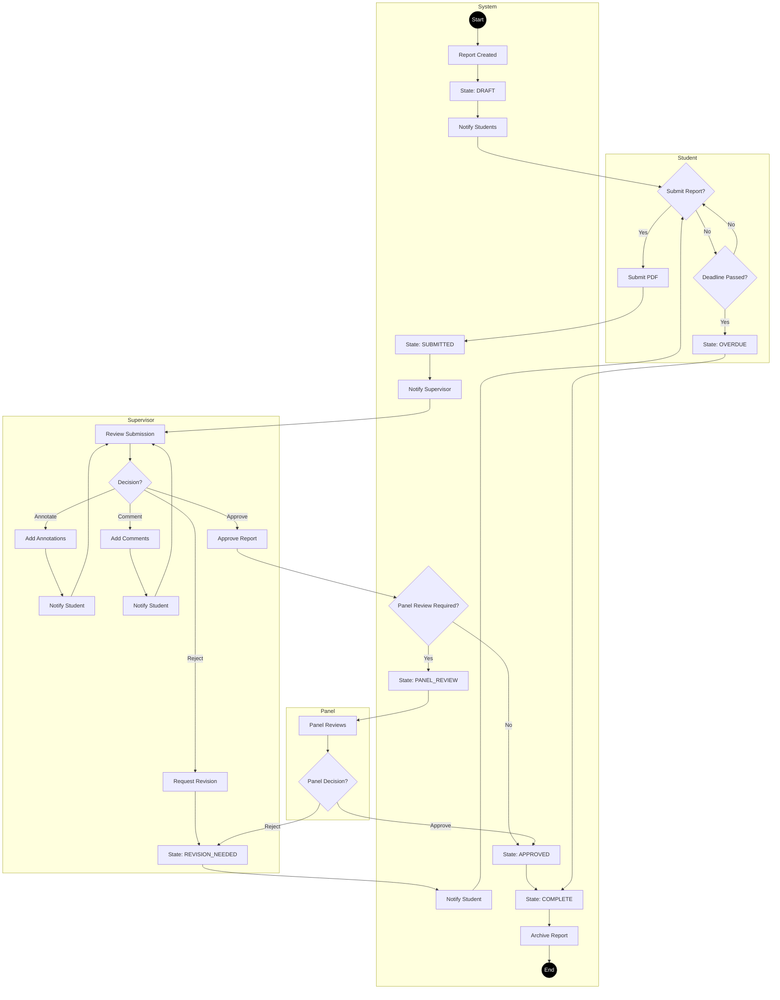

# Activity Diagrams - Thesis Repository Management System

## Table of Contents
1. [User Authentication Activity](#1-user-authentication-activity)
2. [Report Submission Activity](#2-report-submission-activity)
3. [Supervisor Assignment Lottery Activity](#3-supervisor-assignment-lottery-activity)
4. [Report Lifecycle Activity](#4-report-lifecycle-activity)
5. [Meeting Management Activity](#5-meeting-management-activity)
6. [Notification System Activity](#6-notification-system-activity)

---

## 1. User Authentication Activity

### Multi-Actor Authentication Process with Swimlanes

```mermaid
graph TB
    subgraph "User"
        Start1((Start))
        Start1 --> EnterCred[Enter Credentials]
        EnterCred --> Submit[Submit Login Form]
    end
    
    subgraph "System"
        Submit --> CheckType{Check ID Format}
        CheckType -->|Numeric| StudentPath[Student Authentication Path]
        CheckType -->|Alphanumeric| FacultyPath[Faculty Authentication Path]
        
        StudentPath --> ValidateStudent{Validate with Student API}
        FacultyPath --> ValidateFaculty{Validate with Faculty API}
        
        ValidateStudent -->|Invalid| ShowError[Display Error Message]
        ValidateFaculty -->|Invalid| ShowError
        
        ShowError --> EnterCred
        
        ValidateStudent -->|Valid| CreateSession[Create User Session]
        ValidateFaculty -->|Valid| ParseRoles[Parse Faculty Roles]
        ParseRoles --> CreateSession
        
        CreateSession --> Fork1{" "}
        Fork1 --> StoreSession[Store Session Data]
        Fork1 --> LogActivity[Log Login Activity]
        
        StoreSession --> Join1{" "}
        LogActivity --> Join1
    end
    
    subgraph "Database"
        Join1 --> UpdateUser[Update User Record]
        UpdateUser --> SetActive[Set User Active Status]
    end
    
    subgraph "User"
        SetActive --> RedirectDash[View Dashboard]
        RedirectDash --> End1((End))
    end
    
    style Start1 fill:#000,stroke:#000,color:#fff
    style End1 fill:#000,stroke:#000,color:#fff
    style Fork1 fill:#000,stroke:#000,stroke-width:4px
    style Join1 fill:#000,stroke:#000,stroke-width:4px
```

---

## 2. Report Submission Activity

### Student-Supervisor Report Submission Workflow

```mermaid
graph TB
    subgraph "Student"
        Start2((Start))
        Start2 --> ViewReports[View Assigned Reports]
        ViewReports --> SelectReport{Select Report?}
        SelectReport -->|No| Wait[Wait for Assignment]
        Wait --> End2((End))
        SelectReport -->|Yes| ChooseFile[Choose PDF File]
        ChooseFile --> Upload[Upload Document]
    end
    
    subgraph "System"
        Upload --> Fork2{" "}
        Fork2 --> ValidateFormat[Validate PDF Format]
        Fork2 --> CheckSize[Check File Size]
        
        ValidateFormat --> ValidationJoin{" "}
        CheckSize --> ValidationJoin
        
        ValidationJoin --> IsValid{Valid File?}
        IsValid -->|No| RejectFile[Reject Upload]
        RejectFile --> ShowFileError[Show Error to Student]
        ShowFileError --> ChooseFile
        
        IsValid -->|Yes| ProcessFile[Process File]
        ProcessFile --> Fork3{" "}
        Fork3 --> StoreFile[Store in File System]
        Fork3 --> GenerateThumb[Generate Thumbnail]
        Fork3 --> ExtractMeta[Extract Metadata]
        
        StoreFile --> Join3{" "}
        GenerateThumb --> Join3
        ExtractMeta --> Join3
    end
    
    subgraph "Database"
        Join3 --> SaveRecord[Save Submission Record]
        SaveRecord --> UpdateStatus[Update Report Status]
        UpdateStatus --> CreateNotif[Create Supervisor Notification]
    end
    
    subgraph "Student"
        CreateNotif --> ShowSuccess[View Success Message]
        ShowSuccess --> End2
    end
    
    style Start2 fill:#000,stroke:#000,color:#fff
    style End2 fill:#000,stroke:#000,color:#fff
    style Fork2 fill:#000,stroke:#000,stroke-width:4px
    style ValidationJoin fill:#000,stroke:#000,stroke-width:4px
    style Fork3 fill:#000,stroke:#000,stroke-width:4px
    style Join3 fill:#000,stroke:#000,stroke-width:4px
```

---

## 3. Supervisor Assignment Lottery Activity

### Three-Mode Assignment Process with Parallel Execution

```mermaid
graph TB
    subgraph "Advisor"
        Start3((Start))
        Start3 --> InitLottery[Initiate Lottery]
        InitLottery --> SelectMode{Select Mode?}
    end
    
    subgraph "System - AOI Mode"
        SelectMode -->|AOI| AOIStart[Start AOI Process]
        AOIStart --> GetAOIGroups[Get Groups with AOI]
        GetAOIGroups --> GetAOISup[Get Matching Supervisors]
        GetAOISup --> AOILoop{For Each Group}
        AOILoop --> MatchAOI[Match Areas]
        MatchAOI --> RandomPick[Random Selection]
        RandomPick --> AssignAOI[Assign Supervisor]
        AssignAOI --> MoreAOI{More Groups?}
        MoreAOI -->|Yes| AOILoop
        MoreAOI -->|No| AOIComplete[AOI Complete]
    end
    
    subgraph "System - Ranking Mode"
        SelectMode -->|Ranking| RankStart[Start Ranking Process]
        RankStart --> GetAllGroups[Get All Groups]
        GetAllGroups --> SortSupervisors[Sort by Designation]
        SortSupervisors --> RankLoop{Round Robin}
        RankLoop --> NextInLine[Select Next Supervisor]
        NextInLine --> CheckCapacity{Has Capacity?}
        CheckCapacity -->|No| SkipSup[Skip to Next]
        SkipSup --> RankLoop
        CheckCapacity -->|Yes| AssignRank[Assign Supervisor]
        AssignRank --> MoreRank{More Groups?}
        MoreRank -->|Yes| RankLoop
        MoreRank -->|No| RankComplete[Ranking Complete]
    end
    
    subgraph "System - Hybrid Mode"
        SelectMode -->|Hybrid| HybridStart[Start Hybrid Process]
        HybridStart --> Fork4{" "}
        Fork4 --> GetHybridGroups[Get Groups]
        Fork4 --> GetHybridSup[Get Supervisors]
        
        GetHybridGroups --> Join4{" "}
        GetHybridSup --> Join4
        
        Join4 --> HybridLoop{For Each Group}
        HybridLoop --> FindMatches[Find AOI Matches]
        FindMatches --> CheckLoads[Check Workloads]
        CheckLoads --> SelectOptimal[Select Optimal]
        SelectOptimal --> AssignHybrid[Assign Supervisor]
        AssignHybrid --> MoreHybrid{More Groups?}
        MoreHybrid -->|Yes| HybridLoop
        MoreHybrid -->|No| HybridComplete[Hybrid Complete]
    end
    
    subgraph "Database"
        AOIComplete --> SaveResults[Save All Assignments]
        RankComplete --> SaveResults
        HybridComplete --> SaveResults
        SaveResults --> GenerateReport[Generate Assignment Report]
    end
    
    subgraph "Advisor"
        GenerateReport --> ViewResults[View Results]
        ViewResults --> End3((End))
    end
    
    style Start3 fill:#000,stroke:#000,color:#fff
    style End3 fill:#000,stroke:#000,color:#fff
    style Fork4 fill:#000,stroke:#000,stroke-width:4px
    style Join4 fill:#000,stroke:#000,stroke-width:4px
```

---

## 4. Report Lifecycle Activity

### Complete Report State Transitions

---

## 5. Meeting Management Activity

### Supervisor Meeting Documentation Process

```mermaid
graph TB
    subgraph "Supervisor"
        Start5((Start))
        Start5 --> SelectGroup[Select Student Group]
        SelectGroup --> InitMeeting[Initialize Meeting Record]
        InitMeeting --> EnterDetails[Enter Meeting Details]
        EnterDetails --> Fork5{" "}
        Fork5 --> EnterDate[Enter Date/Time]
        Fork5 --> EnterTopics[Enter Topics]
        Fork5 --> EnterOutcomes[Enter Outcomes]
        
        EnterDate --> Join5{" "}
        EnterTopics --> Join5
        EnterOutcomes --> Join5
        
        Join5 --> MarkAttendance[Mark Attendance]
    end
    
    subgraph "System"
        MarkAttendance --> StudentLoop{For Each Student}
        StudentLoop --> ShowStudent[Display Student Name]
        ShowStudent --> AttendanceChoice{Mark Status}
        AttendanceChoice -->|Present| MarkPresent[Set Present]
        AttendanceChoice -->|Absent| MarkAbsent[Set Absent]
        AttendanceChoice -->|Excused| MarkExcused[Set Excused]
        
        MarkPresent --> NextStudent{More Students?}
        MarkAbsent --> NextStudent
        MarkExcused --> NextStudent
        
        NextStudent -->|Yes| StudentLoop
        NextStudent -->|No| SaveMeeting[Save Meeting Record]
        
        SaveMeeting --> Fork6{" "}
        Fork6 --> StoreDB[Store in Database]
        Fork6 --> UpdateStats[Update Statistics]
        
        StoreDB --> Join6{" "}
        UpdateStats --> Join6
    end
    
    subgraph "Supervisor"
        Join6 --> GeneratePDF{Generate Report?}
        GeneratePDF -->|No| Complete[Meeting Recorded]
        GeneratePDF -->|Yes| CreatePDF[Create PDF Report]
        CreatePDF --> DownloadPDF[Download PDF]
        DownloadPDF --> Complete
        Complete --> End5((End))
    end
    
    style Start5 fill:#000,stroke:#000,color:#fff
    style End5 fill:#000,stroke:#000,color:#fff
    style Fork5 fill:#000,stroke:#000,stroke-width:4px
    style Join5 fill:#000,stroke:#000,stroke-width:4px
    style Fork6 fill:#000,stroke:#000,stroke-width:4px
    style Join6 fill:#000,stroke:#000,stroke-width:4px
```

---

## 6. Notification System Activity

### Event-Driven Notification Delivery

```mermaid
graph TB
    subgraph "System - Event Detection"
        Start6((Start))
        Start6 --> EventOccurs[System Event Occurs]
        EventOccurs --> IdentifyEvent{Event Type?}
        
        IdentifyEvent -->|Report Created| ReportEvent[Report Event]
        IdentifyEvent -->|Annotation Added| AnnotationEvent[Annotation Event]
        IdentifyEvent -->|Comment Added| CommentEvent[Comment Event]
        IdentifyEvent -->|Meeting Scheduled| MeetingEvent[Meeting Event]
        
        ReportEvent --> CreateNotif[Create Notification]
        AnnotationEvent --> CreateNotif
        CommentEvent --> CreateNotif
        MeetingEvent --> CreateNotif
    end
    
    subgraph "System - Processing"
        CreateNotif --> Fork7{" "}
        Fork7 --> IdentifyRecipients[Identify Recipients]
        Fork7 --> SetPriority[Set Priority Level]
        Fork7 --> PrepareContent[Prepare Content]
        
        IdentifyRecipients --> Join7{" "}
        SetPriority --> Join7
        PrepareContent --> Join7
        
        Join7 --> StoreNotification[Store in Database]
        StoreNotification --> UpdateCounters[Update User Counters]
    end
    
    subgraph "System - Delivery"
        UpdateCounters --> CheckUserStatus{User Online?}
        CheckUserStatus -->|Yes| PushNotification[Push to Dashboard]
        CheckUserStatus -->|No| QueueNotification[Queue for Later]
        
        PushNotification --> DisplayBadge[Display Badge]
        QueueNotification --> WaitForLogin[Wait for Login]
        WaitForLogin --> UserLogsIn[User Logs In]
        UserLogsIn --> DisplayBadge
    end
    
    subgraph "Student Dashboard"
        DisplayBadge --> UserSees{User Clicks?}
        UserSees -->|No| KeepUnread[Keep as Unread]
        UserSees -->|Yes| ShowDetails[Show Notification Details]
        ShowDetails --> MarkRead[Mark as Read]
        MarkRead --> UpdateDB[Update Database]
        
        KeepUnread --> End6((End))
        UpdateDB --> End6
    end
    
    style Start6 fill:#000,stroke:#000,color:#fff
    style End6 fill:#000,stroke:#000,color:#fff
    style Fork7 fill:#000,stroke:#000,stroke-width:4px
    style Join7 fill:#000,stroke:#000,stroke-width:4px
```

---

## UML Activity Diagram Symbols Reference

### Basic Symbols
- **Initial Node** (●): Filled black circle - Start of activity
- **Final Node** (◉): Circle with dot - End of activity
- **Action Node** [Rectangle]: Represents an action or step
- **Decision Node** (◇): Diamond - Branching based on conditions
- **Merge Node** (◇): Diamond - Multiple flows converge
- **Fork Node** (━): Thick horizontal bar - Split into parallel activities
- **Join Node** (━): Thick horizontal bar - Synchronize parallel activities

### Swimlanes
- **Vertical/Horizontal Partitions**: Represent different actors or systems
- **Cross-lane Activities**: Show interactions between actors

### Control Flow
- **→**: Solid arrow - Shows flow direction
- **[guard]**: Condition on flow - Written in square brackets
- **{weight}**: Priority or probability - Written in curly braces

### Advanced Elements
- **Signal Send**: Triangle pointing right (▷)
- **Signal Receive**: Triangle pointing left (◁)
- **Time Event**: Hourglass symbol (⧗)
- **Interruptible Region**: Dashed rounded rectangle
- **Exception Handler**: Lightning bolt symbol (⚡)

---

## Key Activity Patterns in ThesisRepo

### 1. Parallel Processing
- File upload validation (format + size check simultaneously)
- Notification creation (recipients + content + priority in parallel)
- Meeting record creation (date + topics + outcomes simultaneously)

### 2. Loop Structures
- Student attendance marking (iterate through all students)
- Lottery assignment (process each group)
- Notification delivery (check each recipient)

### 3. Decision Points
- User type detection (student vs faculty)
- Assignment mode selection (AOI vs Ranking vs Hybrid)
- Report approval decisions (approve/reject/revise)

### 4. Synchronization Points
- Join after parallel validation
- Merge after multiple decision paths
- Synchronize before database updates

### 5. Exception Handling
- Invalid file uploads return to selection
- Failed authentication returns to login
- Deadline exceeded triggers overdue state

---

## Notes
These activity diagrams follow UML 2.5 specifications and IEEE standards for software documentation. They use proper activity diagram notation including:
- Swimlanes to show actor responsibilities
- Fork/Join bars for parallel activities
- Decision/Merge nodes for branching logic
- Initial and final nodes for clear boundaries
- Guard conditions on transitions

The diagrams focus on business process flow rather than technical implementation, making them suitable for academic project documentation and stakeholder communication.