# Activity Diagrams - Thesis Repository Management System

## Table of Contents
1. [User Authentication Flow](#1-user-authentication-flow)
2. [Student Activities](#2-student-activities)
3. [Supervisor Activities](#3-supervisor-activities)
4. [Advisor Activities](#4-advisor-activities)
5. [Administrative Activities](#5-administrative-activities)
6. [System Processes](#6-system-processes)

---

## 1. User Authentication Flow

### 1.1 Login Process
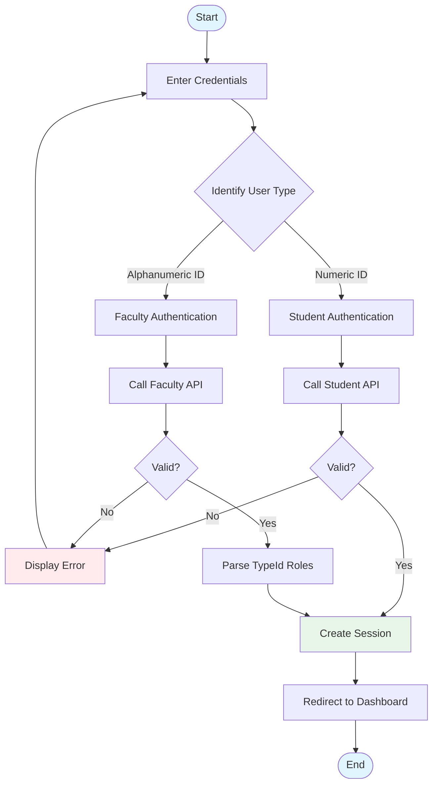

---

## 2. Student Activities

### 2.1 Report Submission Workflow
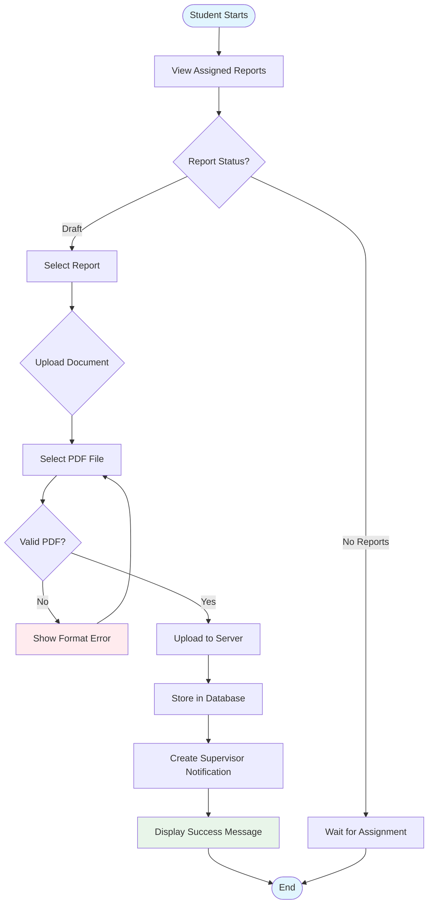

### 2.2 Notification Management
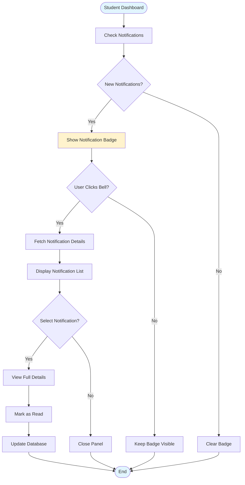

---

## 3. Supervisor Activities

### 3.1 Report Creation and Management
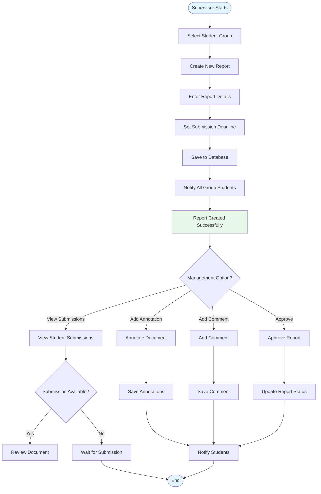

### 3.2 Meeting Documentation Process
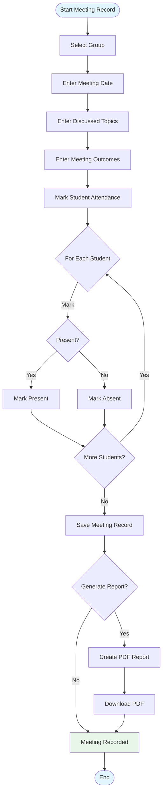

---

## 4. Advisor Activities

### 4.1 Group Formation Process
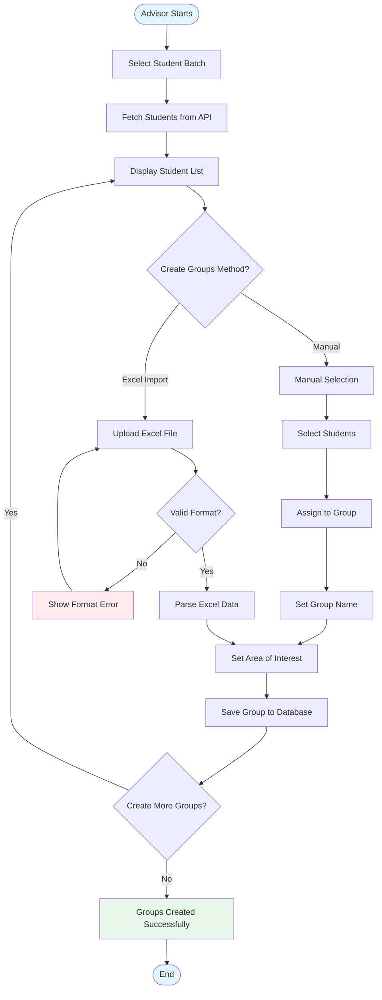

### 4.2 Supervisor Assignment Lottery
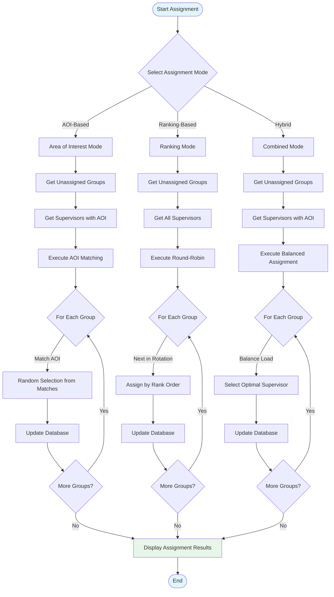

---

## 5. Administrative Activities

### 5.1 Data Synchronization Process
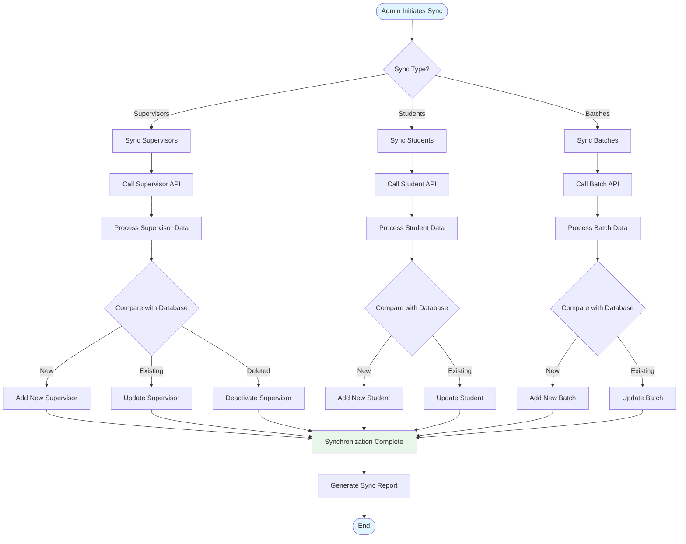

### 5.2 System Monitoring
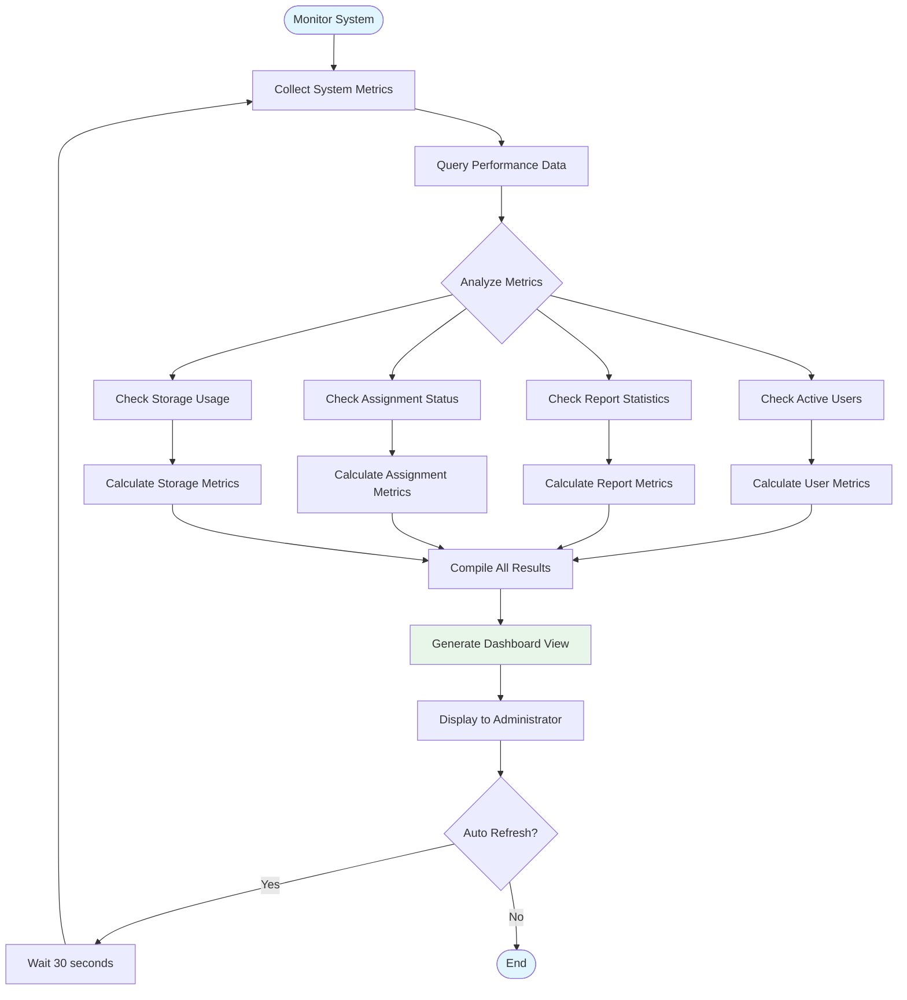

---

## 6. System Processes

### 6.1 Report Lifecycle
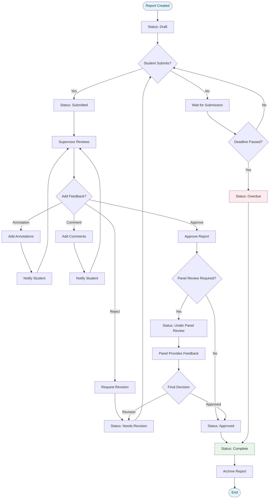

### 6.2 Notification Flow
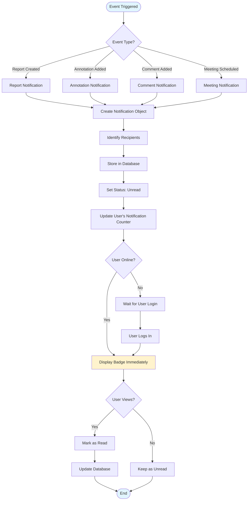

### 6.3 File Upload Process
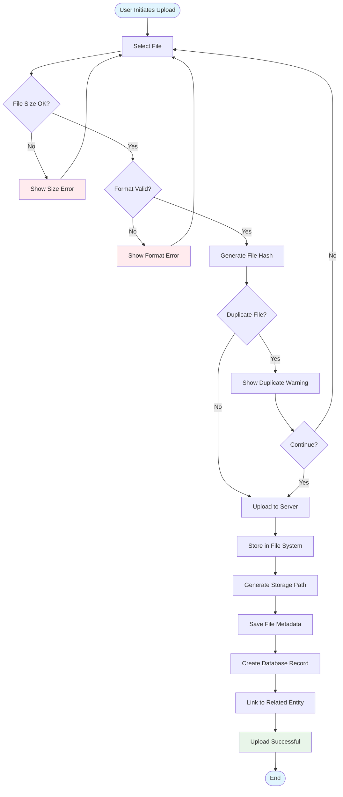

---

## Activity Diagram Notation Guide

### Symbols Used
- **Rounded Rectangle**: Start/End points
- **Rectangle**: Activities/Actions
- **Diamond**: Decision points
- **Arrows**: Flow direction
- **Parallel Bars**: Concurrent activities (fork/join)

### Color Coding
- 🔵 Light Blue: Start/End states
- 🟢 Light Green: Success states
- 🔴 Light Red: Error states
- 🟡 Light Yellow: Warning/Notification states

---

## System Activity Summary

### Core Workflows
1. **Authentication**: Multi-path authentication based on user type
2. **Report Management**: Complete lifecycle from creation to archival
3. **Group Management**: Formation and supervisor assignment
4. **Notification System**: Event-driven notification delivery
5. **File Management**: Secure upload and storage process
6. **Data Synchronization**: External API integration workflow

### Key Decision Points
- User type identification during login
- Assignment strategy selection for supervisor lottery
- Report approval/rejection decisions
- File validation checks
- Notification delivery timing

### Parallel Processes
- Multiple students can submit reports simultaneously
- Supervisors can manage multiple groups concurrently
- System can process multiple API synchronizations
- Notifications are processed asynchronously

---

## Notes
These activity diagrams follow IEEE standards for software documentation and UML 2.5 specifications. They represent the logical flow of activities within the Thesis Repository Management System, focusing on business logic rather than technical implementation details. The diagrams are suitable for inclusion in academic project reports and technical documentation.