# Data Flow Diagram - Level 0
## University Thesis Management System
### Academic Version for IEEE Documentation

---

## Document Information

- **Document Type**: Data Flow Diagram - Context Level (Level 0)
- **Version**: 1.0
- **Date**: January 2025
- **Purpose**: Academic documentation for IEEE standards
- **Audience**: Academic reviewers, stakeholders, and system evaluators

---

## Table of Contents

1. [Introduction](#1-introduction)
2. [System Overview](#2-system-overview)
3. [External Entities](#3-external-entities)
4. [Data Flow Specification](#4-data-flow-specification)
5. [Level 0 DFD Diagram](#5-level-0-dfd-diagram)
6. [Data Flow Descriptions](#6-data-flow-descriptions)
7. [System Boundaries](#7-system-boundaries)

---

## 1. Introduction

### 1.1 Purpose

This document presents the Level 0 Data Flow Diagram (Context Diagram) for the University Thesis Management System. The Level 0 DFD provides a high-level view of the system, showing the system as a single process and its interactions with external entities through data flows.

### 1.2 Scope

The Level 0 DFD illustrates:
- All external entities interacting with the system
- Major data flows between external entities and the system
- System boundaries and interfaces
- High-level system inputs and outputs

### 1.3 DFD Notation Standards

This diagram follows IEEE and structured analysis standards:
- **External Entities**: Represented as rectangles (sources/destinations of data)
- **Process**: Single circle representing the entire system
- **Data Flows**: Arrows showing direction of data movement
- **Data Stores**: Not shown at Level 0 (internal to the system)

---

## 2. System Overview

The University Thesis Management System is a centralized platform for managing thesis supervision, report submissions, feedback distribution, and administrative oversight. The system facilitates collaboration between students, supervisors, co-supervisors, panel members, advisors, and administrators while integrating with external university information systems.

### 2.1 System Boundary

The system boundary encompasses:
- User authentication and authorization
- Report submission and management
- Annotation and feedback mechanisms
- Group formation and student assignment
- Supervisor assignment algorithms
- Meeting documentation
- Administrative functions
- Notification services

### 2.2 External Interfaces

The system interfaces with:
- Seven user role types (students, supervisors, co-supervisors, panel members, advisors, administrators, teachers)
- University API for data synchronization

---

## 3. External Entities

### 3.1 External Entity Descriptions

| Entity ID | Entity Name | Description | Role in System |
|-----------|-------------|-------------|----------------|
| E1 | Student | Thesis/project students | Submits reports, receives feedback, views annotations |
| E2 | Supervisor | Primary thesis supervisors | Creates reports, provides annotations, manages meetings, approves submissions |
| E3 | Co-Supervisor | Secondary supervisors | Provides feedback, optional meeting management |
| E4 | Panel Member | Evaluation reviewers | Evaluates reports, provides assessment feedback |
| E5 | Advisor | Batch coordinators | Forms groups, assigns students, allocates supervisors |
| E6 | Administrator | System administrators | Manages configurations, assigns roles, manages research areas |
| E7 | Teacher | Multi-role faculty | Switches between supervisor, co-supervisor, and panel member roles |
| E8 | University API | External information system | Provides student data, teacher data, batch information |

---

## 4. Data Flow Specification

### 4.1 Input Data Flows

| Flow ID | Flow Name | Source Entity | Description | Data Elements |
|---------|-----------|---------------|-------------|---------------|
| DF1 | Student Credentials | Student (E1) | Login credentials for authentication | Username, Password |
| DF2 | Report Submission | Student (E1) | Thesis report document upload | Report File (PDF/PPT), Metadata |
| DF3 | Supervisor Credentials | Supervisor (E2) | Login credentials for authentication | Username, Password |
| DF4 | Report Assignment | Supervisor (E2) | New report assignment for groups | Report Title, Description, Deadline, Group ID |
| DF5 | Annotations | Supervisor (E2) | PDF annotations and feedback | Annotation Data, Comments, Highlights |
| DF6 | Meeting Details | Supervisor (E2) | Meeting documentation | Date, Time, Attendees, Agenda, Minutes |
| DF7 | Co-Supervisor Credentials | Co-Supervisor (E3) | Login credentials for authentication | Username, Password |
| DF8 | Co-Supervisor Feedback | Co-Supervisor (E3) | Secondary review feedback | Annotations, Comments |
| DF9 | Panel Member Credentials | Panel Member (E4) | Login credentials for authentication | Username, Password |
| DF10 | Evaluation Feedback | Panel Member (E4) | Assessment and evaluation | Annotations, Comments, Review Status |
| DF11 | Advisor Credentials | Advisor (E5) | Login credentials for authentication | Username, Password |
| DF12 | Group Formation Data | Advisor (E5) | Student group assignments | Student IDs, Group Names |
| DF13 | Supervisor Assignment Request | Advisor (E5) | Supervisor allocation request | Group IDs, Assignment Strategy |
| DF14 | Administrator Credentials | Administrator (E6) | Login credentials for authentication | Username, Password |
| DF15 | Role Assignments | Administrator (E6) | Co-supervisor and panel member assignments | User IDs, Group IDs, Role Type |
| DF16 | Research Area Data | Administrator (E6) | Research area management | Area Name, Description |
| DF17 | Teacher Credentials | Teacher (E7) | Login credentials for authentication | Username, Password |
| DF18 | Role Selection | Teacher (E7) | Role switching request | Selected Role Type |
| DF19 | Student Data | University API (E8) | Student information from university | Student Records, Batch Info, Advisor Info |
| DF20 | Teacher Data | University API (E8) | Teacher information from university | Teacher Records, Designation, Expertise |

### 4.2 Output Data Flows

| Flow ID | Flow Name | Destination Entity | Description | Data Elements |
|---------|-----------|-------------------|-------------|---------------|
| DF21 | Authentication Status | Student (E1) | Login success/failure response | Session Token, User Profile, Permissions |
| DF22 | Submission Confirmation | Student (E1) | Report upload confirmation | Submission ID, Timestamp, Status |
| DF23 | Feedback Notifications | Student (E1) | Notification of available feedback | Notification ID, Type, Timestamp, Reviewer Role |
| DF24 | Annotated Documents | Student (E1) | Annotated reports with feedback | PDF with Annotations, Version History, Reviewer Info |
| DF25 | Dashboard Data | Student (E1) | Student dashboard information | Reports, Notifications, Deadlines |
| DF26 | Authentication Status | Supervisor (E2) | Login success/failure response | Session Token, User Profile, Permissions |
| DF27 | Assignment Confirmation | Supervisor (E2) | Report assignment confirmation | Assignment ID, Student List, Status |
| DF28 | Annotation Status | Supervisor (E2) | Annotation save/send confirmation | Session ID, Status, Timestamp |
| DF29 | Meeting Report | Supervisor (E2) | Generated meeting report | PDF Report, Meeting History |
| DF30 | Supervisor Dashboard | Supervisor (E2) | Supervisor dashboard information | Groups, Reports, Meetings |
| DF31 | Authentication Status | Co-Supervisor (E3) | Login success/failure response | Session Token, User Profile, Permissions |
| DF32 | Feedback Status | Co-Supervisor (E3) | Feedback submission confirmation | Session ID, Status, Timestamp |
| DF33 | Co-Supervisor Dashboard | Co-Supervisor (E3) | Co-supervisor dashboard information | Assigned Groups, Reports, Permissions |
| DF34 | Authentication Status | Panel Member (E4) | Login success/failure response | Session Token, User Profile, Permissions |
| DF35 | Evaluation Status | Panel Member (E4) | Evaluation submission confirmation | Review ID, Status, Timestamp |
| DF36 | Panel Member Dashboard | Panel Member (E4) | Panel member dashboard information | Assigned Groups, Reports |
| DF37 | Authentication Status | Advisor (E5) | Login success/failure response | Session Token, User Profile, Permissions |
| DF38 | Group Formation Status | Advisor (E5) | Group creation confirmation | Group IDs, Student Assignments |
| DF39 | Assignment Results | Advisor (E5) | Supervisor assignment results | Assignment Statistics, Group-Supervisor Mapping |
| DF40 | Advisor Dashboard | Advisor (E5) | Advisor dashboard information | Batches, Groups, Students |
| DF41 | Authentication Status | Administrator (E6) | Login success/failure response | Session Token, User Profile, Permissions |
| DF42 | Assignment Confirmation | Administrator (E6) | Role assignment confirmation | Assignment ID, Status |
| DF43 | Management Status | Administrator (E6) | Research area operation status | Operation Result, Updated List |
| DF44 | Administrator Dashboard | Administrator (E6) | Administrator dashboard information | System Statistics, User Management |
| DF45 | Authentication Status | Teacher (E7) | Login success/failure response | Session Token, User Profile, Permissions |
| DF46 | Role Dashboard | Teacher (E7) | Role-specific dashboard | Dashboard based on selected role |
| DF47 | Data Synchronization Request | University API (E8) | Request for updated data | Request Type, Parameters |

---

## 5. Level 0 DFD Diagram

### 5.1 Context Diagram

```mermaid
graph TB
    %% External Entities
    Student[("Student<br/>(E1)")]
    Supervisor[("Supervisor<br/>(E2)")]
    CoSupervisor[("Co-Supervisor<br/>(E3)")]
    PanelMember[("Panel Member<br/>(E4)")]
    Advisor[("Advisor<br/>(E5)")]
    Administrator[("Administrator<br/>(E6)")]
    Teacher[("Teacher<br/>(E7)")]
    UniversityAPI[("University API<br/>(E8)")]
    
    %% Central System Process
    System(("Thesis Repository<br/>Management<br/>System<br/>(Process 0)"))
    
    %% Student Data Flows
    Student -->|"DF1: Student Credentials"| System
    Student -->|"DF2: Report Submission"| System
    System -->|"DF21: Authentication Status"| Student
    System -->|"DF22: Submission Confirmation"| Student
    System -->|"DF23: Feedback Notifications"| Student
    System -->|"DF24: Annotated Documents"| Student
    System -->|"DF25: Dashboard Data"| Student
    
    %% Supervisor Data Flows
    Supervisor -->|"DF3: Supervisor Credentials"| System
    Supervisor -->|"DF4: Report Assignment"| System
    Supervisor -->|"DF5: Annotations"| System
    Supervisor -->|"DF6: Meeting Details"| System
    System -->|"DF26: Authentication Status"| Supervisor
    System -->|"DF27: Assignment Confirmation"| Supervisor
    System -->|"DF28: Annotation Status"| Supervisor
    System -->|"DF29: Meeting Report"| Supervisor
    System -->|"DF30: Supervisor Dashboard"| Supervisor
    
    %% Co-Supervisor Data Flows
    CoSupervisor -->|"DF7: Co-Supervisor Credentials"| System
    CoSupervisor -->|"DF8: Co-Supervisor Feedback"| System
    System -->|"DF31: Authentication Status"| CoSupervisor
    System -->|"DF32: Feedback Status"| CoSupervisor
    System -->|"DF33: Co-Supervisor Dashboard"| CoSupervisor
    
    %% Panel Member Data Flows
    PanelMember -->|"DF9: Panel Member Credentials"| System
    PanelMember -->|"DF10: Evaluation Feedback"| System
    System -->|"DF34: Authentication Status"| PanelMember
    System -->|"DF35: Evaluation Status"| PanelMember
    System -->|"DF36: Panel Member Dashboard"| PanelMember
    
    %% Advisor Data Flows
    Advisor -->|"DF11: Advisor Credentials"| System
    Advisor -->|"DF12: Group Formation Data"| System
    Advisor -->|"DF13: Supervisor Assignment Request"| System
    System -->|"DF37: Authentication Status"| Advisor
    System -->|"DF38: Group Formation Status"| Advisor
    System -->|"DF39: Assignment Results"| Advisor
    System -->|"DF40: Advisor Dashboard"| Advisor
    
    %% Administrator Data Flows
    Administrator -->|"DF14: Administrator Credentials"| System
    Administrator -->|"DF15: Role Assignments"| System
    Administrator -->|"DF16: Research Area Data"| System
    System -->|"DF41: Authentication Status"| Administrator
    System -->|"DF42: Assignment Confirmation"| Administrator
    System -->|"DF43: Management Status"| Administrator
    System -->|"DF44: Administrator Dashboard"| Administrator
    
    %% Teacher Data Flows
    Teacher -->|"DF17: Teacher Credentials"| System
    Teacher -->|"DF18: Role Selection"| System
    System -->|"DF45: Authentication Status"| Teacher
    System -->|"DF46: Role Dashboard"| Teacher
    
    %% University API Data Flows
    UniversityAPI -->|"DF19: Student Data"| System
    UniversityAPI -->|"DF20: Teacher Data"| System
    System -->|"DF47: Data Synchronization Request"| UniversityAPI
    
    %% Styling
    classDef entityStyle fill:#e1f5ff,stroke:#01579b,stroke-width:2px,color:#000
    classDef processStyle fill:#fff9c4,stroke:#f57f17,stroke-width:3px,color:#000
    
    class Student,Supervisor,CoSupervisor,PanelMember,Advisor,Administrator,Teacher,UniversityAPI entityStyle
    class System processStyle
```

**Figure 5.1:** Level 0 Data Flow Diagram (Context Diagram) showing the University Thesis Management System and its interactions with external entities

---

## 6. Data Flow Descriptions

### 6.1 Student Interactions

The student entity interacts with the system through:
- **Authentication**: Submits credentials and receives authentication status
- **Report Submission**: Uploads thesis reports and receives confirmation
- **Feedback Access**: Receives notifications and views annotated documents
- **Dashboard Access**: Views personalized dashboard with reports and notifications

### 6.2 Supervisor Interactions

The supervisor entity interacts with the system through:
- **Authentication**: Submits credentials and receives authentication status
- **Report Management**: Creates report assignments and receives confirmation
- **Annotation Process**: Provides feedback through annotations and receives status updates
- **Meeting Documentation**: Records meeting details and generates reports
- **Dashboard Access**: Views supervised groups, reports, and meetings

### 6.3 Co-Supervisor Interactions

The co-supervisor entity interacts with the system through:
- **Authentication**: Submits credentials and receives authentication status
- **Feedback Provision**: Provides secondary review feedback and receives status
- **Dashboard Access**: Views assigned groups and reports with permission-based access

### 6.4 Panel Member Interactions

The panel member entity interacts with the system through:
- **Authentication**: Submits credentials and receives authentication status
- **Evaluation Process**: Provides assessment feedback and receives status
- **Dashboard Access**: Views assigned groups and reports for evaluation

### 6.5 Advisor Interactions

The advisor entity interacts with the system through:
- **Authentication**: Submits credentials and receives authentication status
- **Group Formation**: Creates groups and assigns students, receives confirmation
- **Supervisor Assignment**: Requests supervisor allocation and receives results
- **Dashboard Access**: Views batches, groups, and student assignments

### 6.6 Administrator Interactions

The administrator entity interacts with the system through:
- **Authentication**: Submits credentials and receives authentication status
- **Role Management**: Assigns co-supervisors and panel members, receives confirmation
- **Research Area Management**: Creates, updates, and deletes research areas
- **Dashboard Access**: Views system statistics and user management information

### 6.7 Teacher Interactions

The teacher entity interacts with the system through:
- **Authentication**: Submits credentials and receives authentication status
- **Role Switching**: Selects active role and receives role-specific dashboard
- **Multi-Role Access**: Accesses different dashboards based on selected role

### 6.8 University API Interactions

The University API interacts with the system through:
- **Data Provision**: Provides student and teacher data for synchronization
- **Data Requests**: Receives synchronization requests from the system

---

## 7. System Boundaries

### 7.1 Internal System Functions

The following functions are internal to the system (not shown at Level 0):
- Data storage and retrieval
- Business logic processing
- Notification generation
- Report processing
- Annotation management
- Assignment algorithms
- Permission management
- Session management

### 7.2 External Dependencies

The system depends on:
- **University API**: For student and teacher data synchronization
- **User Authentication**: External entities must provide valid credentials
- **File Uploads**: Students and supervisors must provide valid document formats

### 7.3 Data Flow Constraints

- All authentication flows require valid credentials
- Report submissions must be in PDF or PPT format
- Annotations can only be created by authorized reviewers
- Supervisor assignments follow algorithmic or manual processes
- Role assignments are restricted to administrators
- Data synchronization occurs periodically with University API

---

## 8. Summary

### 8.1 Key Characteristics

The Level 0 DFD demonstrates:
1. **Seven user role types** interacting with the system
2. **One external system** (University API) for data synchronization
3. **47 distinct data flows** (20 inputs, 27 outputs)
4. **Single system process** representing the entire application
5. **Clear system boundaries** separating internal and external components

### 8.2 System Complexity

The context diagram reveals:
- **High user diversity**: Seven different user roles with distinct responsibilities
- **Bidirectional communication**: All user entities have two-way data flows
- **External integration**: University API provides critical data synchronization
- **Role-based outputs**: Different dashboard and status information per role
- **Collaborative nature**: Multiple reviewers can interact with the same reports

### 8.3 Next Steps

For detailed system analysis:
- **Level 1 DFD**: Decompose Process 0 into major subsystems
- **Level 2 DFD**: Further decompose subsystems into detailed processes
- **Data Dictionary**: Define all data elements and structures
- **Process Specifications**: Detail the logic for each process

---

## Notes

This Level 0 Data Flow Diagram follows IEEE standards for structured analysis and design. The diagram provides a high-level view of the system's interactions with external entities, establishing the foundation for more detailed analysis in subsequent DFD levels.

### Document Conventions

- **External Entities**: Shown as rounded rectangles with entity IDs
- **Process**: Shown as a circle representing the entire system
- **Data Flows**: Shown as labeled arrows with flow IDs
- **Naming**: Descriptive names following academic conventions
- **Numbering**: Sequential numbering for traceability

### References

- IEEE Std 1016-2009: IEEE Standard for Information Technology—Systems Design—Software Design Descriptions
- Yourdon, E., & Constantine, L. L. (1979). Structured Design: Fundamentals of a Discipline of Computer Program and Systems Design
- DeMarco, T. (1979). Structured Analysis and System Specification

---

**Document Version**: 1.0  
**Last Updated**: January 2025  
**Status**: Final  
**Approved For**: Academic Documentation and IEEE Review
