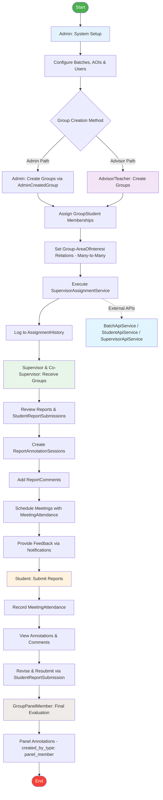

# System Overview Activity Diagram

## Description
This diagram shows the high-level workflow of the thesis management system, accurately reflecting the models and services in the codebase.

## Key Actors
- **Admin**: System configuration, batch management, and user management
- **Advisor/Teacher**: Group creation and supervisor assignment
- **Supervisor & Co-Supervisor**: Report review and feedback
- **Student**: Report submission via StudentReportSubmission model
- **GroupPanelMember**: Final evaluation with panel-specific annotations

## Key Models & Services
- **Models**: User, Batch, AreaOfInterest, Group, GroupStudent, AdminCreatedGroup, Supervisor, Report, StudentReportSubmission, ReportAnnotationSession, ReportComment, Meeting, MeetingAttendance, GroupPanelMember, AssignmentHistory
- **Services**: SupervisorAssignmentService, BatchApiService, StudentApiService, SupervisorApiService
- **Notifications**: NewReportAssigned, NewReportAnnotation, NewReportComment, ReportUpdated