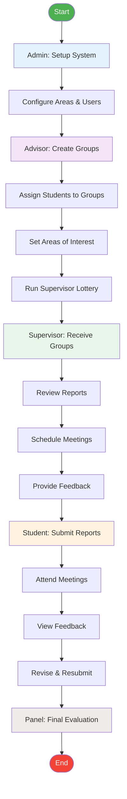

# System Overview Activity Diagram

## Description
This diagram shows the high-level workflow of the thesis management system, displaying how different actors interact throughout the thesis process.

## Key Actors
- **Admin**: System configuration and user management
- **Advisor**: Group creation and supervisor assignment
- **Supervisor**: Report review and feedback
- **Student**: Report submission and revision
- **Panel**: Final evaluation