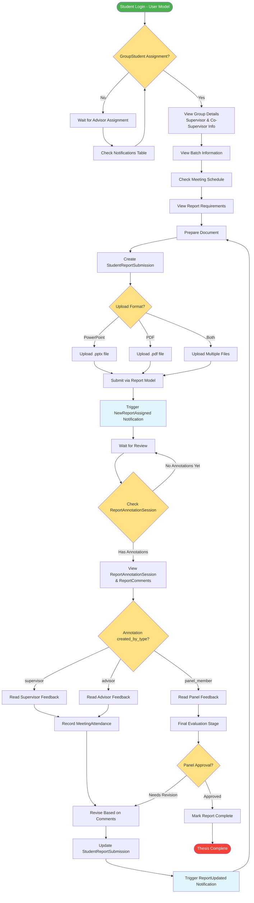

# Student Journey Activity Diagram

## Description
This diagram illustrates the complete student journey accurately reflecting the database models and notification system.

## Key Models Used
- **User**: Student authentication and profile
- **GroupStudent**: Student-group membership
- **Group**: Group information with supervisor assignments
- **Batch**: Academic batch/year information
- **Report**: Main report entity
- **StudentReportSubmission**: Individual submission tracking
- **ReportAnnotationSession**: Annotation sessions with created_by_type
- **ReportComment**: Specific feedback comments
- **Meeting & MeetingAttendance**: Meeting tracking
- **Notifications**: NewReportAssigned, ReportUpdated, NewReportComment, NewReportAnnotation

## Key Decision Points
- **GroupStudent Assignment**: Students must be in GroupStudent table to proceed
- **Upload Format**: Flexible file format support
- **Annotation Source**: Different feedback paths based on created_by_type (supervisor/advisor/panel_member)
- **Panel Approval**: Final evaluation by GroupPanelMember

## Revision Cycle
Students iterate through StudentReportSubmission updates based on ReportAnnotationSession feedback until panel approval.