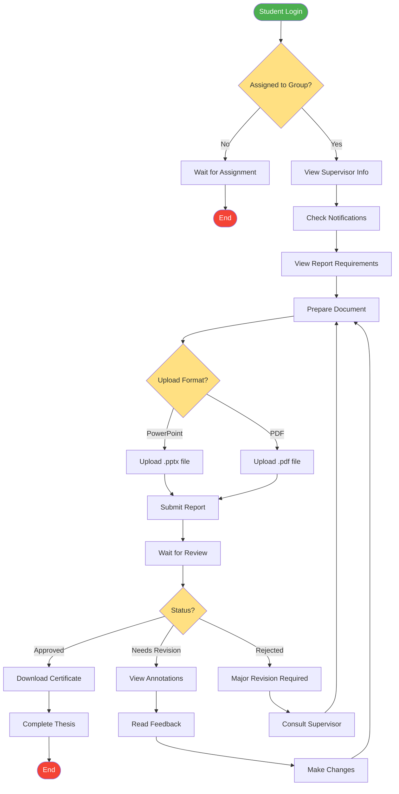

# Student Journey Activity Diagram

## Description
This diagram illustrates the complete student journey from login to thesis completion, including the submission and revision cycle.

## Key Decision Points
- **Group Assignment**: Students must be assigned to a group to proceed
- **Upload Format**: Choice between PowerPoint and PDF
- **Review Status**: Approved, Needs Revision, or Rejected

## Revision Cycle
Students may go through multiple revision cycles based on supervisor feedback until the report is approved.