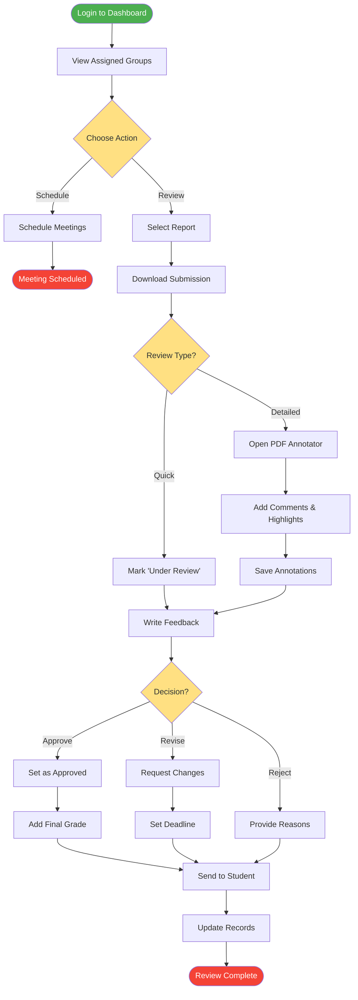

# Supervisor Review Process

## Description
This diagram shows the supervisor's report review workflow, including annotation capabilities and feedback mechanisms.

## Review Types
- **Quick Review**: Mark as under review for later detailed assessment
- **Detailed Review**: Full annotation with PDF tools

## Decision Options
- **Approve**: Accept the report with final grade
- **Revise**: Request specific changes with deadline
- **Reject**: Major issues requiring complete rework