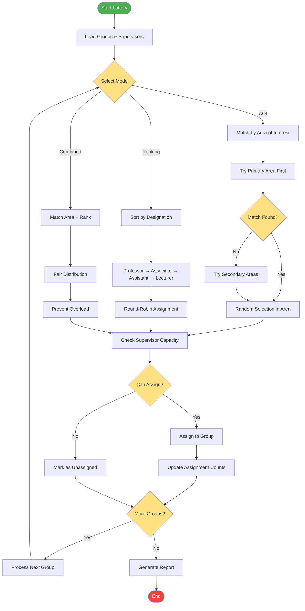

# Supervisor Lottery Assignment Algorithm

## Description
The lottery algorithm for automatic supervisor assignment with three different modes.

## Assignment Modes

### AOI Matching
- Matches groups to supervisors by area of interest
- Tries primary area first, then secondary areas
- Random selection within matching supervisors

### Rank Priority
- Assigns based on academic rank
- Round-robin to ensure fair distribution
- Ignores area of interest

### Combined Mode
- Considers both area and rank
- Ensures fair load distribution
- Prevents senior faculty overload