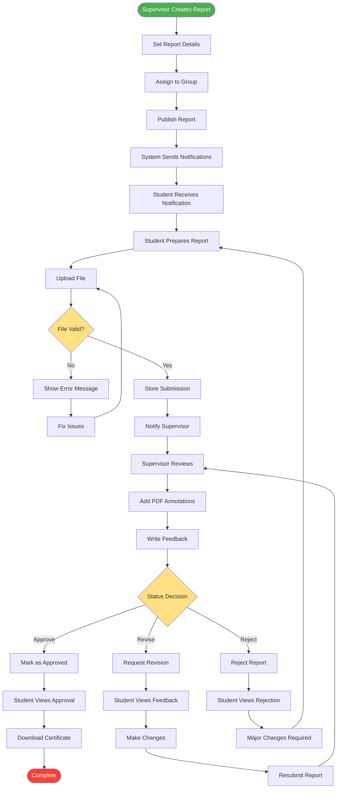

# Report Submission Lifecycle

## Description
Complete lifecycle of report submission from creation to final approval.

## Key Stages
1. **Creation**: Supervisor creates and assigns report
2. **Submission**: Student uploads report
3. **Review**: Supervisor reviews and annotates
4. **Decision**: Approve, Revise, or Reject
5. **Revision**: Iterative improvement cycle

## Status Options
- **Approved**: Report accepted, certificate issued
- **Needs Revision**: Minor changes required
- **Rejected**: Major rework needed