# Report Submission Lifecycle

```mermaid
flowchart TD
    Start([Report Creation]) --> CreateReport[Create Report Model Instance]
    CreateReport --> SetGroup[Link to Group Model]
    SetGroup --> SetRequirements[Define Requirements & Deadline]
    SetRequirements --> Publish[Publish Report Status]
    
    Publish --> TriggerNotif[Trigger NewReportAssigned Notification]
    TriggerNotif --> StudentReceive[Students in GroupStudent Receive Notification]
    
    StudentReceive --> PrepareSubmission[Student Prepares Document]
    PrepareSubmission --> CreateSubmission[Create StudentReportSubmission Entry]
    CreateSubmission --> UploadFile[Upload File to Storage]
    UploadFile --> Validation{Validate File & Size}
    
    Validation -->|Invalid| ShowError[Return Validation Error]
    ShowError --> FixIssues[Student Fixes Issues]
    FixIssues --> UploadFile
    
    Validation -->|Valid| StoreSubmission[Save StudentReportSubmission]
    StoreSubmission --> UpdateReport[Update Report Status]
    UpdateReport --> NotifySupervisor[Send Notification to Supervisor]
    
    NotifySupervisor --> SupervisorReview[Supervisor Opens Report]
    SupervisorReview --> CreateAnnotationSession["Create ReportAnnotationSession<br/>(created_by_type: supervisor)"]
    CreateAnnotationSession --> AddAnnotations[Add PDF Annotations]
    AddAnnotations --> CreateComments[Create ReportComment Entries]
    
    CreateComments --> CheckCoSupervisor{Co-Supervisor Review?}
    CheckCoSupervisor -->|Yes| CoSupervisorAnnotation["Create ReportAnnotationSession<br/>(created_by_type: supervisor)"]
    CheckCoSupervisor -->|No| ProceedDecision
    CoSupervisorAnnotation --> ProceedDecision
    
    ProceedDecision[Proceed to Decision] --> StatusDecision{Review Decision}
    
    StatusDecision -->|Needs Revision| RequestRevision["Update Report Status: revision_required"]
    RequestRevision --> SendRevisionNotif[Trigger NewReportComment Notification]
    SendRevisionNotif --> StudentViewAnnotations[Student Views ReportAnnotationSession]
    StudentViewAnnotations --> ReadComments[Read ReportComments]
    ReadComments --> MakeChanges[Revise Based on Feedback]
    MakeChanges --> UpdateSubmission[Update StudentReportSubmission]
    UpdateSubmission --> TriggerUpdateNotif[Trigger ReportUpdated Notification]
    TriggerUpdateNotif --> SupervisorReview
    
    StatusDecision -->|Panel Review| AssignPanel[Assign GroupPanelMember]
    AssignPanel --> PanelAnnotation["Create ReportAnnotationSession<br/>(created_by_type: panel_member)"]
    PanelAnnotation --> PanelComments[Panel ReportComments]
    PanelComments --> PanelDecision{Panel Decision}
    
    PanelDecision -->|Approved| MarkApproved["Update Report Status: approved"]
    PanelDecision -->|Needs Changes| RequestRevision
    
    MarkApproved --> RecordMeeting[Create Meeting Entry]
    RecordMeeting --> RecordAttendance[Log MeetingAttendance]
    RecordAttendance --> FinalizeReport[Finalize Report]
    FinalizeReport --> End([Report Complete])
    
    StatusDecision -->|Major Issues| RejectReport["Update Report Status: rejected"]
    RejectReport --> NotifyRejection[Send Rejection Notification]
    NotifyRejection --> ConsultMeeting[Schedule Consultation Meeting]
    ConsultMeeting --> MajorRevision[Major Revision Required]
    MajorRevision --> PrepareSubmission
    
    style Start fill:#4CAF50,color:#fff
    style End fill:#f44336,color:#fff
    style Validation fill:#FFE082
    style StatusDecision fill:#FFE082
    style PanelDecision fill:#FFE082
    style CheckCoSupervisor fill:#FFE082
    style TriggerNotif fill:#E1F5FE
    style SendRevisionNotif fill:#E1F5FE
    style TriggerUpdateNotif fill:#E1F5FE
```

## Description
Complete lifecycle of report submission accurately reflecting the Report, StudentReportSubmission, ReportAnnotationSession, and ReportComment models.

## Key Models
- **Report**: Main report entity with status tracking
- **StudentReportSubmission**: Individual student submissions
- **ReportAnnotationSession**: Annotation sessions with created_by_type field
- **ReportComment**: Specific feedback comments
- **GroupPanelMember**: Panel members for final evaluation
- **Meeting & MeetingAttendance**: Meeting tracking for consultations

## Annotation Types (created_by_type)
- **supervisor**: Primary supervisor annotations
- **advisor**: Advisor review annotations  
- **panel_member**: Panel evaluation annotations

## Report Status Flow
1. **draft**: Initial creation
2. **published**: Available for submission
3. **submitted**: Student has submitted
4. **under_review**: Being reviewed
5. **revision_required**: Needs changes
6. **panel_review**: Under panel evaluation
7. **approved**: Final approval
8. **rejected**: Major issues requiring restart

## Notification Triggers
- **NewReportAssigned**: When report is published
- **NewReportComment**: When comments are added
- **NewReportAnnotation**: When annotations are created
- **ReportUpdated**: When submission is updated