# Admin System Management

```mermaid
flowchart TD
    Start([Admin Login]) --> Dashboard[Access Admin Dashboard]
    Dashboard --> Operations{Select Operation}
    
    Operations -->|Areas| ManageAOI[Manage Areas of Interest]
    ManageAOI --> AOIActions{Action?}
    AOIActions -->|Create| CreateArea[Create New Area]
    AOIActions -->|Edit| EditArea[Edit Existing]
    AOIActions -->|Delete| DeleteArea[Delete Area]
    AOIActions -->|Bulk| BulkImport[Bulk Import Areas]
    
    Operations -->|Supervisors| ManageSup[Manage Supervisors]
    ManageSup --> SupActions{Action?}
    SupActions -->|Sync| SyncAPI[Sync from API]
    SupActions -->|Edit| EditSup[Edit Details]
    SupActions -->|Limits| SetLimits[Set Thesis Limits]
    SupActions -->|Areas| AssignAreas[Assign Areas]
    
    Operations -->|Batches| ManageBatch[Manage Batches]
    ManageBatch --> BatchActions{Action?}
    BatchActions -->|Sync| SyncBatches[Sync from API]
    BatchActions -->|Toggle| ToggleStatus[Activate/Deactivate]
    BatchActions -->|Edit| EditBatch[Edit Details]
    
    Operations -->|Groups| ManageGroups[Manage Groups]
    ManageGroups --> GroupActions{Action?}
    GroupActions -->|Create| CreateGroup[Create Group]
    GroupActions -->|Assign| AssignMembers[Assign Students/Supervisors]
    GroupActions -->|Delete| DeleteGroup[Delete Group]
    
    Operations -->|Performance| MonitorPerf[Monitor Performance]
    MonitorPerf --> PerfActions{Action?}
    PerfActions -->|Metrics| ViewMetrics[View Metrics]
    PerfActions -->|Health| CheckHealth[System Health]
    PerfActions -->|Cache| ClearCache[Clear Cache]
    PerfActions -->|Export| ExportReport[Export Reports]
    
    CreateArea --> SaveChanges[Save Changes]
    EditArea --> SaveChanges
    DeleteArea --> SaveChanges
    BulkImport --> SaveChanges
    
    SyncAPI --> UpdateDB[Update Database]
    EditSup --> UpdateDB
    SetLimits --> UpdateDB
    AssignAreas --> UpdateDB
    
    SyncBatches --> UpdateDB
    ToggleStatus --> UpdateDB
    EditBatch --> UpdateDB
    
    CreateGroup --> UpdateDB
    AssignMembers --> UpdateDB
    DeleteGroup --> UpdateDB
    
    ViewMetrics --> GenerateReport[Generate Report]
    CheckHealth --> GenerateReport
    ClearCache --> SystemUpdate[System Update]
    ExportReport --> Download[Download File]
    
    SaveChanges --> End([Complete])
    UpdateDB --> End
    GenerateReport --> End
    SystemUpdate --> End
    Download --> End
    
    style Start fill:#4CAF50,color:#fff
    style End fill:#f44336,color:#fff
    style Operations fill:#FFE082
    style AOIActions fill:#FFE082
    style SupActions fill:#FFE082
    style BatchActions fill:#FFE082
    style GroupActions fill:#FFE082
    style PerfActions fill:#FFE082
```

## Description
Administrative operations for system management and configuration.

## Main Operations
- **Areas of Interest**: CRUD operations and bulk import
- **Supervisors**: Sync from API, set limits, assign areas
- **Batches**: Manage student batches
- **Groups**: Create and manage thesis groups
- **Performance**: Monitor system health and metrics