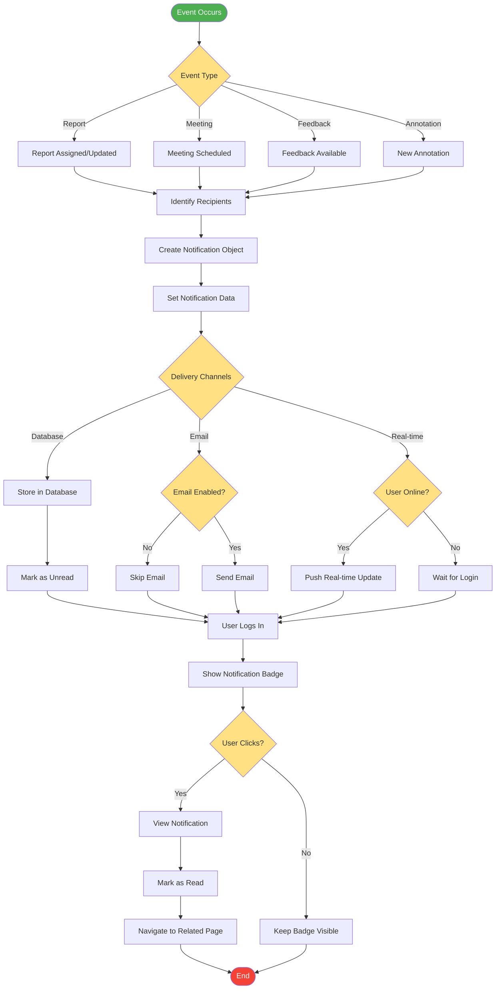

# Notification System Flow

## Description
Multi-channel notification delivery system for various system events.

## Event Types
- **Report Events**: Assignment, status updates
- **Meeting Events**: Scheduling, reminders
- **Feedback Events**: New feedback available
- **Annotation Events**: PDF annotations added

## Delivery Channels
1. **Database**: Persistent storage for all notifications
2. **Email**: Optional email notifications
3. **Real-time**: Instant updates for online users

## User Interaction
- Badge display for unread notifications
- Click to view and mark as read
- Navigation to related content