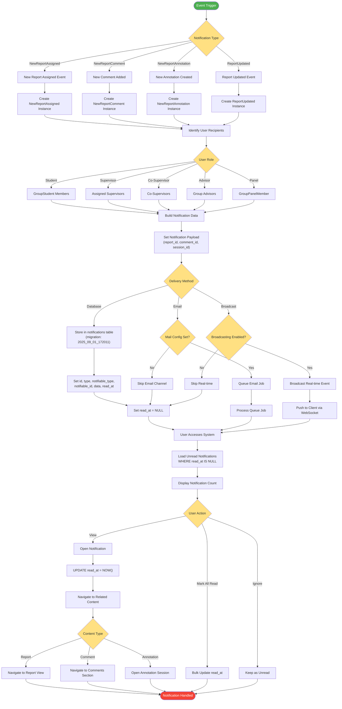

# Notification System Flow

## Description
Notification system flow accurately reflecting the notification classes and database structure.

## Notification Classes (app/Notifications/)
- **NewReportAssigned**: Triggered when report assigned to group
- **NewReportComment**: Triggered when comment added to report
- **NewReportAnnotation**: Triggered when annotation session created
- **ReportUpdated**: Triggered when report submission updated

## Database Structure (notifications table)
- **id**: UUID primary key
- **type**: Notification class name
- **notifiable_type**: Polymorphic model type (User)
- **notifiable_id**: User ID
- **data**: JSON payload with context
- **read_at**: Timestamp when read (NULL if unread)
- **created_at/updated_at**: Timestamps

## Recipient Resolution
- **Students**: Via GroupStudent relationship
- **Supervisors**: Via Group supervisor assignment
- **Co-Supervisors**: Via Group co-supervisor field
- **Advisors**: Via Group advisor relationship
- **Panel Members**: Via GroupPanelMember table

## Delivery Channels
1. **Database**: Always stored in notifications table
2. **Email**: Optional via Laravel mail queue
3. **Broadcast**: Real-time via broadcasting (if configured)

## Notification Lifecycle
1. Event triggers notification creation
2. Recipients identified based on relationships
3. Notification stored with unread status (read_at = NULL)
4. Optional email/broadcast delivery
5. User views and marks as read (updates read_at)
6. Navigation to related content based on payload