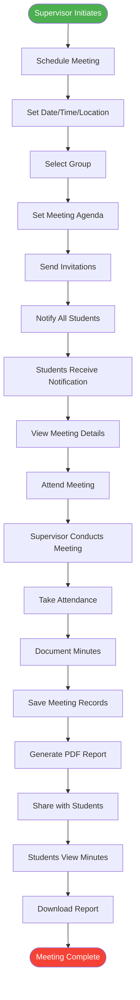

# Meeting Management Workflow

## Description
Complete meeting workflow from scheduling to documentation.

## Key Steps
1. **Scheduling**: Supervisor sets meeting details
2. **Notification**: System notifies all participants
3. **Attendance**: Track who attended
4. **Documentation**: Record meeting minutes
5. **Distribution**: Share minutes with students

## Features
- Automated notifications
- Attendance tracking
- PDF report generation
- Meeting history maintenance