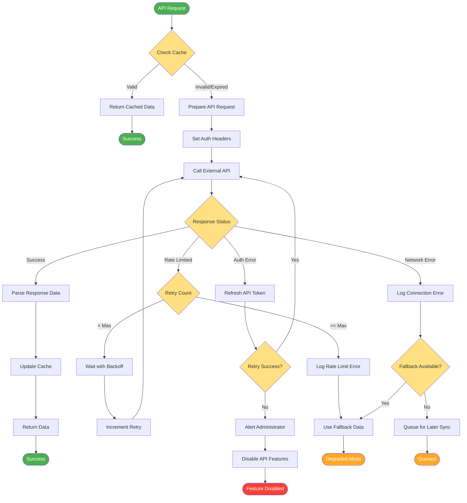

# External API Integration Flow

## Description
External API integration with caching, error handling, and fallback mechanisms.

## API Endpoints
- Student data: `/api/student/{registration}`
- Batch sync: `/api/batches`
- Teacher sync: `/api/teachers`

## Error Handling
- **Rate Limiting**: Exponential backoff retry
- **Auth Errors**: Token refresh mechanism
- **Network Errors**: Fallback to cached data
- **Degraded Mode**: Limited functionality when API unavailable

## Caching Strategy
- Memory cache: 1 minute
- Redis cache: 5 minutes
- Database cache: 1 hour