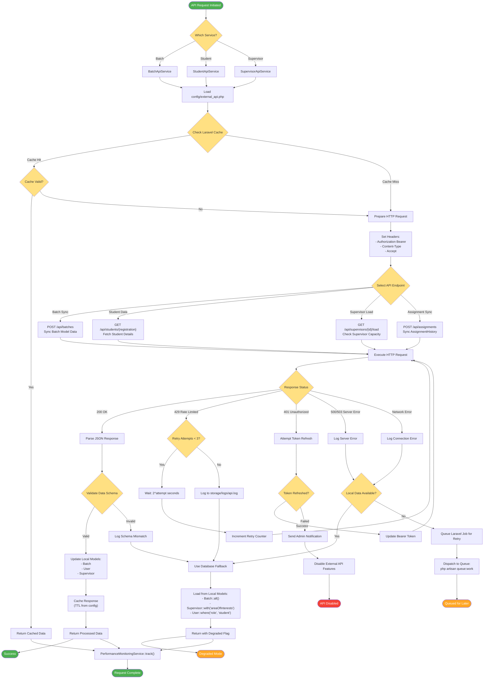

# External API Integration Flow

## Description
External API integration flow showing the three API services and their error handling strategies.

## API Services (app/Services/)
- **BatchApiService**: Synchronizes batch data with external system
- **StudentApiService**: Fetches and validates student information
- **SupervisorApiService**: Manages supervisor load and availability

## Configuration (config/external_api.php)
- Base URL configuration
- Authentication tokens
- Timeout settings
- Cache TTL values
- Retry configuration

## API Endpoints
- **Batch Sync**: `POST /api/batches` - Sync Batch model data
- **Student Data**: `GET /api/students/{registration}` - Fetch student details
- **Supervisor Load**: `GET /api/supervisors/{id}/load` - Check capacity
- **Assignment Sync**: `POST /api/assignments` - Sync AssignmentHistory

## Error Handling Strategies
1. **Rate Limiting (429)**: Exponential backoff with max 3 retries
2. **Auth Errors (401)**: Token refresh with admin notification fallback
3. **Server Errors (500/503)**: Fallback to local database
4. **Network Errors**: Queue for later processing via Laravel jobs

## Caching Strategy
- Laravel Cache facade used
- TTL configured per endpoint in external_api.php
- Cache invalidation on model updates
- Fallback to database when cache unavailable

## Performance Monitoring
- All requests tracked via PerformanceMonitoringService
- Metrics: response time, cache hit rate, error rate
- Degraded mode tracking for SLA monitoring

## Fallback Data Sources
- **Batch**: Local Batch model with relationships
- **Student**: User model with role='student'
- **Supervisor**: Supervisor model with area_of_interests
- **Assignment**: AssignmentHistory model records