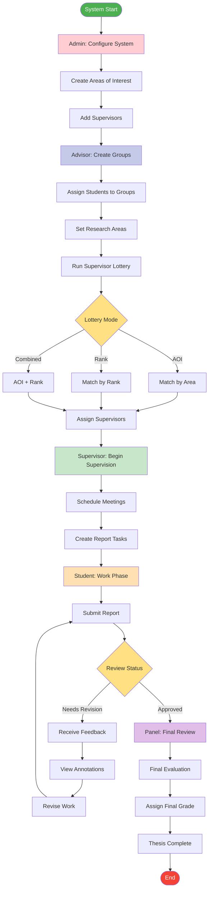

# Complete Thesis Management Flow

## Description
End-to-end thesis management process from system setup to final evaluation.

## Major Phases
1. **Setup Phase**: Admin configures system
2. **Formation Phase**: Advisor creates groups
3. **Assignment Phase**: Lottery-based supervisor assignment
4. **Supervision Phase**: Active thesis supervision
5. **Submission Phase**: Report submission and review
6. **Evaluation Phase**: Final panel evaluation

## Key Features
- Multiple lottery modes for fair assignment
- Iterative review and revision cycle
- Multi-stage evaluation process