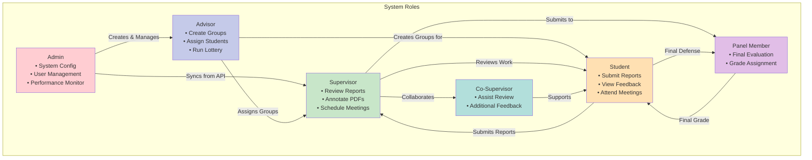

# User Roles and Interactions

## Description
Visual representation of all system roles and their interactions.

## Role Hierarchy
1. **Admin**: System-level management
2. **Advisor**: Group and assignment management
3. **Supervisor**: Primary thesis supervision
4. **Co-Supervisor**: Secondary supervision support
5. **Student**: Thesis work and submission
6. **Panel Member**: Final evaluation

## Key Interactions
- Admin manages all system users
- Advisor bridges admin and academic roles
- Supervisor-Student is the core interaction
- Panel provides final assessment