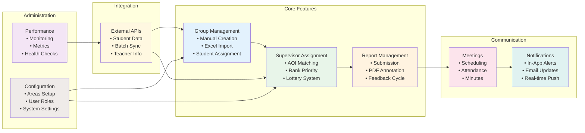

# System Key Features Overview

## Description
Overview of all major system features and their relationships.

## Feature Categories

### Core Features
- **Group Management**: Foundation of thesis organization
- **Supervisor Assignment**: Intelligent matching algorithms
- **Report Management**: Complete submission and review cycle

### Communication
- **Meetings**: Structured supervisor-student interactions
- **Notifications**: Multi-channel alert system

### Integration
- **External APIs**: Seamless data synchronization

### Administration
- **Performance**: System health monitoring
- **Configuration**: Flexible system setup