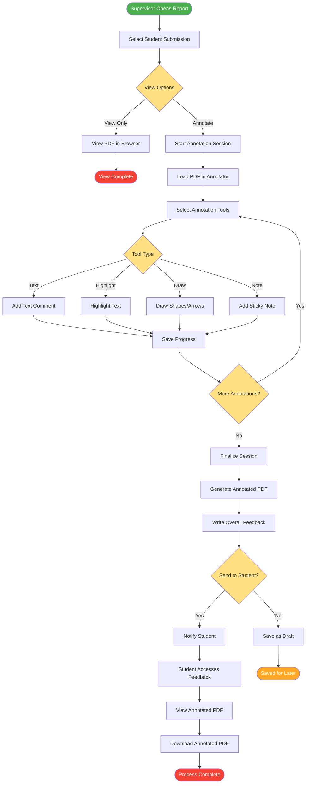

# PDF Annotation Process

## Description
Detailed PDF annotation workflow for report review and feedback.

## Annotation Tools
- **Text Comments**: Add specific feedback on content
- **Highlights**: Mark important sections
- **Drawings**: Visual indicators and corrections
- **Sticky Notes**: Additional context and suggestions

## Process Flow
1. Supervisor selects submission to review
2. Opens PDF in annotation mode
3. Adds various types of annotations
4. Saves progress periodically
5. Finalizes and generates annotated PDF
6. Sends feedback to student
7. Student views and downloads annotated version