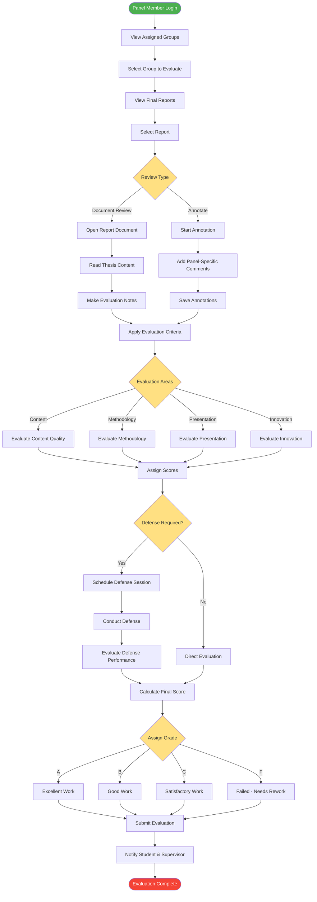

# Panel Member Evaluation Process

## Description
Panel member's evaluation workflow for final thesis assessment.

## Evaluation Process
1. **Document Review**: Read and analyze thesis content
2. **Annotation**: Add panel-specific feedback
3. **Criteria Assessment**: Evaluate multiple aspects
4. **Defense Session**: Optional oral defense
5. **Grade Assignment**: Final grade determination

## Evaluation Criteria
- **Content Quality**: Depth and accuracy of research
- **Methodology**: Research methods appropriateness
- **Presentation**: Document structure and clarity
- **Innovation**: Originality and contribution

## Grading Scale
- **A**: Excellent (90-100%)
- **B**: Good (75-89%)
- **C**: Satisfactory (60-74%)
- **F**: Failed (<60%)