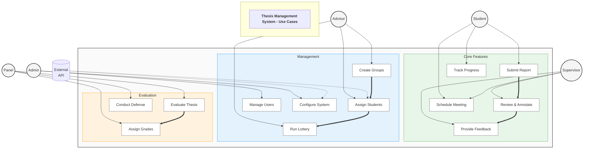

# Use Case Diagram - Best A4 Version



---

## 📋 Use Case Quick Reference

### Primary Actors & Responsibilities

| **Actor** | **Main Functions** | **Access Level** |
|-----------|-------------------|-----------------|
| 👤 **Student** | Submit reports, View feedback, Track progress | Basic User |
| 👨‍🏫 **Supervisor** | Review & annotate, Provide guidance, Schedule meetings | Reviewer |
| 👥 **Advisor** | Create groups, Manage assignments, Run lottery | Manager |
| ⚙️ **Admin** | System configuration, User management, Monitoring | Administrator |
| 📊 **Panel** | Final evaluation, Grade assignment, Defense | Evaluator |

### Core System Workflows

```
1. Report Submission:  Student → Submit → Supervisor → Review → Feedback → Student
2. Group Formation:    Advisor → Create → Assign → Lottery → Supervisor Assignment
3. Final Evaluation:   Supervisor → Finalize → Panel → Evaluate → Grade
```

### Feature Categories

**🟢 Core Features** - Daily operations
- Submit/Review reports
- Annotation & feedback
- Meeting management
- Progress tracking

**🔵 Management** - Administrative tasks
- Group creation
- Student assignment
- Supervisor lottery
- User management

**🟠 Evaluation** - Assessment activities
- Thesis evaluation
- Grade assignment
- Defense conduction

### System Interactions

| From | To | Action |
|------|-----|--------|
| Student | System | Submits reports |
| System | Supervisor | Notifies for review |
| Supervisor | Student | Provides feedback |
| Advisor | System | Configures groups |
| System | API | Syncs data |
| Panel | System | Records grades |

---
*Optimized for A4 printing - Use landscape orientation for best results*