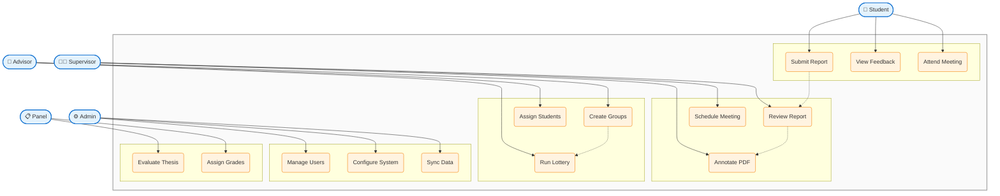

# Use Case Diagram - Compact A4 Version

## Thesis Management System - Core Use Cases

### Actors & Primary Functions

| Actor | Key Responsibilities |
|-------|---------------------|
| **Student** | Submit reports, view feedback, attend meetings |
| **Supervisor** | Review reports, annotate PDFs, schedule meetings |
| **Advisor** | Create groups, run lottery, assign students |
| **Admin** | Manage users, configure system, sync data |
| **Panel** | Evaluate thesis, assign final grades |

### Use Case Categories

**📚 Student Activities**
- Submit Report → Triggers review workflow
- View Feedback → Access annotations and comments
- Attend Meeting → Participate in scheduled sessions

**👨‍🏫 Supervision Activities**
- Review Report → Evaluate submissions
- Annotate PDF → Add detailed feedback
- Schedule Meeting → Organize student meetings

**👥 Group Management**
- Create Groups → Form thesis groups
- Run Lottery → Automated supervisor assignment
- Assign Students → Manual student allocation

**⚙️ Administration**
- Manage Users → User account control
- Configure System → System settings
- Sync Data → External API integration

**📋 Evaluation**
- Evaluate Thesis → Final assessment
- Assign Grades → Grade determination