# Use Case Diagram

```mermaid
graph TB
    %% Actors
    Student([Student])
    Supervisor([Supervisor])
    CoSupervisor([Co-Supervisor])
    Advisor([Advisor])
    Admin([Admin])
    Panel([Panel Member])
    API([External API])
    
    %% Student Use Cases
    subgraph Student_Features[Student Features]
        UC1[Login/Logout]
        UC2[View Dashboard]
        UC3[Submit Report]
        UC4[View Feedback]
        UC5[Download Annotations]
        UC6[Attend Meeting]
        UC7[Track Progress]
    end
    
    %% Supervisor Use Cases
    subgraph Supervisor_Features[Supervision Features]
        UC10[Manage Groups]
        UC11[Review Reports]
        UC12[Annotate PDF]
        UC13[Provide Feedback]
        UC14[Schedule Meeting]
        UC15[Finalize Report]
    end
    
    %% Advisor Use Cases
    subgraph Advisor_Features[Group Formation]
        UC20[Create Groups]
        UC21[Import Excel]
        UC22[Assign Students]
        UC23[Set Areas of Interest]
        UC24[Run Supervisor Lottery]
        UC25[Manual Assignment]
    end
    
    %% Admin Use Cases
    subgraph Admin_Features[Administration]
        UC30[Manage Users]
        UC31[Configure System]
        UC32[Manage Areas]
        UC33[Sync Supervisors]
        UC34[Monitor Performance]
    end
    
    %% Panel Use Cases
    subgraph Panel_Features[Evaluation]
        UC40[Review Final Reports]
        UC41[Evaluate Thesis]
        UC42[Conduct Defense]
        UC43[Assign Grades]
    end
    
    %% Actor connections
    Student --> UC1
    Student --> UC2
    Student --> UC3
    Student --> UC4
    Student --> UC5
    Student --> UC6
    Student --> UC7
    
    Supervisor --> UC10
    Supervisor --> UC11
    Supervisor --> UC12
    Supervisor --> UC13
    Supervisor --> UC14
    Supervisor --> UC15
    
    CoSupervisor --> UC11
    CoSupervisor --> UC12
    CoSupervisor --> UC13
    
    Advisor --> UC20
    Advisor --> UC21
    Advisor --> UC22
    Advisor --> UC23
    Advisor --> UC24
    Advisor --> UC25
    
    Admin --> UC30
    Admin --> UC31
    Admin --> UC32
    Admin --> UC33
    Admin --> UC34
    
    Panel --> UC40
    Panel --> UC41
    Panel --> UC42
    Panel --> UC43
    
    API --> UC33
    API --> UC2
    
    %% Include relationships
    UC3 -.->|includes| UC4
    UC11 -.->|includes| UC12
    UC24 -.->|includes| UC23
    
    %% Extend relationships
    UC21 -.->|extends| UC20
    UC42 -.->|extends| UC41
    
    style Student fill:#FFE0B2
    style Supervisor fill:#C8E6C9
    style CoSupervisor fill:#B2DFDB
    style Advisor fill:#C5CAE9
    style Admin fill:#FFCDD2
    style Panel fill:#E1BEE7
    style API fill:#FFF8E1
```

## Description
This use case diagram illustrates all the functional requirements of the thesis management system, showing the interactions between different actors and system features.

## Actors
1. **Student**: Primary user who submits reports and tracks progress
2. **Supervisor**: Reviews and guides student work
3. **Co-Supervisor**: Assists in supervision
4. **Advisor**: Manages group formation and assignments
5. **Admin**: System administration and configuration
6. **Panel Member**: Final thesis evaluation
7. **External API**: Provides student and teacher data

## Key Use Cases

### Student Features
- Submit and track thesis reports
- View feedback and annotations
- Attend scheduled meetings
- Monitor progress

### Supervision Features
- Review and annotate reports
- Provide feedback
- Schedule meetings
- Finalize reports

### Group Formation
- Create and manage groups
- Import data from Excel
- Run supervisor lottery assignment
- Handle manual assignments

### Administration
- User management
- System configuration
- Performance monitoring
- External data synchronization

### Evaluation
- Final report review
- Thesis evaluation
- Defense conduction
- Grade assignment