# Use Case Diagram - Matrix Layout (A4 Optimized)

```mermaid
graph TB
    subgraph "Thesis Management System Use Cases"
        subgraph "Students"
            S1[Login]
            S2[Submit Report]
            S3[View Feedback]
            S4[Download Annotations]
            S5[Attend Meetings]
            S1 --> S2
            S2 --> S3
            S3 --> S4
        end
        
        subgraph "Supervisors"
            T1[Manage Groups]
            T2[Review Reports]
            T3[Annotate PDFs]
            T4[Schedule Meetings]
            T5[Finalize Reports]
            T1 --> T2
            T2 --> T3
            T3 --> T5
        end
        
        subgraph "Advisors"
            A1[Create Groups]
            A2[Import Excel]
            A3[Assign Students]
            A4[Run Lottery]
            A1 --> A3
            A2 --> A3
            A3 --> A4
        end
        
        subgraph "Administrators"
            D1[Manage Users]
            D2[Configure Areas]
            D3[Sync APIs]
            D4[Monitor System]
            D1 --> D2
            D3 --> D4
        end
        
        subgraph "Panel"
            P1[Review Thesis]
            P2[Evaluate]
            P3[Assign Grades]
            P1 --> P2
            P2 --> P3
        end
    end
    
    %% Cross-functional relationships
    S2 -.-> T2
    T3 -.-> S3
    A4 -.-> T1
    T5 -.-> P1
    D3 -.-> A1
    
    %% Styling for A4 print
    classDef student fill:#FFE0B2,stroke:#FF6F00,color:#000
    classDef supervisor fill:#C8E6C9,stroke:#388E3C,color:#000
    classDef advisor fill:#C5CAE9,stroke:#303F9F,color:#000
    classDef admin fill:#FFCDD2,stroke:#C62828,color:#000
    classDef panel fill:#E1BEE7,stroke:#6A1B9A,color:#000
    
    class S1,S2,S3,S4,S5 student
    class T1,T2,T3,T4,T5 supervisor
    class A1,A2,A3,A4 advisor
    class D1,D2,D3,D4 admin
    class P1,P2,P3 panel
```

## Use Case Summary Table

| Actor | Primary Use Cases | Dependencies |
|-------|------------------|--------------|
| **Student** | • Submit Report • View Feedback • Attend Meetings | Requires group assignment |
| **Supervisor** | • Review Reports • Annotate PDFs • Schedule Meetings | Receives from students |
| **Advisor** | • Create Groups • Run Lottery • Assign Students | Configures for supervisors |
| **Admin** | • Manage System �� Sync APIs • Configure Areas | Enables all operations |
| **Panel** | • Evaluate Thesis • Assign Grades | Final stage review |