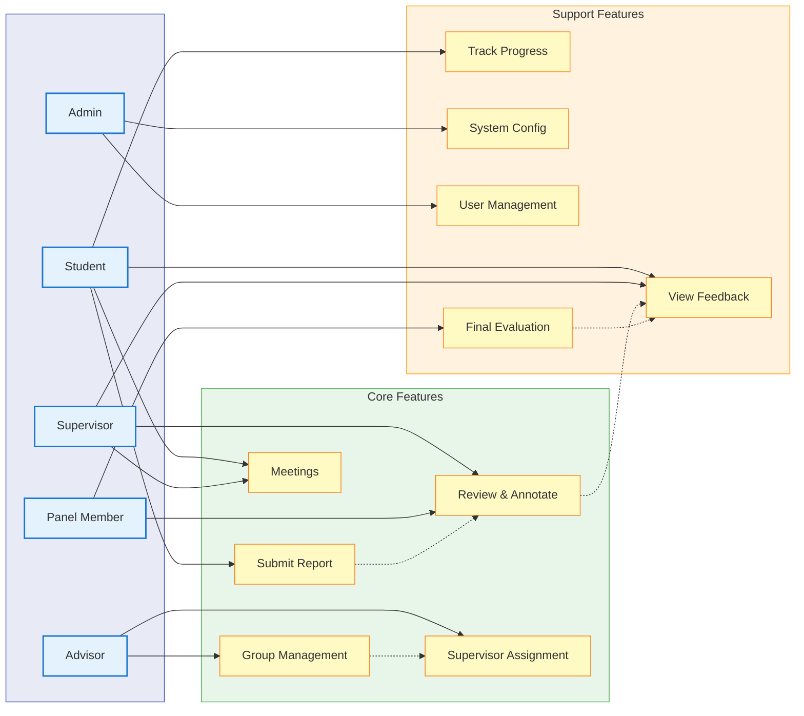

# Use Case Diagram - Simplified A4 Layout



## System Use Cases - Quick Reference

### Primary Workflows

**📝 Report Submission Flow**
```
Student → Submit Report → Supervisor Review → Feedback → Student
```

**👥 Group Formation Flow**
```
Advisor → Create Groups → Assign Students → Run Lottery → Assign Supervisors
```

**📊 Evaluation Flow**
```
Panel → Review Final Reports → Evaluate → Assign Grades
```

### Actor Permissions Matrix

| Feature | Student | Supervisor | Advisor | Admin | Panel |
|---------|---------|------------|---------|-------|-------|
| Submit Report | ✅ | - | - | - | - |
| Review Report | View | ✅ | View | View | ✅ |
| Annotate PDF | - | ✅ | - | - | ✅ |
| Schedule Meeting | Request | ✅ | - | - | - |
| Create Groups | - | - | ✅ | ✅ | - |
| Run Lottery | - | - | ✅ | - | - |
| System Config | - | - | - | ✅ | - |
| Final Evaluation | - | - | - | - | ✅ |

### Key System Interactions

1. **Students** interact primarily with submission and feedback features
2. **Supervisors** focus on review, annotation, and guidance
3. **Advisors** manage group formation and assignments
4. **Admins** handle system-level configuration
5. **Panel Members** perform final evaluations