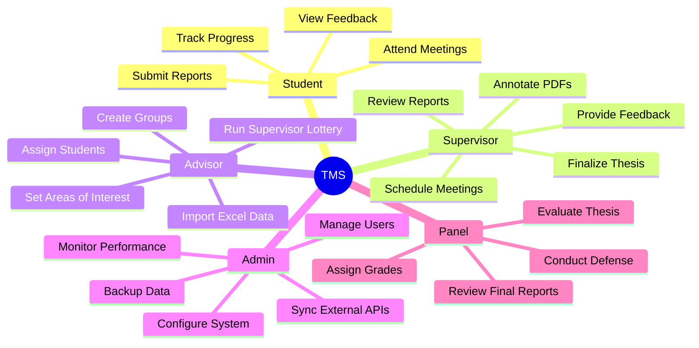
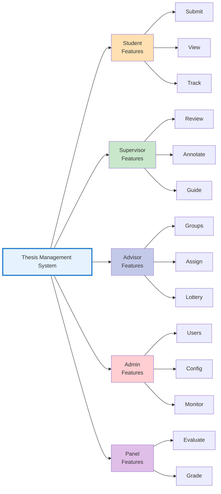

# Use Case Diagram - Ultra Compact (Single A4 Page)

## Alternative Compact Representation

## Quick Reference Card

### 🎯 Core System Functions

| **Students** | **Supervisors** | **Advisors** | **Admin** | **Panel** |
|:------------|:---------------|:------------|:----------|:---------|
| ✓ Submit | ✓ Review | ✓ Create Groups | ✓ Manage | ✓ Evaluate |
| ✓ View | ✓ Annotate | ✓ Assign | ✓ Configure | ✓ Grade |
| ✓ Track | ✓ Guide | ✓ Lottery | ✓ Monitor | ✓ Assess |
| ✓ Attend | ✓ Schedule | ✓ Import | ✓ Sync | ✓ Decide |

### 📊 System Statistics
- **5** Actor Types
- **25+** Use Cases
- **10** Core Workflows
- **3** Assignment Modes
- **4** Report States

### 🔄 Primary Workflows
1. **Submit** → **Review** → **Feedback** → **Revise**
2. **Groups** → **Assign** → **Supervise** → **Complete**
3. **Configure** → **Operate** → **Monitor** → **Optimize**