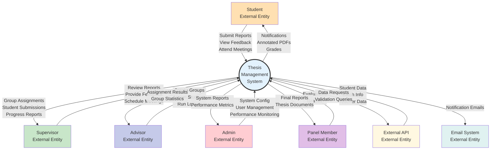

# Data Flow Diagram - Context Level (Level 0)

## Description
This Level 0 (Context) Data Flow Diagram shows the thesis management system as a single process with all external entities and their data interactions.

## External Entities
- **Student**: Submits reports, receives feedback
- **Supervisor**: Reviews work, provides guidance
- **Advisor**: Manages groups and assignments
- **Admin**: Configures and monitors system
- **Panel Member**: Evaluates final thesis
- **External API**: Provides institutional data
- **Email System**: Delivers notifications

## Key Data Flows

### Inbound Data
- Student submissions and attendance
- Supervisor reviews and feedback
- Advisor group configurations
- Admin system settings
- Panel evaluations
- External API data feeds

### Outbound Data
- Notifications and alerts
- Annotated documents
- Assignment results
- System reports
- Performance metrics
- Email notifications