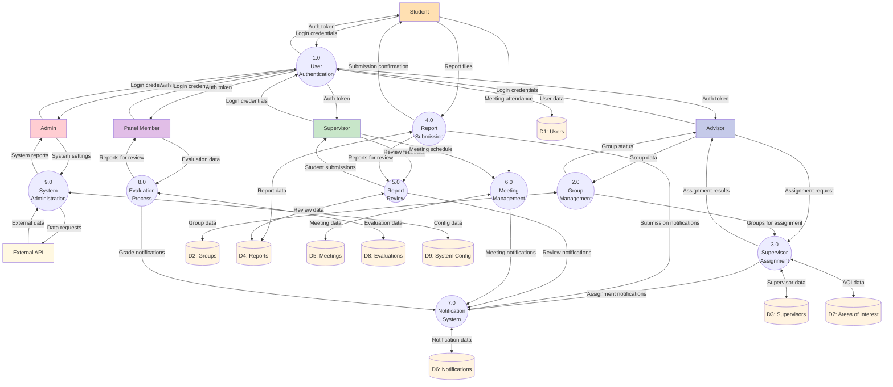

# Data Flow Diagram - Level 1

## Description
Level 1 DFD breaks down the thesis management system into major processes, showing data flows between processes, external entities, and data stores.

## Major Processes
1. **User Authentication (1.0)**: Handles login and access control
2. **Group Management (2.0)**: Creates and manages thesis groups
3. **Supervisor Assignment (3.0)**: Assigns supervisors to groups
4. **Report Submission (4.0)**: Handles student report uploads
5. **Report Review (5.0)**: Manages review and annotation process
6. **Meeting Management (6.0)**: Schedules and tracks meetings
7. **Notification System (7.0)**: Sends alerts and updates
8. **Evaluation Process (8.0)**: Final thesis evaluation
9. **System Administration (9.0)**: System configuration and monitoring

## Data Stores
- **D1 Users**: User accounts and authentication
- **D2 Groups**: Thesis group information
- **D3 Supervisors**: Supervisor details and availability
- **D4 Reports**: Submitted reports and reviews
- **D5 Meetings**: Meeting schedules and attendance
- **D6 Notifications**: System notifications
- **D7 Areas of Interest**: Research areas
- **D8 Evaluations**: Final evaluations and grades
- **D9 System Config**: System settings

## Key Data Flows
- Authentication flows through Process 1.0
- Group creation and assignment through Processes 2.0 and 3.0
- Report submission and review cycle through Processes 4.0 and 5.0
- All notifications centralized through Process 7.0