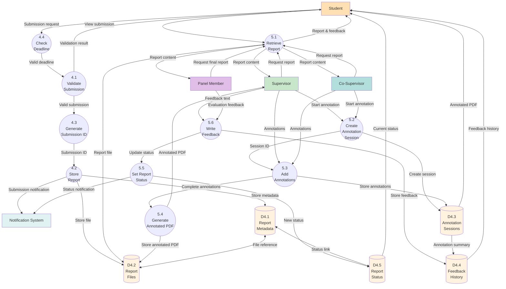

# Data Flow Diagram - Level 2 (Report Management Subsystem)

## Description
Level 2 DFD details the Report Management subsystem, breaking down processes 4.0 (Report Submission) and 5.0 (Report Review) into sub-processes.

## Report Submission Sub-processes (4.x)
- **4.1 Validate Submission**: Checks file format, size, and requirements
- **4.2 Store Report**: Saves report file to storage
- **4.3 Generate Submission ID**: Creates unique identifier
- **4.4 Check Deadline**: Verifies submission is within deadline

## Report Review Sub-processes (5.x)
- **5.1 Retrieve Report**: Fetches report for viewing
- **5.2 Create Annotation Session**: Initiates annotation process
- **5.3 Add Annotations**: Records comments and markups
- **5.4 Generate Annotated PDF**: Creates annotated version
- **5.5 Set Report Status**: Updates report status
- **5.6 Write Feedback**: Records reviewer feedback

## Data Stores
- **D4.1 Report Metadata**: Submission details and properties
- **D4.2 Report Files**: Actual document storage
- **D4.3 Annotation Sessions**: Annotation data and history
- **D4.4 Feedback History**: All feedback records
- **D4.5 Report Status**: Current status tracking

## Key Data Flows

### Submission Flow
1. Student submits report
2. System validates deadline and format
3. Generates unique ID
4. Stores file and metadata
5. Sends notification

### Review Flow
1. Reviewer retrieves report
2. Creates annotation session
3. Adds annotations and feedback
4. Generates annotated PDF
5. Updates status and notifies student

### Multi-reviewer Support
- Supervisors, Co-supervisors, and Panel members can all review
- Each creates separate annotation sessions
- All feedback stored in history