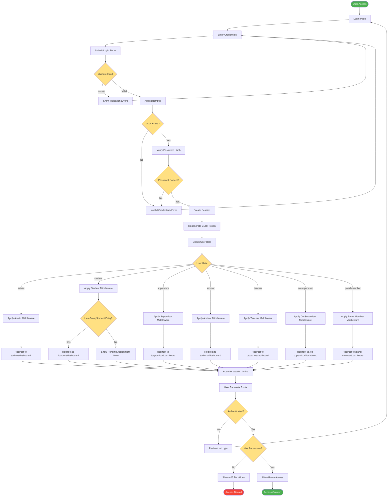

# Authentication & Authorization Flow

## Description
Complete authentication and authorization flow showing role-based access control and middleware protection.

## Key Components
- **Authentication**: Laravel Auth facade with session management
- **User Model**: Stores role field for authorization
- **Middleware**: Role-specific middleware in app/Http/Middleware
- **Routes**: Protected routes in routes/web.php and routes/auth.php

## User Roles
1. **admin**: Full system access
2. **student**: Access to reports, submissions, meetings
3. **supervisor**: Group management, report review
4. **advisor**: Group creation, student assignment
5. **teacher**: Similar to advisor role
6. **co-supervisor**: Limited supervisor access
7. **panel-member**: Evaluation access only

## Security Features
- CSRF token regeneration on login
- Password hashing via bcrypt
- Session-based authentication
- Route middleware protection
- 403 responses for unauthorized access