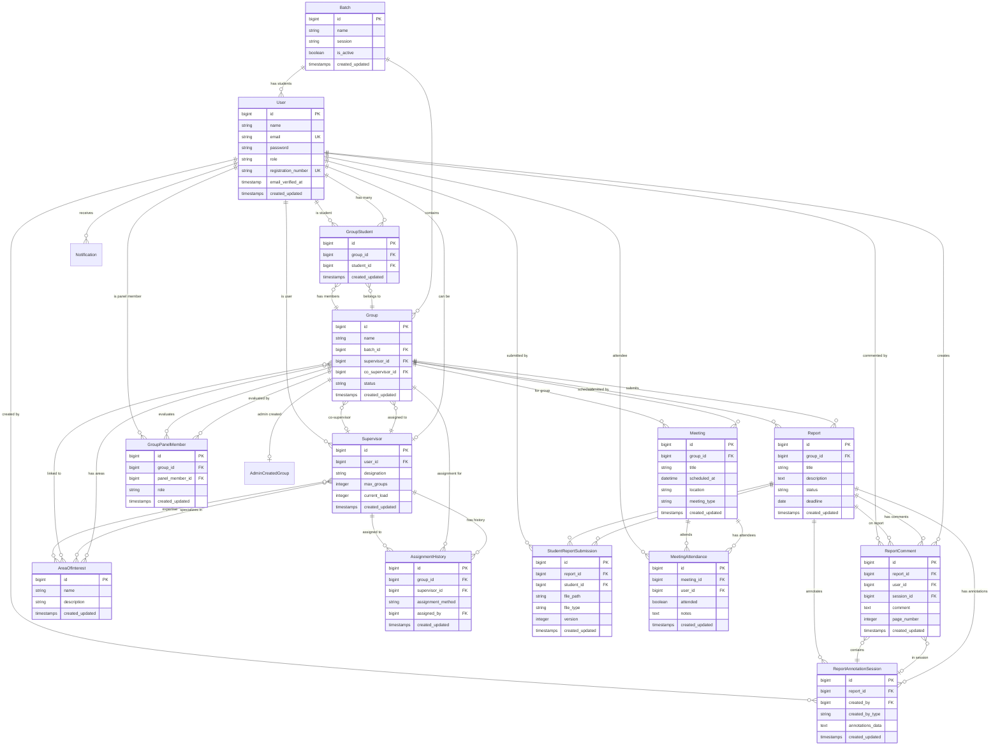

# Database Entity Relationship Diagram

## Description
Complete entity relationship diagram showing all database tables and their relationships.

## Key Relationships
- **Many-to-Many**: Group ↔ AreaOfInterest, Supervisor ↔ AreaOfInterest
- **One-to-Many**: Batch → Group, Group → Report, Report → StudentReportSubmission
- **Polymorphic**: Notifications (notifiable_type, notifiable_id)
- **Self-referential**: User table with multiple roles

## Junction Tables
- **group_area_of_interest**: Links groups to multiple areas
- **supervisor_area_of_interest**: Links supervisors to expertise areas
- **GroupStudent**: Links students to groups
- **GroupPanelMember**: Links panel members to groups

## Audit Tables
- **AssignmentHistory**: Tracks all supervisor assignments
- **notifications**: Stores all system notifications
- **AdminCreatedGroup**: View for admin-created groups