# Error Handling & Recovery Flow

```mermaid
flowchart TD
    Start([Error Occurs]) --> ErrorType{Error Type}
    
    ErrorType -->|Validation| ValidationError[Validation Exception]
    ErrorType -->|Database| DatabaseError[Database Exception]
    ErrorType -->|Authentication| AuthError[Authentication Exception]
    ErrorType -->|Authorization| AuthzError[Authorization Exception]
    ErrorType -->|NotFound| NotFoundError[Model Not Found]
    ErrorType -->|API| APIError[External API Error]
    ErrorType -->|System| SystemError[System/Server Error]
    
    %% Validation Error Handling
    ValidationError --> CheckRequest{Ajax Request?}
    CheckRequest -->|Yes| ReturnJSON422[Return JSON 422<br/>with field errors]
    CheckRequest -->|No| RedirectBack[Redirect Back<br/>with errors & old input]
    
    %% Database Error Handling
    DatabaseError --> CheckDBType{Database Error Type}
    CheckDBType -->|Connection| DBConnection[Connection Lost]
    CheckDBType -->|Constraint| DBConstraint[Foreign Key/Unique Violation]
    CheckDBType -->|Deadlock| DBDeadlock[Transaction Deadlock]
    
    DBConnection --> RetryConnection{Retry Count < 3?}
    RetryConnection -->|Yes| WaitRetry[Wait 2 seconds]
    WaitRetry --> AttemptReconnect[Attempt Reconnection]
    AttemptReconnect --> CheckReconnect{Connected?}
    CheckReconnect -->|Yes| RetryOperation[Retry Original Operation]
    CheckReconnect -->|No| RetryConnection
    
    RetryConnection -->|No| UseReadReplica{Read Replica Available?}
    UseReadReplica -->|Yes| SwitchReplica[Switch to Read Replica]
    UseReadReplica -->|No| ShowMaintenance[Show Maintenance Page]
    
    DBConstraint --> ParseConstraint[Parse Constraint Type]
    ParseConstraint --> UserMessage[Generate User-Friendly Message]
    UserMessage --> ReturnError[Return Error Response]
    
    DBDeadlock --> RollbackTransaction[Rollback Transaction]
    RollbackTransaction --> RetryTransaction{Retry Count < 2?}
    RetryTransaction -->|Yes| DelayRetry[Random Delay 100-500ms]
    DelayRetry --> RestartTransaction[Restart Transaction]
    RetryTransaction -->|No| LogDeadlock[Log Deadlock Details]
    LogDeadlock --> ReturnError
    
    %% Authentication Error Handling
    AuthError --> CheckAuthType{Auth Error Type}
    CheckAuthType -->|Expired Session| SessionExpired[Session Expired]
    CheckAuthType -->|Invalid Token| InvalidToken[Invalid CSRF Token]
    
    SessionExpired --> StoreIntendedURL[Store Intended URL]
    StoreIntendedURL --> RedirectLogin[Redirect to Login]
    
    InvalidToken --> RegenerateToken[Regenerate CSRF Token]
    RegenerateToken --> ReturnNewToken[Return New Token]
    
    %% Authorization Error Handling
    AuthzError --> CheckUserRole[Check User Role]
    CheckUserRole --> LogUnauthorized[Log Unauthorized Attempt]
    LogUnauthorized --> Return403[Return 403 Forbidden]
    
    %% Not Found Error Handling
    NotFoundError --> CheckModel{Model Type}
    CheckModel -->|User| UserNotFound[User Not Found]
    CheckModel -->|Group| GroupNotFound[Group Not Found]
    CheckModel -->|Report| ReportNotFound[Report Not Found]
    
    UserNotFound --> CheckContext{Request Context}
    GroupNotFound --> CheckContext
    ReportNotFound --> CheckContext
    
    CheckContext -->|API| Return404JSON[Return JSON 404]
    CheckContext -->|Web| Show404Page[Show 404 Page]
    
    %% API Error Handling
    APIError --> CheckAPIError{API Error Type}
    CheckAPIError -->|Timeout| APITimeout[Request Timeout]
    CheckAPIError -->|RateLimit| APIRateLimit[Rate Limited]
    CheckAPIError -->|ServerError| APIServerError[5xx Error]
    
    APITimeout --> UseCachedData{Cached Data Available?}
    UseCachedData -->|Yes| ReturnCached[Return Cached Data<br/>with stale warning]
    UseCachedData -->|No| QueueRetry[Queue for Background Retry]
    
    APIRateLimit --> CheckBackoff[Check Retry-After Header]
    CheckBackoff --> ScheduleRetry[Schedule Retry After Delay]
    
    APIServerError --> ActivateCircuit[Activate Circuit Breaker]
    ActivateCircuit --> UseFallback[Use Local Fallback]
    
    %% System Error Handling
    SystemError --> CheckSeverity{Severity Level}
    CheckSeverity -->|Critical| CriticalError[Critical System Error]
    CheckSeverity -->|High| HighError[High Priority Error]
    CheckSeverity -->|Medium| MediumError[Medium Priority Error]
    
    CriticalError --> LogCritical[Log to Multiple Channels:<br/>- File<br/>- Database<br/>- External Service]
    LogCritical --> NotifyOncall[Notify On-Call Team]
    NotifyOncall --> ShowErrorPage[Show Generic Error Page]
    
    HighError --> LogHigh[Log with Stack Trace]
    LogHigh --> NotifyTeam[Send Team Notification]
    NotifyTeam --> ShowErrorPage
    
    MediumError --> LogMedium[Log to File]
    LogMedium --> ShowErrorPage
    
    %% Common Error Processing
    ReturnJSON422 --> LogValidation[Log Validation Failure]
    RedirectBack --> LogValidation
    ReturnError --> LogError[Log Error Details]
    Return403 --> LogError
    Return404JSON --> LogError
    Show404Page --> LogError
    ReturnCached --> LogError
    QueueRetry --> LogError
    ScheduleRetry --> LogError
    UseFallback --> LogError
    ShowErrorPage --> LogError
    ShowMaintenance --> LogError
    
    LogValidation --> StoreMetrics[Store Error Metrics]
    LogError --> StoreMetrics
    
    StoreMetrics --> CheckPattern{Error Pattern Detected?}
    CheckPattern -->|Yes| TriggerAlert[Trigger Pattern Alert]
    CheckPattern -->|No| End
    
    TriggerAlert --> AutoRemediation{Auto-Remediation Available?}
    AutoRemediation -->|Yes| ExecuteRemediation[Execute Remediation:<br/>- Clear Cache<br/>- Restart Service<br/>- Scale Resources]
    AutoRemediation -->|No| ManualIntervention[Flag for Manual Review]
    
    ExecuteRemediation --> VerifyFix{Issue Resolved?}
    VerifyFix -->|Yes| LogResolution[Log Automatic Resolution]
    VerifyFix -->|No| EscalateIssue[Escalate to Higher Level]
    
    LogResolution --> End([Error Handled])
    EscalateIssue --> End
    ManualIntervention --> End
    
    style Start fill:#f44336,color:#fff
    style End fill:#4CAF50,color:#fff
    style ErrorType fill:#FFE082
    style CheckRequest fill:#FFE082
    style CheckDBType fill:#FFE082
    style RetryConnection fill:#FFE082
    style CheckAuthType fill:#FFE082
    style CheckModel fill:#FFE082
    style CheckAPIError fill:#FFE082
    style CheckSeverity fill:#FFE082
    style CheckPattern fill:#FFE082
    style AutoRemediation fill:#FFE082
    style VerifyFix fill:#FFE082
```

## Description
Comprehensive error handling and recovery flow for all error types in the system.

## Error Categories

### Validation Errors
- Form validation failures
- Input sanitization errors
- Business rule violations

### Database Errors
- Connection failures with retry logic
- Constraint violations with user-friendly messages
- Deadlock detection and retry
- Automatic failover to read replicas

### Authentication/Authorization
- Session expiration handling
- CSRF token regeneration
- Role-based access denial
- Audit logging for security

### Model Not Found
- Graceful 404 handling
- Context-aware responses (API vs Web)
- Helpful error messages

### External API Errors
- Timeout handling with cache fallback
- Rate limit respect with backoff
- Circuit breaker pattern
- Queue-based retry mechanism

### System Errors
- Severity-based handling
- Multi-channel logging
- Automatic alerting
- Self-healing capabilities

## Recovery Strategies

1. **Retry Logic**: Exponential backoff for transient failures
2. **Fallback Mechanisms**: Cache, read replicas, local data
3. **Circuit Breaker**: Prevent cascade failures
4. **Queue Recovery**: Background retry for non-critical operations
5. **Auto-Remediation**: Automated fixes for known issues

## Logging & Monitoring
- Structured logging with context
- Error pattern detection
- Metric collection for analysis
- Alert triggering based on thresholds

## User Experience
- Friendly error messages
- Preservation of user input
- Clear next steps
- Graceful degradation