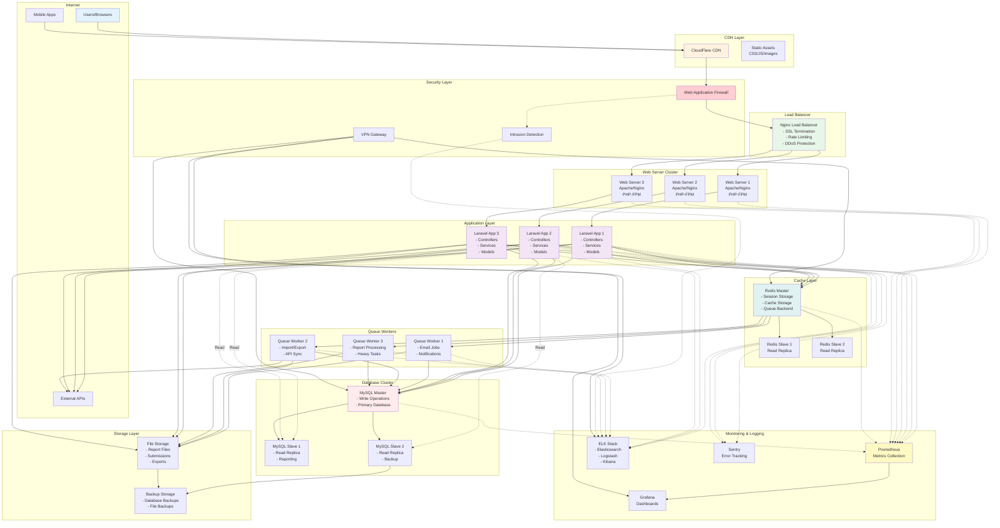

# Deployment Architecture & Infrastructure

## Description
Complete deployment architecture showing all infrastructure components and their interactions.

## Infrastructure Components

### Frontend Layer
- **CDN**: CloudFlare for static asset delivery
- **Load Balancer**: Nginx for request distribution
- **Web Servers**: Apache/Nginx with PHP-FPM

### Application Layer
- **Laravel Instances**: Horizontally scaled application servers
- **Session Management**: Redis-based shared sessions
- **File Storage**: Centralized storage for uploads

### Data Layer
- **MySQL Cluster**: Master-slave replication
- **Redis Cluster**: Master-slave for caching
- **Backup Storage**: Automated backup system

### Processing Layer
- **Queue Workers**: Dedicated workers for background jobs
- **Scheduled Tasks**: Cron-based Laravel scheduler
- **API Integration**: External service connections

### Monitoring Layer
- **Prometheus**: Metrics collection
- **Grafana**: Visualization dashboards
- **ELK Stack**: Centralized logging
- **Sentry**: Error tracking and alerting

### Security Layer
- **WAF**: Web application firewall
- **IDS**: Intrusion detection system
- **VPN**: Secure admin access
- **SSL/TLS**: End-to-end encryption

## Scaling Strategy

### Horizontal Scaling
- Web servers: Auto-scaling based on load
- Application servers: Load-balanced instances
- Queue workers: Dynamic worker allocation

### Vertical Scaling
- Database: Read replicas for query distribution
- Cache: Redis cluster for high availability
- Storage: Expandable file storage

## High Availability

### Redundancy
- Multiple web server instances
- Database replication
- Redis sentinel for failover
- Cross-region backups

### Failover Mechanisms
- Automatic database failover
- Load balancer health checks
- Circuit breaker patterns
- Graceful degradation

## Deployment Process
1. **CI/CD Pipeline**: Automated testing and deployment
2. **Blue-Green Deployment**: Zero-downtime updates
3. **Database Migrations**: Automated with rollback
4. **Configuration Management**: Environment-based configs
5. **Monitoring Integration**: Automatic metric collection