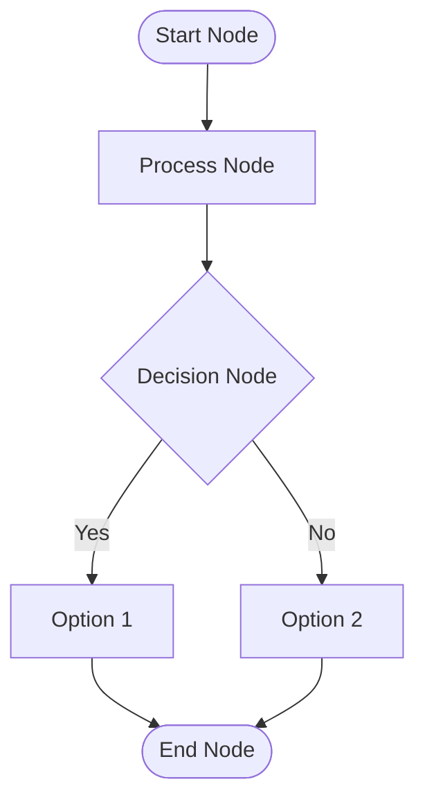
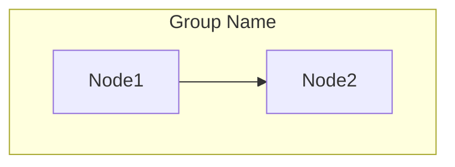
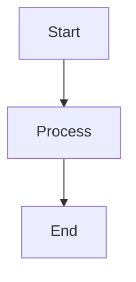

# Mermaid Activity Diagrams

This directory contains activity diagrams in Mermaid format, which can be rendered directly in Markdown files, GitHub, GitLab, and many documentation platforms.

## 📊 Diagram Collection

### Core Workflows
1. **System Overview** - High-level system workflow
2. **Student Journey** - Complete student thesis journey
3. **Supervisor Review** - Report review and annotation process
4. **Advisor Group Management** - Group creation and assignment
5. **Lottery Algorithm** - Supervisor assignment algorithm

### Process Lifecycles
6. **Report Lifecycle** - Submission to approval cycle
7. **Admin Operations** - System administration tasks
8. **Notification Flow** - Multi-channel notification system
9. **Meeting Workflow** - Meeting management process
10. **API Integration** - External API handling

### System Overview
11. **Complete Thesis Flow** - End-to-end process
12. **User Roles & Interactions** - Role relationships
13. **Key Features Overview** - Feature map
14. **Annotation Process** - PDF annotation details
15. **Panel Evaluation** - Final evaluation workflow

## 🚀 How to Use

### View in Markdown
The diagrams are embedded in `.md` files and will render automatically in:
- GitHub/GitLab repositories
- VS Code with Mermaid extension
- Obsidian, Notion, and other markdown editors
- Documentation sites (MkDocs, Docusaurus, etc.)

### View Online
Copy the mermaid code and paste in:
- [Mermaid Live Editor](https://mermaid.live/)
- [Mermaid Chart Editor](https://www.mermaidchart.com/)

### VS Code Extension
Install the "Mermaid Preview" extension:
```bash
code --install-extension bierner.markdown-mermaid
```

### Export as Images

#### Using Mermaid CLI
```bash
# Install mermaid CLI
npm install -g @mermaid-js/mermaid-cli

# Generate PNG
mmdc -i 01-system-overview.md -o output/01-system-overview.png

# Generate SVG
mmdc -i 01-system-overview.md -o output/01-system-overview.svg

# Generate PDF
mmdc -i 01-system-overview.md -o output/01-system-overview.pdf
```

#### Batch Export Script
```bash
# Export all diagrams
for file in *.md; do
  mmdc -i "$file" -o "output/${file%.md}.png"
done
```

## 🎨 Mermaid Syntax Guide

### Flowchart Basics


### Node Shapes
- `[Text]` - Rectangle
- `([Text])` - Rounded rectangle
- `{Text}` - Diamond (decision)
- `[[Text]]` - Subroutine
- `[(Text)]` - Database

### Styling
```mermaid
style NodeID fill:#color,stroke:#color,color:#textcolor
```

## 📝 Customization

### Change Theme
Add to the beginning of mermaid code:
```mermaid
%%{init: {'theme':'dark'}}%%
flowchart TD
```

### Change Direction
- `TD` or `TB` - Top to Bottom
- `LR` - Left to Right
- `RL` - Right to Left
- `BT` - Bottom to Top

### Add Subgraphs


## 🔄 Integration with Documentation

### GitHub README
```markdown
## System Flow

```

### MkDocs
```yaml
# mkdocs.yml
markdown_extensions:
  - pymdownx.superfences:
      custom_fences:
        - name: mermaid
          class: mermaid
```

### Docusaurus
```javascript
// docusaurus.config.js
markdown: {
  mermaid: true,
},
themes: ['@docusaurus/theme-mermaid'],
```

## ✅ Advantages of Mermaid

1. **Text-based**: Version control friendly
2. **No special tools**: Renders in markdown
3. **Live preview**: Instant visualization
4. **Platform agnostic**: Works everywhere
5. **Easy to edit**: Simple syntax
6. **Responsive**: Auto-adjusts layout
7. **Exportable**: PNG, SVG, PDF formats
8. **Themeable**: Light/dark themes

## 📊 Diagram Categories

### For Technical Documentation
- Lottery Algorithm (05)
- API Integration (10)
- Annotation Process (14)

### For User Manuals
- Student Journey (02)
- Supervisor Review (03)
- Meeting Workflow (09)

### For System Overview
- System Overview (01)
- Complete Thesis Flow (11)
- User Roles & Interactions (12)

### For Administration
- Admin Operations (07)
- Panel Evaluation (15)
- Notification Flow (08)

## 🛠️ Troubleshooting

### Diagram Not Rendering
- Check mermaid syntax
- Ensure proper markdown formatting
- Verify platform supports mermaid

### Export Issues
- Install latest mermaid-cli
- Check node.js version (>=14)
- Use correct file paths

### Styling Problems
- Use supported color formats
- Check style syntax
- Verify node ID matches

---

*Mermaid Version: 10.x compatible*
*Last Updated: Current*