# Thesis Management System Use Case Diagram
## A4 Document Format - Vertical Layout

```mermaid
%%{init: {'theme':'neutral', 'themeVariables': { 'fontSize': '11px', 'fontFamily': 'Arial'}}}%%
graph TD
    %% Actors at Top
    subgraph Actors[" External Actors "]
        Student([Student])
        Teacher([Teacher])
        Advisor([Advisor])
        Admin([Admin])
        ExtAPI([External API])
        Email([Email System])
    end
    
    %% Main System
    subgraph System[" THESIS MANAGEMENT SYSTEM "]
        %% Row 1 - Core Functions
        subgraph Row1[" "]
            subgraph M1["Authentication"]
                Login[Login/Logout]
                Profile[Profile Mgmt]
                RoleSwitch[Role Switch]
            end
            
            subgraph M2["Student Module"]
                Dashboard[Dashboard]
                Submit[Submit Report]
                ViewFeedback[View Feedback]
                Progress[Track Progress]
            end
            
            subgraph M3["Supervision"]
                ManageGrp[Manage Groups]
                Review[Review Reports]
                Annotate[Annotate PDF]
                Schedule[Schedule Meet]
            end
        end
        
        %% Row 2 - Advanced Functions
        subgraph Row2[" "]
            subgraph M4["Co-Supervision"]
                CoSupervise[Co-Supervise]
                CollabReview[Collab Review]
                SharedAnnot[Shared Annot]
            end
            
            subgraph M5["Panel"]
                Evaluate[Evaluate]
                Defense[Defense]
                Grades[Assign Grades]
            end
            
            subgraph M6["Group Mgmt"]
                CreateGrp[Create Groups]
                ImportData[Import Excel]
                AssignStd[Assign Students]
                SetAOI[Set AOI]
            end
        end
        
        %% Row 3 - System Functions
        subgraph Row3[" "]
            subgraph M7["Algorithms"]
                AOIMatch[AOI Matching]
                Ranking[Ranking Based]
                Combined[Combined Algo]
                LoadBal[Load Balance]
            end
            
            subgraph M8["Admin"]
                UserMgmt[User Mgmt]
                SysConfig[Config]
                DataSync[Sync Data]
                Reports[Reports]
            end
            
            subgraph M9["Integration"]
                APISync[API Sync]
                Validate[Validation]
                Notify[Notifications]
            end
        end
    end
    
    %% Primary Connections
    Student ==> Login
    Student ==> Dashboard
    Student ==> Submit
    Student ==> ViewFeedback
    
    Teacher ==> Login
    Teacher ==> ManageGrp
    Teacher ==> Review
    Teacher ==> CoSupervise
    Teacher ==> Evaluate
    
    Advisor ==> Login
    Advisor ==> CreateGrp
    Advisor ==> ImportData
    Advisor ==> AOIMatch
    
    Admin ==> Login
    Admin ==> UserMgmt
    Admin ==> SysConfig
    
    ExtAPI ==> APISync
    Email ==> Notify
    
    %% Key Dependencies
    Submit -.-> Notify
    Review -.-> Annotate
    CreateGrp -.-> AOIMatch
    
    %% Styling
    classDef actorStyle fill:#e1f5fe,stroke:#01579b,stroke-width:2px
    classDef authStyle fill:#fff3e0,stroke:#e65100,stroke-width:1px
    classDef studentStyle fill:#e8f5e9,stroke:#2e7d32,stroke-width:1px
    classDef teacherStyle fill:#fce4ec,stroke:#880e4f,stroke-width:1px
    classDef adminStyle fill:#f3e5f5,stroke:#4a148c,stroke-width:1px
    classDef systemStyle fill:#e0f2f1,stroke:#00695c,stroke-width:1px
    
    class Student,Teacher,Advisor,Admin,ExtAPI,Email actorStyle
    class Login,Profile,RoleSwitch authStyle
    class Dashboard,Submit,ViewFeedback,Progress studentStyle
    class ManageGrp,Review,Annotate,Schedule,CoSupervise,CollabReview,SharedAnnot,Evaluate,Defense,Grades teacherStyle
    class UserMgmt,SysConfig,DataSync,Reports adminStyle
    class APISync,Validate,Notify systemStyle
```

## Use Case Summary Table

| **Module** | **Use Cases** | **Primary Actor** |
|------------|---------------|-------------------|
| **Authentication** | Login, Profile Management, Role Switching | All Users |
| **Student Operations** | Dashboard, Submit Reports, View Feedback, Track Progress | Student |
| **Supervision** | Manage Groups, Review Reports, Annotate PDFs, Schedule Meetings | Teacher |
| **Co-Supervision** | Collaborative Supervision, Shared Annotations | Teacher |
| **Panel Evaluation** | Thesis Evaluation, Defense, Grade Assignment | Teacher |
| **Group Management** | Create Groups, Import Data, Assign Students, Set AOI | Advisor |
| **Algorithms** | AOI Matching, Ranking-Based, Combined, Load Balancing | System/Advisor |
| **Administration** | User Management, Configuration, Data Sync, Reports | Admin |
| **Integration** | API Sync, Validation, Notifications | System |

## Key System Features

### Core Capabilities
- **Multi-role support** for teachers (Supervisor, Co-supervisor, Panel)
- **Intelligent assignment** algorithms (AOI, Ranking, Combined)
- **Real-time collaboration** with shared annotations
- **External API integration** for data synchronization
- **Comprehensive notification** system

### Technical Specifications
- **Users**: 10,000+ concurrent
- **Performance**: <200ms response time
- **Availability**: 99.9% uptime
- **Security**: MFA, RBAC, Encryption
- **Formats**: PDF, Word, Excel, PowerPoint

---
*Optimized for A4 printing - Page 1 of 1*