# Thesis Management System - Use Case Diagram (A4 Format)

## System Overview
**Enterprise-Level Thesis Management Platform**  
*Multi-Role Academic Workflow with Advanced Assignment Algorithms*

```mermaid
%%{init: {'theme':'neutral', 'themeVariables': { 'fontSize': '10px'}}}%%
graph LR
    %% External Actors (Left Side)
    Student([Student])
    Teacher([Teacher])
    Advisor([Advisor])
    Admin([Admin])
    ExtAPI([External<br/>API])
    Email([Email<br/>System])
    
    %% System Boundary
    subgraph TMS[" Thesis Management System "]
        %% Core Modules - Compact Layout
        subgraph Auth["Auth"]
            UC1[Login]
            UC2[Profile]
            UC3[Role Switch]
        end
        
        subgraph StudOps["Student Ops"]
            UC4[Dashboard]
            UC5[Submit Report]
            UC6[View Feedback]
            UC7[Track Progress]
        end
        
        subgraph SupOps["Supervision"]
            UC8[Manage Groups]
            UC9[Review Reports]
            UC10[Annotate PDF]
            UC11[Schedule Meetings]
        end
        
        subgraph CoSup["Co-Supervision"]
            UC12[Co-Supervise]
            UC13[Collab Review]
            UC14[Shared Annot.]
        end
        
        subgraph Panel["Panel Eval"]
            UC15[Evaluate]
            UC16[Defense]
            UC17[Grades]
        end
        
        subgraph Groups["Group Mgmt"]
            UC18[Create Groups]
            UC19[Import Excel]
            UC20[Assign Students]
            UC21[Set AOI]
            UC22[Run Lottery]
        end
        
        subgraph Algo["Algorithms"]
            UC23[AOI Match]
            UC24[Ranking]
            UC25[Combined]
            UC26[Load Balance]
        end
        
        subgraph SysAdmin["Admin"]
            UC27[Users]
            UC28[Config]
            UC29[Manage AOI]
            UC30[Sync Data]
            UC31[Reports]
        end
        
        subgraph Integ["Integration"]
            UC32[API Sync]
            UC33[Validation]
            UC34[Rate Limit]
        end
        
        subgraph Comm["Notifications"]
            UC35[Send Notif.]
            UC36[Email Notif.]
            UC37[Real-Time]
        end
    end
    
    %% Connections - Simplified
    Student --> UC1
    Student --> UC4
    Student --> UC5
    Student --> UC6
    Student --> UC7
    
    Teacher --> UC1
    Teacher --> UC3
    Teacher --> UC8
    Teacher --> UC9
    Teacher --> UC10
    Teacher --> UC11
    Teacher --> UC12
    Teacher --> UC13
    Teacher --> UC14
    Teacher --> UC15
    Teacher --> UC16
    Teacher --> UC17
    
    Advisor --> UC1
    Advisor --> UC18
    Advisor --> UC19
    Advisor --> UC20
    Advisor --> UC21
    Advisor --> UC22
    Advisor --> UC23
    Advisor --> UC24
    Advisor --> UC25
    Advisor --> UC26
    
    Admin --> UC1
    Admin --> UC27
    Admin --> UC28
    Admin --> UC29
    Admin --> UC30
    Admin --> UC31
    
    ExtAPI --> UC32
    ExtAPI --> UC33
    ExtAPI --> UC34
    
    Email --> UC36
    
    %% Internal Dependencies
    UC5 -.-> UC35
    UC9 -.-> UC10
    UC22 -.-> UC23
    UC22 -.-> UC24
    UC22 -.-> UC25
```

## Actor Roles & Responsibilities

### Primary Actors
| **Actor** | **Role** | **Key Functions** |
|-----------|----------|-------------------|
| **Student** | End User | Submit reports, view feedback, track progress |
| **Teacher** | Multi-Role | Supervise, co-supervise, panel evaluation |
| **Advisor** | Manager | Group formation, supervisor assignment |
| **Admin** | System Admin | User management, configuration |
| **External API** | Data Provider | Student/teacher data synchronization |
| **Email System** | Service | Notification delivery |

## System Modules

### 1. Authentication & Authorization
- User login/logout
- Profile management
- Role context switching
- Password reset & email verification

### 2. Student Operations
- Academic dashboard
- Report submission
- Feedback viewing
- Progress tracking
- Meeting participation
- Notification management

### 3. Supervision & Review
- Group management
- Report review & annotation
- Feedback provision
- Meeting scheduling
- Attendance recording
- Report finalization

### 4. Co-Supervision
- Collaborative group supervision
- Shared annotation system
- Co-supervisor meetings
- Permission management

### 5. Panel Evaluation
- Thesis evaluation
- Defense conduction
- Grade assignment
- Panel review process

### 6. Group Formation & Assignment
- Group creation
- Excel data import
- Student assignment
- Area of interest setting
- Supervisor lottery system
- Manual assignment options

### 7. Assignment Algorithms
- **AOI Matching**: Research area-based assignment
- **Ranking-Based**: Hierarchical assignment by academic rank
- **Combined**: Balanced expertise and ranking
- **Load Balancing**: Fair workload distribution

### 8. System Administration
- User account management
- System configuration
- AOI management
- Data synchronization
- Performance monitoring
- Report generation
- Backup & recovery

### 9. External Integration
- API synchronization
- Data validation
- Rate limiting
- Cache management

### 10. Communication
- System notifications
- Email integration
- Real-time updates
- Notification history

## System Specifications

### Performance Metrics
- **Concurrent Users**: 10,000+
- **Response Time**: < 200ms
- **Availability**: 99.9% uptime
- **Data Integrity**: 100% consistency

### Supported Formats
- **Documents**: PDF, Word, PowerPoint, Excel
- **Export**: PDF, Excel, CSV, JSON
- **Integration**: REST API, Email SMTP

### Security Features
- Multi-factor authentication
- Role-based access control
- End-to-end encryption
- Comprehensive audit logging
- GDPR compliance

---
*Version 1.0 - Production Grade System Design*