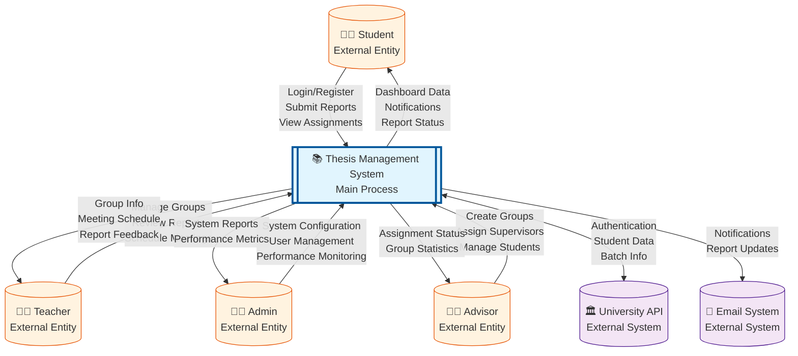
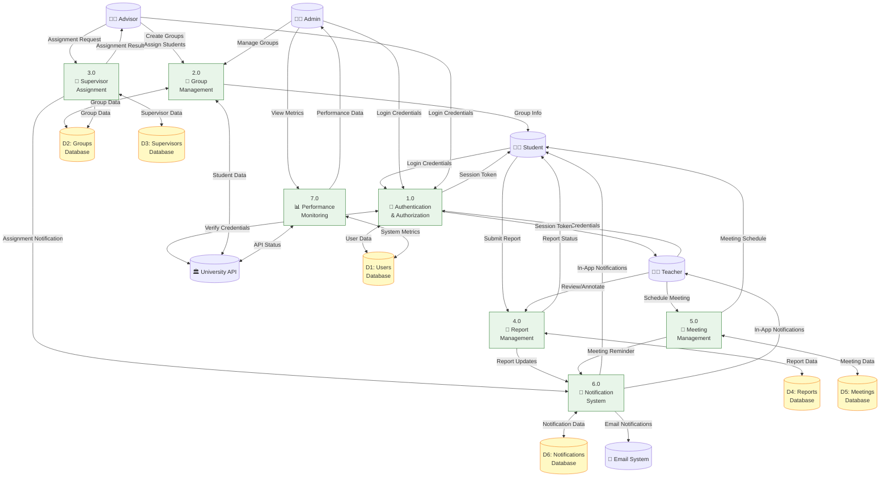
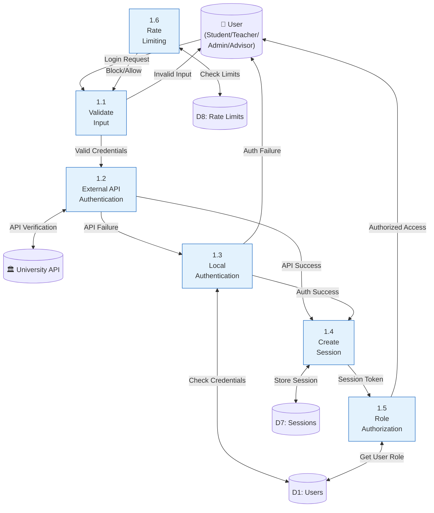
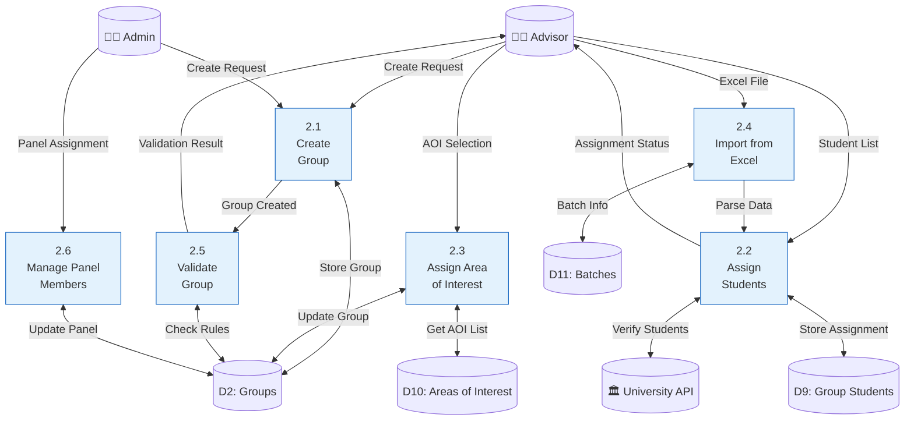
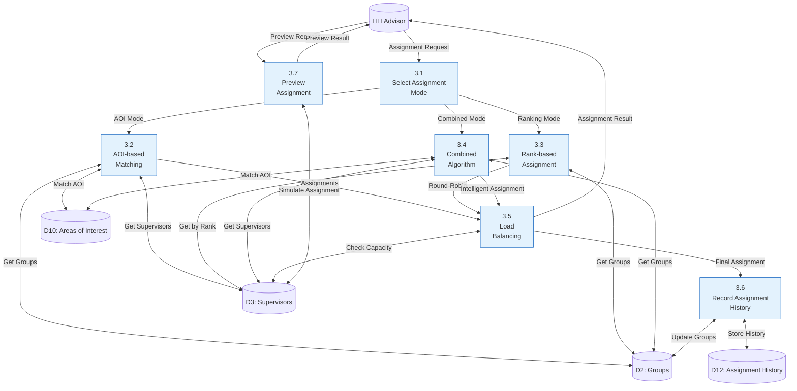
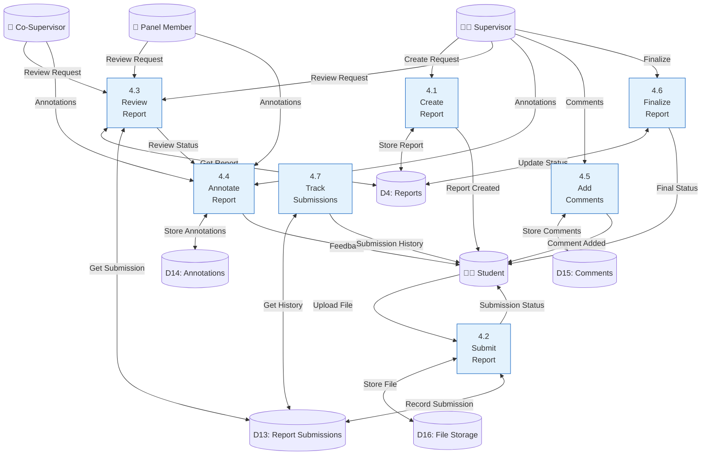
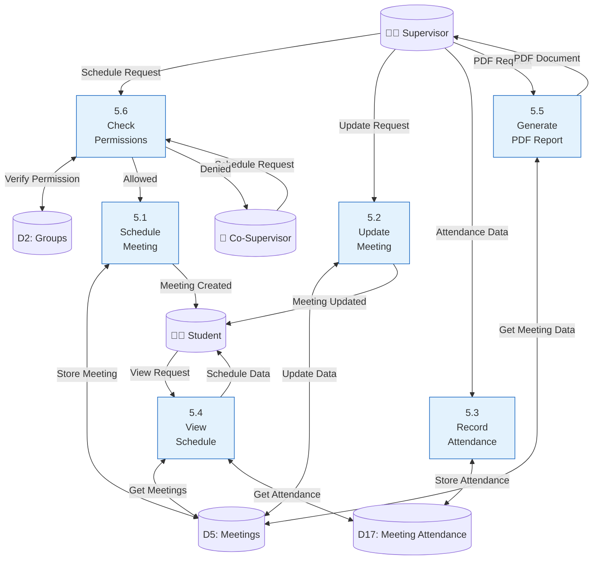
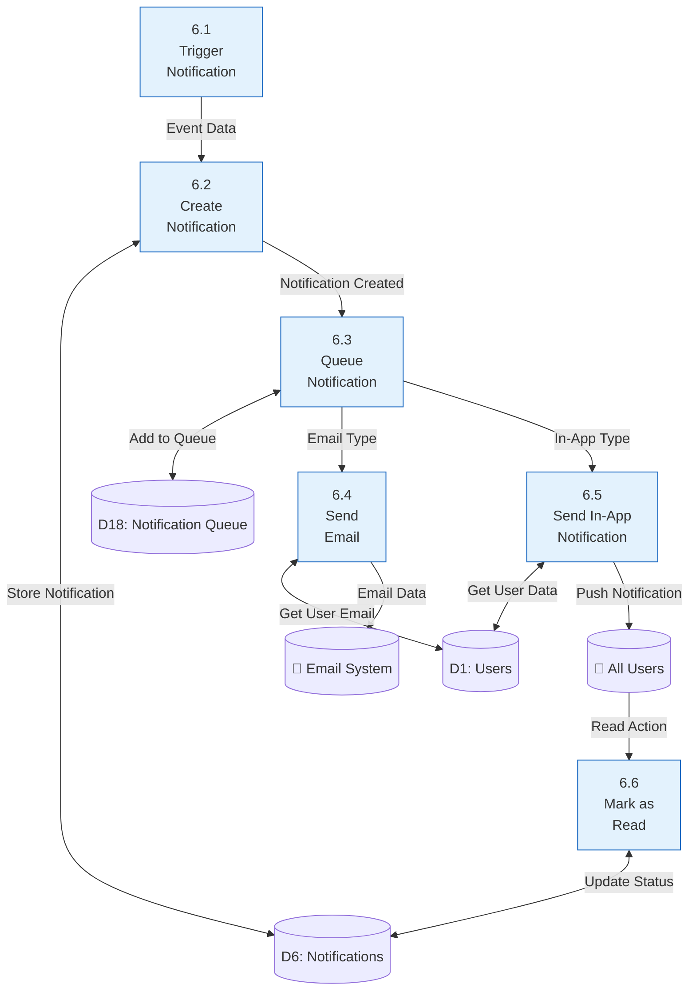
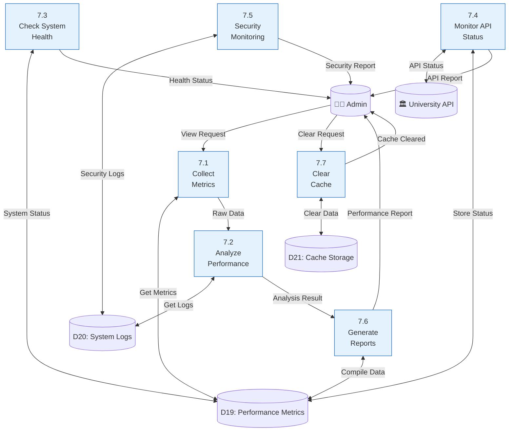
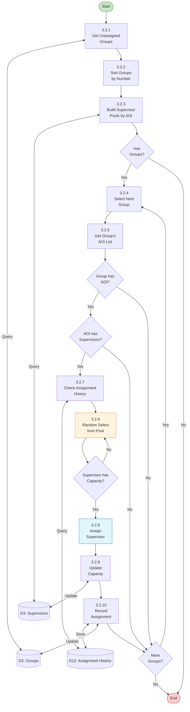

# Production-Grade Data Flow Diagrams - University Thesis Management System

## Level 0 - Context Diagram

## Level 1 - Main System Processes

## Level 2 - Authentication & Authorization Process

## Level 2 - Group Management Process

## Level 2 - Supervisor Assignment Process (Lottery Algorithm)

## Level 2 - Report Management Process

## Level 2 - Meeting Management Process

## Level 2 - Notification System Process

## Level 2 - Performance Monitoring Process

## Level 3 - Detailed Lottery Algorithm Process

## Data Dictionary

### Data Stores

| Store ID | Name | Description | Key Attributes |
|----------|------|-------------|----------------|
| D1 | Users | User accounts and authentication | id, email, password, role, name |
| D2 | Groups | Thesis groups | id, name, batch_id, supervisor_id, area_of_interest_id |
| D3 | Supervisors | Supervisor information | id, fullname, designation, rank_priority, max_groups, is_active |
| D4 | Reports | Thesis reports | id, title, group_id, status, deadline, created_by |
| D5 | Meetings | Scheduled meetings | id, group_id, title, date, time, location |
| D6 | Notifications | System notifications | id, user_id, type, message, read_at |
| D7 | Sessions | User sessions | id, user_id, token, expires_at |
| D8 | Rate Limits | API rate limiting | id, key, attempts, reset_at |
| D9 | Group Students | Student-group assignments | id, group_id, student_id, roll_no |
| D10 | Areas of Interest | Research areas | id, name, description |
| D11 | Batches | Student batches | id, batch_name, is_active |
| D12 | Assignment History | Supervisor assignment history | id, group_id, supervisor_id, assigned_at, method |
| D13 | Report Submissions | Student report submissions | id, report_id, student_id, file_path, submitted_at |
| D14 | Annotations | Report annotations | id, submission_id, annotator_id, annotations_data |
| D15 | Comments | Report comments | id, report_id, user_id, comment, created_at |
| D16 | File Storage | Document storage | id, path, type, size, uploaded_by |
| D17 | Meeting Attendance | Meeting attendance records | id, meeting_id, student_id, status |
| D18 | Notification Queue | Queued notifications | id, notification_id, status, attempts |
| D19 | Performance Metrics | System performance data | id, metric_type, value, timestamp |
| D20 | System Logs | Application logs | id, level, message, context, created_at |
| D21 | Cache Storage | Cached data | key, value, expiration |

### External Entities

| Entity | Description | Interactions |
|--------|-------------|--------------|
| Student | Thesis students | Submit reports, view assignments, attend meetings |
| Teacher | Faculty members (multiple roles) | Supervise, review, conduct meetings |
| Admin | System administrators | Configure system, manage users, monitor performance |
| Advisor | Faculty advisors | Create groups, assign supervisors, manage students |
| University API | External authentication system | Verify credentials, fetch student/batch data |
| Email System | Email service provider | Send notifications, alerts, reminders |

### Key Processes

| Process | Description | Key Features |
|---------|-------------|--------------|
| Authentication | Multi-role authentication with external API | Rate limiting, session management, role-based access |
| Group Management | Create and manage thesis groups | Bulk import, Excel integration, validation |
| Supervisor Assignment | Lottery-based assignment algorithm | AOI matching, ranking priority, load balancing |
| Report Management | Complete report lifecycle | Submission, review, annotation, finalization |
| Meeting Management | Schedule and track meetings | Attendance, permissions, PDF generation |
| Notification System | Multi-channel notifications | Email, in-app, queueing, read tracking |
| Performance Monitoring | System health and metrics | API monitoring, security tracking, cache management |

## System Architecture Notes

1. **Multi-Role Support**: Teachers can act as Supervisors, Co-Supervisors, and Panel Members
2. **External API Integration**: Authentication and data synchronization with university systems
3. **Lottery Algorithm**: Three modes - AOI-based, Ranking-based, and Combined
4. **Rate Limiting**: Protection on critical endpoints (12+ protected routes)
5. **File Management**: Support for PDF reports and Excel imports/exports
6. **Real-time Notifications**: Both email and in-app notification channels
7. **Performance Monitoring**: Comprehensive metrics and health checks
8. **Security Features**: CSRF protection, secure sessions, input validation

## Production Deployment Considerations

- **Scalability**: Designed for multiple concurrent users with proper load balancing
- **Reliability**: Assignment history tracking for audit trails
- **Performance**: Caching mechanisms and optimized queries
- **Security**: Multi-layer security with rate limiting and validation
- **Monitoring**: Built-in performance and health monitoring dashboards
- **Maintenance**: Clear separation of concerns with service layer architecture