# Implementation-Based UML Use Case Diagram
## Thesis Management System - Based on Actual Codebase Analysis

This use case diagram is derived from analyzing the actual controllers, models, routes, and services in the codebase.

```mermaid
%%{init: {'theme':'base', 'themeVariables': { 'fontSize':'11px', 'primaryColor':'#f9f9f9'}}}%%
graph TB
    %% Define All Actors (Based on middleware and controllers)
    Student([👤 Student])
    Advisor([👤 Advisor])
    Supervisor([👤 Supervisor])
    Admin([👤 Admin])
    Teacher([👤 Teacher<br/>Multi-Role])
    PanelMember([👤 Panel Member])
    CoSupervisor([👤 Co-Supervisor])
    ExtAPI([🌐 External API])
    Guest([👤 Guest/Public])
    
    %% System Boundary
    subgraph System["<b>Thesis Management System</b>"]
        direction TB
        
        %% Authentication Module (AuthenticatedSessionController)
        subgraph Auth["Authentication & Access Control"]
            UC_Login((Login))
            UC_Logout((Logout))
            UC_Register((Register))
            UC_PasswordReset((Password Reset))
            UC_EmailVerify((Email Verification))
            UC_ProfileMgmt((Profile Management))
        end
        
        %% Student Module (Student Controllers)
        subgraph StudentModule["Student Features"]
            UC_StudentDash((View Dashboard<br/>with Group Info))
            UC_ViewMeetings((View Meetings))
            UC_ViewReports((View Reports))
            UC_SubmitReport((Submit Report<br/>Submissions))
            UC_EditSubmission((Edit/Update<br/>Submissions))
            UC_DownloadSubmission((Download<br/>Submissions))
            UC_ViewAnnotations((View Report<br/>Annotations))
            UC_ManageNotif((Manage<br/>Notifications))
        end
        
        %% Advisor Module (Advisor Controllers)
        subgraph AdvisorModule["Advisor Features"]
            UC_AdvisorDash((View Advisor<br/>Dashboard))
            UC_ViewStudents((View/Refresh<br/>Students))
            UC_ManageGroups((Manage Groups))
            UC_CreateGroups((Create Multiple<br/>Groups))
            UC_AssignStudents((Assign/Remove<br/>Students))
            UC_AssignAOI((Assign Areas<br/>of Interest))
            UC_ExcelOps((Excel Upload/<br/>Download))
            UC_ManualSupAssign((Manual Supervisor<br/>Assignment))
            UC_LotteryAssign((Lottery Assignment<br/>with Preview))
            UC_UnassignSup((Unassign<br/>Supervisors))
        end
        
        %% Supervisor Module (Supervisor Controllers)
        subgraph SupervisorModule["Supervisor Features"]
            UC_SuperDash((View Supervisor<br/>Dashboard))
            UC_ViewAssignedGroups((View Assigned<br/>Groups))
            UC_ToggleCoSupPerm((Toggle Co-Supervisor<br/>Permissions))
            UC_ManageMeetings((Create/Edit<br/>Meetings))
            UC_RecordAttendance((Record Meeting<br/>Attendance))
            UC_DownloadMeetingPDF((Download Meeting<br/>PDFs))
            UC_CreateReports((Create Reports))
            UC_ReviewReports((Review/Edit<br/>Reports))
            UC_FinalizeReport((Finalize/Approve<br/>Reports))
            UC_MarkUnderReview((Mark Reports<br/>Under Review))
            UC_AnnotateReports((Annotate Report<br/>Submissions))
            UC_SendFeedback((Send Annotation<br/>Feedback))
        end
        
        %% Admin Module (Admin Controllers)
        subgraph AdminModule["Admin Features"]
            UC_AdminDash((Admin Dashboard))
            UC_AOIMgmt((Manage Areas<br/>of Interest))
            UC_BulkAOI((Bulk Create<br/>AOIs))
            UC_SupervisorMgmt((Manage<br/>Supervisors))
            UC_SyncSupervisors((Sync Supervisors<br/>from API))
            UC_BulkLimits((Bulk Update<br/>Thesis Limits))
            UC_BatchMgmt((Manage Batches))
            UC_SyncBatches((Sync Batches<br/>from API))
            UC_CompareBatches((Compare Local<br/>vs API))
            UC_GroupMgmt((Admin Group<br/>Management))
            UC_CreateAdminGroup((Create Groups<br/>with 4 Students))
            UC_DeleteGroups((Delete Groups<br/>with Renumbering))
            UC_AssignPanelMembers((Assign Panel<br/>Members))
            UC_PerfMonitor((Performance<br/>Monitoring))
            UC_HealthCheck((System Health<br/>Checks))
            UC_ExportMetrics((Export Performance<br/>Metrics))
        end
        
        %% Teacher Module (Teacher Controller)
        subgraph TeacherModule["Teacher Features"]
            UC_TeacherDash((Teacher Dashboard<br/>Role Selection))
            UC_AddComments((Add Report<br/>Comments))
        end
        
        %% Co-Supervisor Module (CoSupervisor Controllers)
        subgraph CoSupModule["Co-Supervisor Features"]
            UC_CoSupDash((Co-Supervisor<br/>Dashboard))
            UC_ViewCoGroups((View Co-Supervised<br/>Groups))
            UC_CoSupMeetings((Manage Co-Supervisor<br/>Meetings))
            UC_CoSupReports((Review Co-Supervised<br/>Reports))
            UC_CoSupAnnotate((Annotate as<br/>Co-Supervisor))
        end
        
        %% Panel Member Module (PanelMember Controllers)
        subgraph PanelModule["Panel Member Features"]
            UC_PanelDash((Panel Member<br/>Dashboard))
            UC_ViewPanelGroups((View Panel<br/>Groups))
            UC_PanelReports((Review Panel<br/>Reports))
            UC_PanelAnnotate((Annotate as<br/>Panel Member))
        end
        
        %% Public Module (HomeController)
        subgraph PublicModule["Public Features"]
            UC_ViewPublicReports((View Public<br/>Reports))
            UC_DownloadPublicPDF((Download Public<br/>Report PDFs))
        end
        
        %% API Services (Services folder)
        subgraph Services["External Services"]
            UC_StudentAPI((Student API<br/>Service))
            UC_SupervisorAPI((Supervisor API<br/>Service))
            UC_BatchAPI((Batch API<br/>Service))
            UC_AssignmentService((Supervisor Assignment<br/>Algorithm Service))
            UC_PerfService((Performance<br/>Monitoring Service))
        end
        
        %% Notification System (NotificationController)
        subgraph NotificationSys["Notification System"]
            UC_GetNotif((Get Notifications))
            UC_MarkRead((Mark as Read))
            UC_UnreadCount((Get Unread<br/>Count))
        end
    end
    
    %% Actor to Use Case Connections
    
    %% Guest/Public Access
    Guest --> UC_ViewPublicReports
    Guest --> UC_DownloadPublicPDF
    Guest --> UC_Login
    Guest --> UC_Register
    Guest --> UC_PasswordReset
    
    %% Student Connections
    Student --> UC_Login
    Student --> UC_Logout
    Student --> UC_ProfileMgmt
    Student --> UC_StudentDash
    Student --> UC_ViewMeetings
    Student --> UC_ViewReports
    Student --> UC_SubmitReport
    Student --> UC_EditSubmission
    Student --> UC_DownloadSubmission
    Student --> UC_ViewAnnotations
    Student --> UC_ManageNotif
    Student --> UC_GetNotif
    Student --> UC_MarkRead
    
    %% Advisor Connections
    Advisor --> UC_Login
    Advisor --> UC_AdvisorDash
    Advisor --> UC_ViewStudents
    Advisor --> UC_ManageGroups
    Advisor --> UC_CreateGroups
    Advisor --> UC_AssignStudents
    Advisor --> UC_AssignAOI
    Advisor --> UC_ExcelOps
    Advisor --> UC_ManualSupAssign
    Advisor --> UC_LotteryAssign
    Advisor --> UC_UnassignSup
    
    %% Supervisor Connections
    Supervisor --> UC_Login
    Supervisor --> UC_SuperDash
    Supervisor --> UC_ViewAssignedGroups
    Supervisor --> UC_ToggleCoSupPerm
    Supervisor --> UC_ManageMeetings
    Supervisor --> UC_RecordAttendance
    Supervisor --> UC_DownloadMeetingPDF
    Supervisor --> UC_CreateReports
    Supervisor --> UC_ReviewReports
    Supervisor --> UC_FinalizeReport
    Supervisor --> UC_MarkUnderReview
    Supervisor --> UC_AnnotateReports
    Supervisor --> UC_SendFeedback
    
    %% Admin Connections
    Admin --> UC_Login
    Admin --> UC_AdminDash
    Admin --> UC_AOIMgmt
    Admin --> UC_BulkAOI
    Admin --> UC_SupervisorMgmt
    Admin --> UC_SyncSupervisors
    Admin --> UC_BulkLimits
    Admin --> UC_BatchMgmt
    Admin --> UC_SyncBatches
    Admin --> UC_CompareBatches
    Admin --> UC_GroupMgmt
    Admin --> UC_CreateAdminGroup
    Admin --> UC_DeleteGroups
    Admin --> UC_AssignPanelMembers
    Admin --> UC_PerfMonitor
    Admin --> UC_HealthCheck
    Admin --> UC_ExportMetrics
    
    %% Teacher Multi-Role Connections
    Teacher --> UC_Login
    Teacher --> UC_TeacherDash
    Teacher --> UC_AddComments
    Teacher -.->|as Supervisor| UC_SuperDash
    Teacher -.->|as Co-Supervisor| UC_CoSupDash
    Teacher -.->|as Panel Member| UC_PanelDash
    Teacher -.->|as Advisor| UC_AdvisorDash
    
    %% Co-Supervisor Connections
    CoSupervisor --> UC_Login
    CoSupervisor --> UC_CoSupDash
    CoSupervisor --> UC_ViewCoGroups
    CoSupervisor --> UC_CoSupMeetings
    CoSupervisor --> UC_CoSupReports
    CoSupervisor --> UC_CoSupAnnotate
    
    %% Panel Member Connections
    PanelMember --> UC_Login
    PanelMember --> UC_PanelDash
    PanelMember --> UC_ViewPanelGroups
    PanelMember --> UC_PanelReports
    PanelMember --> UC_PanelAnnotate
    
    %% External API Connections
    ExtAPI --> UC_StudentAPI
    ExtAPI --> UC_SupervisorAPI
    ExtAPI --> UC_BatchAPI
    ExtAPI --> UC_Login
    
    %% Service Dependencies (Include relationships)
    UC_AdvisorDash -.->|<<include>>| UC_StudentAPI
    UC_ViewStudents -.->|<<include>>| UC_StudentAPI
    UC_SyncSupervisors -.->|<<include>>| UC_SupervisorAPI
    UC_SyncBatches -.->|<<include>>| UC_BatchAPI
    UC_LotteryAssign -.->|<<include>>| UC_AssignmentService
    UC_PerfMonitor -.->|<<include>>| UC_PerfService
    UC_CreateReports -.->|<<include>>| UC_GetNotif
    UC_FinalizeReport -.->|<<include>>| UC_GetNotif
    UC_StudentDash -.->|<<include>>| UC_StudentAPI
    
    %% Extend Relationships
    UC_ReviewReports -.->|<<extend>>| UC_FinalizeReport
    UC_ManageMeetings -.->|<<extend>>| UC_RecordAttendance
    UC_LotteryAssign -.->|<<extend>>| UC_UnassignSup
    UC_GroupMgmt -.->|<<extend>>| UC_DeleteGroups
    UC_AnnotateReports -.->|<<extend>>| UC_SendFeedback
    
    %% Styling
    classDef actorStyle fill:#4A90E2,stroke:#2E5C8A,stroke-width:2px,color:#fff,font-weight:bold
    classDef authStyle fill:#FFD700,stroke:#DAA520,stroke-width:2px,color:#000
    classDef studentStyle fill:#87CEEB,stroke:#4682B4,stroke-width:2px,color:#000
    classDef advisorStyle fill:#DDA0DD,stroke:#8B008B,stroke-width:2px,color:#000
    classDef supervisorStyle fill:#F0E68C,stroke:#BDB76B,stroke-width:2px,color:#000
    classDef adminStyle fill:#FF6B6B,stroke:#DC143C,stroke-width:2px,color:#fff
    classDef teacherStyle fill:#98FB98,stroke:#2E8B57,stroke-width:2px,color:#000
    classDef serviceStyle fill:#FFE4B5,stroke:#FF8C00,stroke-width:2px,color:#000
    classDef publicStyle fill:#E0E0E0,stroke:#808080,stroke-width:2px,color:#000
    
    class Student,Advisor,Supervisor,Admin,Teacher,PanelMember,CoSupervisor,ExtAPI,Guest actorStyle
    class UC_Login,UC_Logout,UC_Register,UC_PasswordReset,UC_EmailVerify,UC_ProfileMgmt authStyle
    class UC_StudentDash,UC_ViewMeetings,UC_ViewReports,UC_SubmitReport,UC_EditSubmission,UC_DownloadSubmission,UC_ViewAnnotations,UC_ManageNotif studentStyle
    class UC_AdvisorDash,UC_ViewStudents,UC_ManageGroups,UC_CreateGroups,UC_AssignStudents,UC_AssignAOI,UC_ExcelOps,UC_ManualSupAssign,UC_LotteryAssign,UC_UnassignSup advisorStyle
    class UC_SuperDash,UC_ViewAssignedGroups,UC_ToggleCoSupPerm,UC_ManageMeetings,UC_RecordAttendance,UC_DownloadMeetingPDF,UC_CreateReports,UC_ReviewReports,UC_FinalizeReport,UC_MarkUnderReview,UC_AnnotateReports,UC_SendFeedback supervisorStyle
    class UC_AdminDash,UC_AOIMgmt,UC_BulkAOI,UC_SupervisorMgmt,UC_SyncSupervisors,UC_BulkLimits,UC_BatchMgmt,UC_SyncBatches,UC_CompareBatches,UC_GroupMgmt,UC_CreateAdminGroup,UC_DeleteGroups,UC_AssignPanelMembers,UC_PerfMonitor,UC_HealthCheck,UC_ExportMetrics adminStyle
    class UC_TeacherDash,UC_AddComments,UC_CoSupDash,UC_ViewCoGroups,UC_CoSupMeetings,UC_CoSupReports,UC_CoSupAnnotate,UC_PanelDash,UC_ViewPanelGroups,UC_PanelReports,UC_PanelAnnotate teacherStyle
    class UC_StudentAPI,UC_SupervisorAPI,UC_BatchAPI,UC_AssignmentService,UC_PerfService,UC_GetNotif,UC_MarkRead,UC_UnreadCount serviceStyle
    class UC_ViewPublicReports,UC_DownloadPublicPDF publicStyle
```

## Implementation Details from Codebase Analysis

### Controllers Found (45 Total)

#### Admin Controllers
- **DashboardController**: System overview and statistics
- **AreaOfInterestController**: CRUD operations for research areas, bulk creation
- **SupervisorController**: Sync from API, manage limits, toggle status
- **BatchController**: Sync batches, compare with API, bulk actions
- **GroupManagementController**: Create groups (4 students), delete with renumbering, assign panel members
- **PerformanceController**: Monitor system health, export metrics, clear cache

#### Advisor Controllers
- **DashboardController**: Advisor overview with API throttling
- **StudentController**: View and refresh student data from API
- **GroupController**: Create groups, Excel operations, assign students/AOIs
- **SupervisorAssignmentController**: Manual and lottery assignment with preview
- **AdminCreatedGroupController**: Handle admin-created groups

#### Supervisor Controllers
- **DashboardController**: Supervisor overview
- **GroupController**: View groups, toggle co-supervisor permissions
- **MeetingController**: CRUD meetings, record attendance, generate PDFs
- **ReportController**: Create, review, finalize reports, mark under review
- **ReportAnnotationController**: Annotate submissions, send feedback

#### Student Controllers
- **DashboardController**: Enhanced dashboard with group info (API throttled)
- **ReportController**: View reports, manage notifications
- **ReportSubmissionController**: Submit, edit, download submissions
- **ReportAnnotationController**: View annotation history

#### Teacher Controllers
- **DashboardController**: Multi-role dashboard hub
- **ReportCommentController**: Add comments to reports

#### Co-Supervisor Controllers
- **DashboardController**: Co-supervisor overview
- **GroupController**: View co-supervised groups
- **MeetingController**: Manage meetings for co-supervised groups
- **ReportController**: Review reports, mark under review
- **ReportAnnotationController**: Annotate as co-supervisor

#### Panel Member Controllers
- **DashboardController**: Panel member overview
- **GroupController**: View assigned panel groups
- **ReportController**: Review panel reports
- **ReportAnnotationController**: Annotate as panel member

#### Other Controllers
- **HomeController**: Public report viewing
- **ProfileController**: User profile management
- **NotificationController** (API): Real-time notifications
- **AuthenticatedSessionController**: Login/logout handling

### Services Found (5 Total)

1. **BatchApiService**: External batch data synchronization
2. **StudentApiService**: External student data fetching
3. **SupervisorApiService**: External supervisor data fetching
4. **SupervisorAssignmentService**: Lottery algorithm implementation
5. **PerformanceMonitoringService**: System metrics collection

### Key Models Identified

- User, Group, Supervisor, Meeting, Report
- GroupStudent, GroupPanelMember, MeetingAttendance
- ReportComment, ReportAnnotationSession, StudentReportSubmission
- AreaOfInterest, Batch, AssignmentHistory

### Middleware & Security

- **Authentication**: Required for all protected routes
- **Role-based Access**: student, teacher, admin, advisor middleware
- **Rate Limiting**: Applied to API-heavy operations
- **CSRF Protection**: On all state-changing operations

### Route Patterns

- **/admin/**: Admin-only features
- **/advisor/**: Advisor-specific operations
- **/supervisor/**: Supervisor management
- **/student/**: Student portal
- **/teacher/**: Multi-role access
- **/co-supervisor/**: Co-supervisor features
- **/panel-member/**: Panel member features
- **/api/**: API endpoints for notifications

## Key Differences from Original Diagram

1. **More Granular Roles**: Includes Co-Supervisor and Panel Member as distinct actors
2. **Public Access**: Guest users can view approved public reports
3. **Teacher Multi-Role**: Explicitly shows role switching capability
4. **Service Layer**: Shows actual services used for external integration
5. **Notification System**: Separate subsystem for real-time notifications
6. **Performance Monitoring**: Dedicated admin feature for system health
7. **Annotation System**: Multiple actors can annotate (Supervisor, Co-Supervisor, Panel Member)
8. **Excel Operations**: Specific upload/download functionality for advisors
9. **Bulk Operations**: Admin bulk actions for AOIs, limits, batches
10. **Report Lifecycle**: Clear progression from creation to finalization/approval

## Implementation Technologies

- **Framework**: Laravel (MVC architecture)
- **Database**: MySQL with Eloquent ORM
- **Authentication**: Laravel Auth with external API integration
- **File Handling**: Excel import/export, PDF generation
- **Real-time**: Database notifications with API polling
- **Security**: Rate limiting, CSRF tokens, role-based middleware

---

*Generated from codebase analysis on January 2025*
*Based on 45 controllers, 5 services, and complete route definitions*