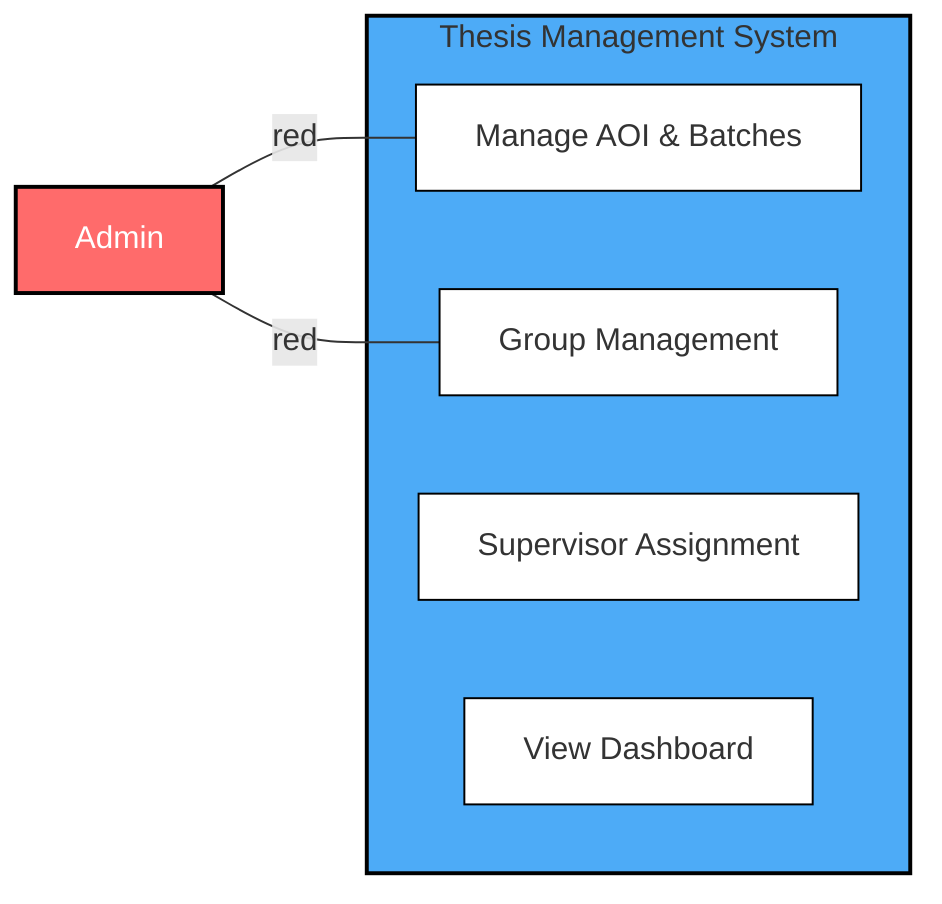
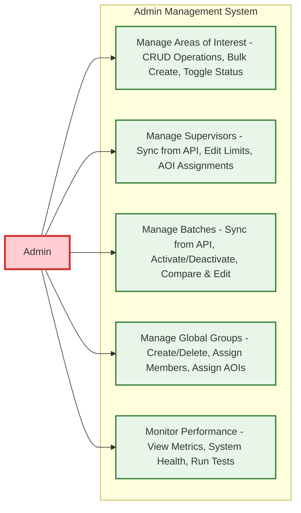

# Admin Use Case Diagram

## Overview
The Admin role has comprehensive system management capabilities including configuration, monitoring, and global group management.

## Use Case Diagram (Reference Design Style)

## Detailed Use Case Diagram

```mermaid
graph TB
    %% Actor
    Admin["👤 Admin"]
    
    %% System Boundary
    subgraph System["Thesis Management System - Admin Module"]
        %% Areas of Interest Management
        subgraph AOI["Areas of Interest Management"]
            UC1["List AOIs"]
            UC2["Create AOI"]
            UC3["Edit AOI"]
            UC4["Delete AOI"]
            UC5["Bulk Create AOIs"]
            UC6["Toggle AOI Active/Inactive"]
        end
        
        %% Supervisor Management
        subgraph SupervisorMgmt["Supervisor Management"]
            UC7["Sync Supervisors from API"]
            UC8["Edit Thesis Limit"]
            UC9["Toggle Supervisor Active Status"]
            UC10["Bulk Update Limits"]
            UC11["Toggle AOI Memberships"]
            UC12["Refresh Supervisor from API"]
        end
        
        %% Batch Management
        subgraph BatchMgmt["Batch Management"]
            UC13["Sync Batches from API"]
            UC14["Activate/Deactivate Batch"]
            UC15["Compare Local vs API"]
            UC16["Edit Batch Metadata"]
            UC17["Delete Batch"]
            UC18["Bulk Activate/Deactivate"]
        end
        
        %% Global Group Management
        subgraph GroupMgmt["Global Group Management"]
            UC19["Create Group"]
            UC20["Assign/Remove Students"]
            UC21["Assign Supervisor"]
            UC22["Assign Co-Supervisor"]
            UC23["Assign Panel Members"]
            UC24["Assign AOIs"]
            UC25["Delete Empty Groups"]
            UC26["Query Available Supervisors"]
            UC27["Bulk Delete Groups"]
        end
        
        %% Performance Monitoring
        subgraph Performance["Performance Monitoring"]
            UC28["View Dashboard"]
            UC29["Retrieve Metrics"]
            UC30["Check System Health"]
            UC31["Monitor Database"]
            UC32["Monitor API"]
            UC33["Check Security"]
            UC34["Clear Cache"]
            UC35["Export JSON"]
            UC36["Run Component Tests"]
        end
    end
    
    %% Connections
    Admin --> UC1
    Admin --> UC2
    Admin --> UC3
    Admin --> UC4
    Admin --> UC5
    Admin --> UC6
    Admin --> UC7
    Admin --> UC8
    Admin --> UC9
    Admin --> UC10
    Admin --> UC11
    Admin --> UC12
    Admin --> UC13
    Admin --> UC14
    Admin --> UC15
    Admin --> UC16
    Admin --> UC17
    Admin --> UC18
    Admin --> UC19
    Admin --> UC20
    Admin --> UC21
    Admin --> UC22
    Admin --> UC23
    Admin --> UC24
    Admin --> UC25
    Admin --> UC26
    Admin --> UC27
    Admin --> UC28
    Admin --> UC29
    Admin --> UC30
    Admin --> UC31
    Admin --> UC32
    Admin --> UC33
    Admin --> UC34
    Admin --> UC35
    Admin --> UC36
    
    %% Styling
    classDef actor fill:#ffebee,stroke:#c62828,stroke-width:3px
    classDef usecase fill:#fff3e0,stroke:#e65100,stroke-width:1px
    classDef subsystem fill:#f5f5f5,stroke:#616161,stroke-width:2px
    
    class Admin actor
    class UC1,UC2,UC3,UC4,UC5,UC6,UC7,UC8,UC9,UC10,UC11,UC12,UC13,UC14,UC15,UC16,UC17,UC18,UC19,UC20,UC21,UC22,UC23,UC24,UC25,UC26,UC27,UC28,UC29,UC30,UC31,UC32,UC33,UC34,UC35,UC36 usecase
```

## Simplified Version for Better Readability

## Key Use Cases

### Areas of Interest (AOI) Management
- **Create/Edit/Delete**: Full CRUD operations on AOIs
- **Bulk Operations**: Create multiple AOIs at once
- **Status Management**: Toggle active/inactive status

### Supervisor Management
- **API Integration**: Sync supervisor data from external API (throttled)
- **Capacity Management**: Edit thesis limits for supervisors
- **AOI Assignment**: Manage supervisor-AOI relationships

### Batch Management
- **Synchronization**: Sync batch data from external API
- **Status Control**: Activate/deactivate batches individually or in bulk
- **Data Comparison**: Compare local vs API data

### Global Group Management
- **Group Creation**: Create groups with name, batch, and AOIs
- **Member Assignment**: Assign students, supervisors, co-supervisors, and panel members
- **Capacity Checks**: Enforce supervisor capacity limits
- **Auto-numbering**: Automatic re-numbering of group labels

### Performance Monitoring
- **Dashboard**: Comprehensive performance overview
- **Metrics**: Database, API, cache, and security metrics
- **Testing**: Run component tests for system health
- **Export**: Export performance data as JSON

## Access Paths
- `/admin/dashboard` - Main admin dashboard
- `/admin/areas-of-interest` - AOI management
- `/admin/supervisors` - Supervisor management
- `/admin/batches` - Batch management
- `/admin/groups` - Global group management
- `/admin/performance` - Performance monitoring

## Notes
- Admin has the highest level of system access
- All API operations are throttled to prevent overload
- Group deletion only allowed for empty groups
- Automatic validation and capacity checks are enforced