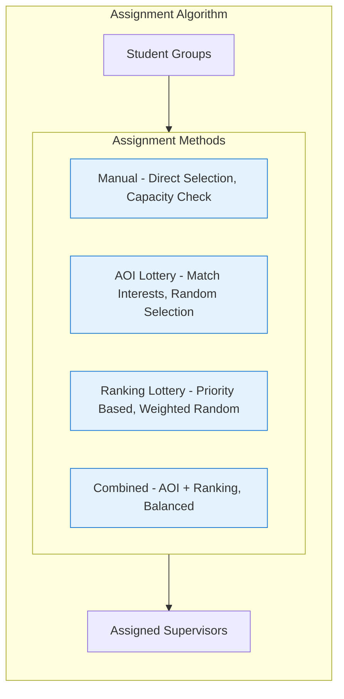

# Advisor Use Case Diagram

## Overview
Advisors manage student group formation and supervisor assignment, acting as the bridge between students and supervisors in the thesis process.

## Use Case Diagram (Reference Design Style)

```mermaid
graph LR
    %% Actor
    actor Advisor
    
    %% System Boundary
    subgraph System["Thesis Management System"]
        %% Use Cases
        UC1[Group Management]
        UC2[Supervisor Assignment]
    end
    
    %% Connections
    Advisor ---|blue| UC1
    Advisor ---|blue| UC2
    
    %% Styling
    classDef system fill:#4dabf7,stroke:#000,stroke-width:2px
    classDef usecase fill:#ffffff,stroke:#000,stroke-width:1px
    
    class System system
    class UC1,UC2 usecase
    
    style Advisor fill:#2196f3,color:#fff,stroke:#000,stroke-width:2px
```

## Detailed Use Case Diagram

```mermaid
graph TB
    %% Actor
    actor Advisor as "👤 Advisor"
    
    %% System Boundary
    subgraph System["Thesis Management System - Advisor Module"]
        %% Student Management
        subgraph Students["Student Management"]
            UC1["List Students from API"]
            UC2["Filter Students"]
            UC3["Search Students"]
            UC4["View Student Details"]
            UC5["Refresh Student Data"]
        end
        
        %% Group Management
        subgraph Groups["Group Management (Capacity: 3)"]
            UC6["Create Groups Automatically"]
            UC7["Add Group by Name"]
            UC8["Assign Students to Groups"]
            UC9["Unassign Students"]
            UC10["Validate Cross-Batch"]
            UC11["Assign AOIs (Multi-select)"]
            UC12["Remove All AOIs in Batch"]
            UC13["Remove All Groups in Batch"]
            UC14["Auto-detect Advisor"]
        end
        
        %% Supervisor Assignment
        subgraph SupervisorAssign["Supervisor Assignment"]
            UC15["Manual Assignment"]
            UC16["Check AOI Match"]
            UC17["Check Capacity"]
            UC18["Avoid Co-Supervisor Conflict"]
            UC19["Lottery Assignment"]
            UC20["AOI-based Lottery"]
            UC21["Ranking-based Lottery"]
            UC22["Combined Lottery"]
            UC23["Preview Assignment"]
            UC24["Unassign Supervisor"]
            UC25["Batch Unassign"]
        end
        
        %% Excel Integration
        subgraph Excel["Excel Integration"]
            UC26["Download Template"]
            UC27["Upload Excel File"]
            UC28["Bulk Assign Groups"]
            UC29["Validate Data"]
            UC30["Randomized Mapping"]
        end
        
        %% Query Operations
        subgraph Queries["Query Operations"]
            UC31["Fetch Available Supervisors"]
            UC32["Filter by Multiple AOIs"]
            UC33["Check Supervisor Capacity"]
        end
    end
    
    %% Connections
    Advisor --> UC1
    Advisor --> UC2
    Advisor --> UC3
    Advisor --> UC4
    Advisor --> UC5
    Advisor --> UC6
    Advisor --> UC7
    Advisor --> UC8
    Advisor --> UC9
    Advisor --> UC10
    Advisor --> UC11
    Advisor --> UC12
    Advisor --> UC13
    Advisor --> UC14
    Advisor --> UC15
    Advisor --> UC16
    Advisor --> UC17
    Advisor --> UC18
    Advisor --> UC19
    Advisor --> UC20
    Advisor --> UC21
    Advisor --> UC22
    Advisor --> UC23
    Advisor --> UC24
    Advisor --> UC25
    Advisor --> UC26
    Advisor --> UC27
    Advisor --> UC28
    Advisor --> UC29
    Advisor --> UC30
    Advisor --> UC31
    Advisor --> UC32
    Advisor --> UC33
    
    %% Include relationships
    UC15 -.includes.-> UC16
    UC15 -.includes.-> UC17
    UC19 -.includes.-> UC23
    UC27 -.includes.-> UC29
    
    %% Styling
    classDef actor fill:#e8eaf6,stroke:#3f51b5,stroke-width:3px
    classDef usecase fill:#fce4ec,stroke:#c2185b,stroke-width:1px
    classDef subsystem fill:#f5f5f5,stroke:#616161,stroke-width:2px
    
    class Advisor actor
    class UC1,UC2,UC3,UC4,UC5,UC6,UC7,UC8,UC9,UC10,UC11,UC12,UC13,UC14,UC15,UC16,UC17,UC18,UC19,UC20,UC21,UC22,UC23,UC24,UC25,UC26,UC27,UC28,UC29,UC30,UC31,UC32,UC33 usecase
```

## Simplified Version for Better Readability

```mermaid
graph LR
    %% Actor
    actor Advisor
    
    %% System Boundary
    subgraph System["Advisor Management System"]
        %% Core Use Cases
        UC1["Manage Students - List/Search, View Details, Refresh Data"]
        UC2["Create Groups - Auto/Manual, Assign Students, Set AOIs"]
        UC3["Assign Supervisors - Manual/Lottery, Check Capacity, Preview"]
        UC4["Excel Operations - Download Template, Bulk Upload, Validate"]
        UC5["Query System - Available Supervisors, Filter by AOI, Check Capacity"]
    end
    
    %% Connections
    Advisor --> UC1
    Advisor --> UC2
    Advisor --> UC3
    Advisor --> UC4
    Advisor --> UC5
    
    %% Styling
    classDef usecase fill:#e0f7fa,stroke:#00838f,stroke-width:2px
    
    class UC1,UC2,UC3,UC4,UC5 usecase
    
    style Advisor fill:#e1bee7,stroke:#6a1b9a,stroke-width:3px
```

## Detailed Workflow Diagram

```mermaid
graph TD
    %% Actor
    actor Advisor
    
    %% Main Workflows
    subgraph Workflows["Advisor Workflows"]
        %% Group Formation Flow
        subgraph GroupFormation["Group Formation Process"]
            GetStudents[Get Students from API]
            CreateGroup[Create Group]
            AssignStudents["Assign Students (Max 3)"]
            SetAOI[Set Areas of Interest]
            ValidateGroup[Validate Group]
            
            GetStudents --> CreateGroup
            CreateGroup --> AssignStudents
            AssignStudents --> SetAOI
            SetAOI --> ValidateGroup
        end
        
        %% Supervisor Assignment Flow
        subgraph SupervisorAssignment["Supervisor Assignment Process"]
            CheckAvailable[Check Available Supervisors]
            MatchAOI[Match AOI Requirements]
            CheckCapacity[Verify Capacity]
            AssignSuper[Assign Supervisor]
            
            CheckAvailable --> MatchAOI
            MatchAOI --> CheckCapacity
            CheckCapacity --> AssignSuper
        end
        
        %% Lottery System
        subgraph LotterySystem["Lottery Assignment"]
            SelectMethod[Select Lottery Method]
            RunLottery[Run Algorithm]
            Preview[Preview Results]
            Confirm[Confirm Assignment]
            
            SelectMethod --> RunLottery
            RunLottery --> Preview
            Preview --> Confirm
        end
    end
    
    Advisor --> GetStudents
    Advisor --> CheckAvailable
    Advisor --> SelectMethod
    
    %% Styling
    classDef process fill:#ffffff,stroke:#424242,stroke-width:1px
    classDef workflow fill:#fafafa,stroke:#9e9e9e,stroke-width:2px
    
    class GetStudents,CreateGroup,AssignStudents,SetAOI,ValidateGroup,CheckAvailable,MatchAOI,CheckCapacity,AssignSuper,SelectMethod,RunLottery,Preview,Confirm process
    
    style Advisor fill:#f3e5f5,stroke:#7b1fa2,stroke-width:3px
```

## Key Use Cases

### Student Management
- **API Integration**: Fetch and refresh student data from external API
- **Search & Filter**: Advanced search and filtering capabilities
- **Detail View**: Access comprehensive student information
- **Batch Operations**: Handle students across multiple batches

### Group Management
- **Automatic Creation**: Bulk create groups for a batch
- **Manual Creation**: Add individual groups by name
- **Student Assignment**: Assign up to 3 students per group
- **Validation**: Cross-batch validation and same-advisor enforcement
- **AOI Management**: Multi-select AOI assignment per group
- **Cleanup Operations**: Remove all AOIs or groups in a batch

### Supervisor Assignment
- **Manual Assignment**:
  - AOI matching requirement
  - Capacity verification
  - Conflict avoidance (co-supervisor check)
  
- **Lottery System**:
  - **AOI-based**: Match based on areas of interest
  - **Ranking-based**: Use supervisor rankings
  - **Combined**: Hybrid approach
  - **Preview**: Review before confirming
  - **Batch Operations**: Unassign by batch

### Excel Integration
- **Template System**: Download standardized Excel template
- **Bulk Upload**: Upload Excel for mass group assignments
- **Validation**: Comprehensive data validation
- **Randomized Mapping**: Automatic randomization for fairness

## Assignment Algorithm Features



## Constraints & Validations

| Constraint | Description |
|------------|-------------|
| Group Capacity | Maximum 3 students per advisor-created group |
| Same Advisor | All students in a group must have the same advisor |
| Cross-Batch | Students can be from different batches if same advisor |
| AOI Match | Supervisor must have matching AOI for assignment |
| Capacity Limit | Supervisor thesis limit must not be exceeded |
| Co-Supervisor | Cannot assign current co-supervisor as main |

## Access Paths
- `/advisor/dashboard` - Main advisor dashboard
- `/advisor/students` - Student management interface
- `/advisor/groups` - Group creation and management
- `/advisor/supervisor-assignment` - Supervisor assignment tools

## Excel Template Structure
```
| Student ID | Student Name | Group Name | Batch | AOI |
|------------|--------------|------------|-------|-----|
| Required   | Required     | Required   | Auto  | Optional |
```

## Notes
- Advisor-created groups are limited to 3 students
- External API integration provides real-time student data
- Lottery system ensures fair supervisor distribution
- Excel integration enables efficient bulk operations
- All operations include comprehensive validation