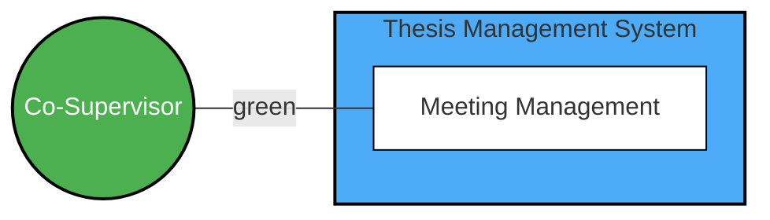
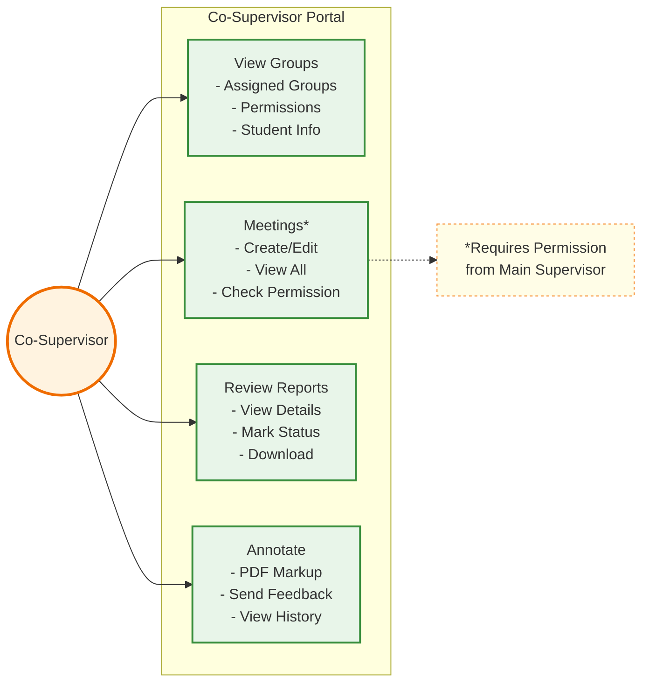
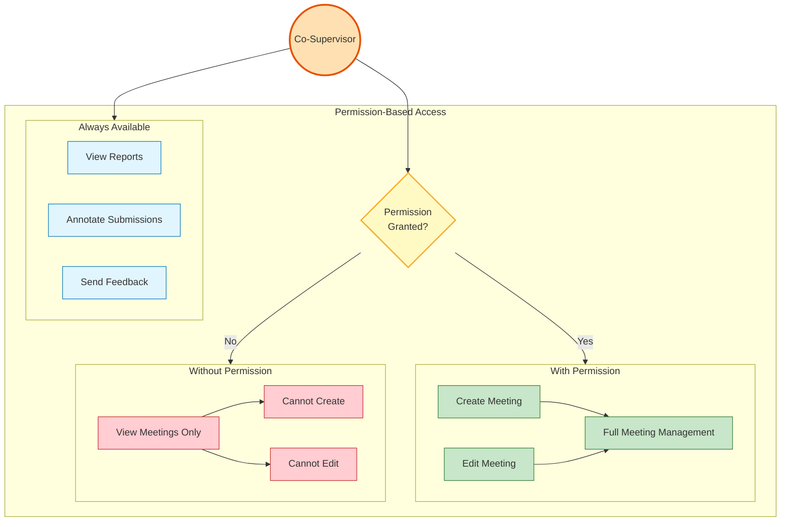
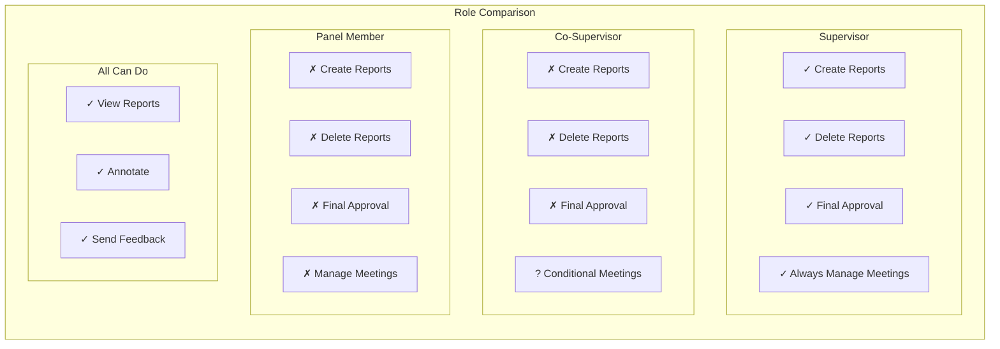
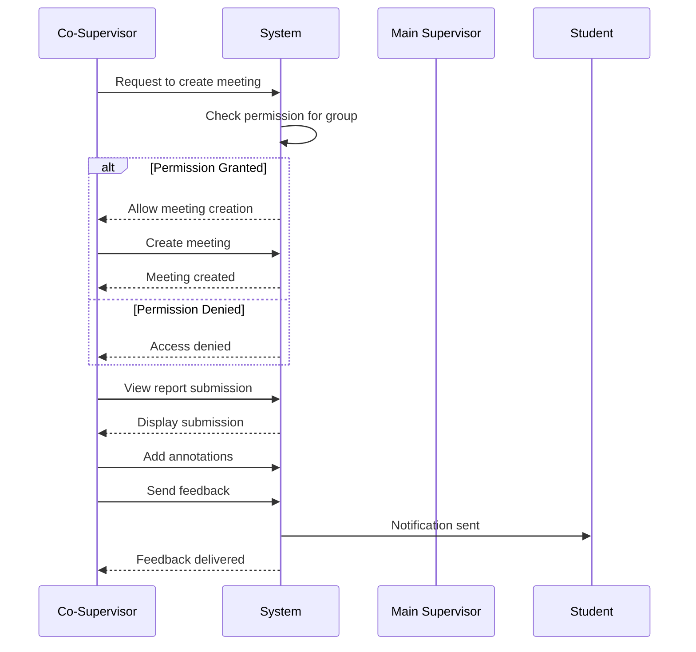

# Co-Supervisor Use Case Diagram

## Overview
Co-Supervisors assist main supervisors in thesis guidance, with conditional meeting management permissions and full annotation capabilities.

## Use Case Diagram (Reference Design Style)

## Detailed Use Case Diagram

```mermaid
graph TB
    %% Actor
    CoSupervisor[("👤 Co-Supervisor")]
    
    %% System Boundary
    subgraph System["Thesis Management System - Co-Supervisor Module"]
        %% Group Visibility
        subgraph Groups["Group Visibility"]
            UC1["View Assigned Groups"]
            UC2["Check Meeting Permissions"]
            UC3["View Group Details"]
            UC4["View Student Information"]
        end
        
        %% Meeting Management (Conditional)
        subgraph Meetings["Meeting Management*"]
            UC5["Create Meeting<br/>(if permitted)"]
            UC6["Edit Meeting<br/>(if permitted)"]
            UC7["View All Meetings"]
            UC8["Check Permission Status"]
        end
        
        %% Report Management
        subgraph Reports["Report Management"]
            UC9["View Report Details"]
            UC10["View Student Submissions"]
            UC11["Mark Under Review"]
            UC12["View Inline Documents"]
            UC13["Download Submissions"]
        end
        
        %% Report Annotations
        subgraph Annotations["Report Annotations"]
            UC14["Annotate PDF Submissions"]
            UC15["Save Draft Annotations"]
            UC16["Send Feedback"]
            UC17["Notify Students"]
            UC18["View Annotation History"]
            UC19["Review Previous Annotations"]
        end
    end
    
    %% Connections
    CoSupervisor --> UC1
    CoSupervisor --> UC2
    CoSupervisor --> UC3
    CoSupervisor --> UC4
    CoSupervisor --> UC5
    CoSupervisor --> UC6
    CoSupervisor --> UC7
    CoSupervisor --> UC8
    CoSupervisor --> UC9
    CoSupervisor --> UC10
    CoSupervisor --> UC11
    CoSupervisor --> UC12
    CoSupervisor --> UC13
    CoSupervisor --> UC14
    CoSupervisor --> UC15
    CoSupervisor --> UC16
    CoSupervisor --> UC17
    CoSupervisor --> UC18
    CoSupervisor --> UC19
    
    %% Include relationships
    UC5 -.requires.-> UC8
    UC6 -.requires.-> UC8
    UC16 -.includes.-> UC17
    
    %% Extend relationships
    UC2 -.extends.-> UC5
    UC2 -.extends.-> UC6
    
    %% Styling
    classDef actor fill:#fff8e1,stroke:#ff8f00,stroke-width:3px
    classDef usecase fill:#e0f2f1,stroke:#00796b,stroke-width:1px
    classDef subsystem fill:#f5f5f5,stroke:#616161,stroke-width:2px
    classDef conditional fill:#ffebee,stroke:#c62828,stroke-width:1px,stroke-dasharray: 5 5
    
    class CoSupervisor actor
    class UC1,UC2,UC3,UC4,UC7,UC8,UC9,UC10,UC11,UC12,UC13,UC14,UC15,UC16,UC17,UC18,UC19 usecase
    class UC5,UC6 conditional
```

## Simplified Version for Better Readability

## Permission-Based Workflow

## Key Use Cases

### Group Management
- **View Access**: See all groups where assigned as co-supervisor
- **Permission Status**: Check meeting management permissions per group
- **Student Information**: Access student details for assigned groups

### Meeting Management (Conditional)
- **Permission Required**: Main supervisor must grant permission per group
- **Create/Edit**: Full meeting management when permitted
- **View Always**: Can always view meeting details regardless of permission
- **Permission Check**: System validates permission before allowing create/edit

### Report Review
- **Full Read Access**: View all report details for assigned groups
- **Status Management**: Mark reports as "under review"
- **Submission Access**: View inline or download student submissions
- **No Creation/Deletion**: Cannot create or delete reports

### Annotation Capabilities
- **Full Annotation**: Complete PDF annotation tools
- **Draft Management**: Save work in progress before sending
- **Student Notification**: Automatic notification when feedback sent
- **History Access**: View complete annotation history

## Comparison with Other Roles

## Access Paths
- `/co-supervisor/dashboard` - Main co-supervisor dashboard
- `/co-supervisor/groups` - View assigned groups
- `/co-supervisor/meetings` - Meeting management (conditional)
- `/co-supervisor/reports` - Report review and annotation

## Permission Matrix

| Feature | Always Available | Requires Permission |
|---------|-----------------|-------------------|
| View Groups | ✓ | - |
| View Meetings | ✓ | - |
| Create Meetings | - | ✓ |
| Edit Meetings | - | ✓ |
| View Reports | ✓ | - |
| Mark Under Review | ✓ | - |
| Annotate Submissions | ✓ | - |
| Send Feedback | ✓ | - |

## System Interactions

## Notes
- Meeting management is the only conditional feature
- Permission is granted per group by the main supervisor
- All annotation features are always available
- Co-supervisors cannot create, delete, or give final approval for reports
- System automatically checks permissions before allowing actions