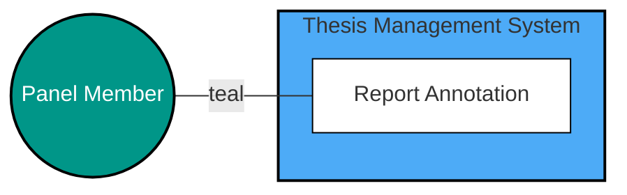
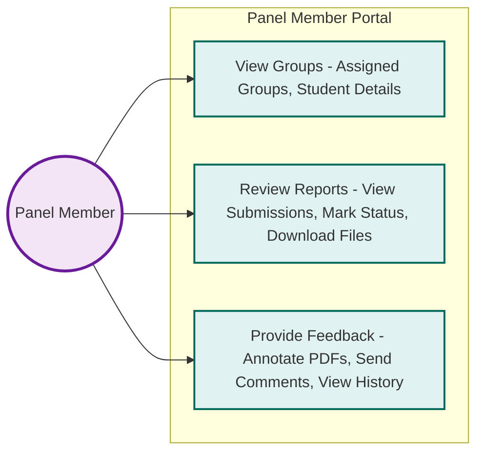
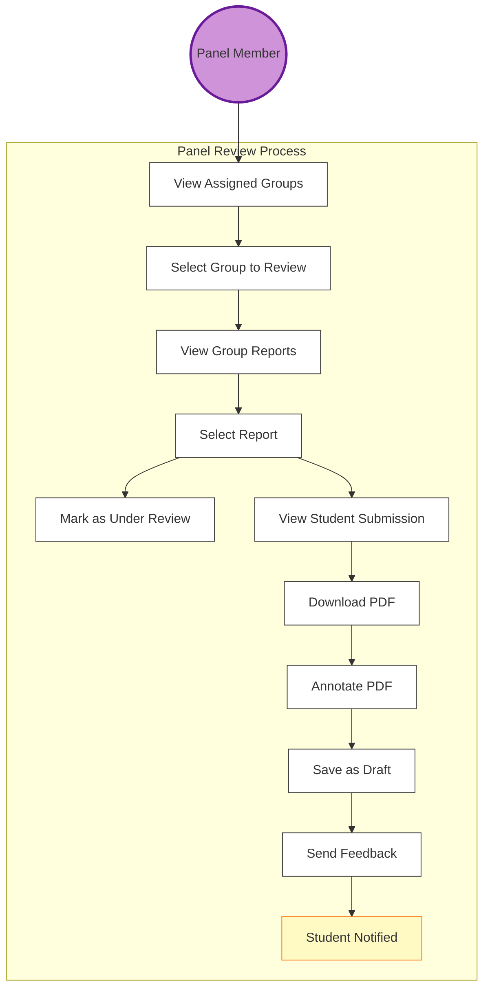
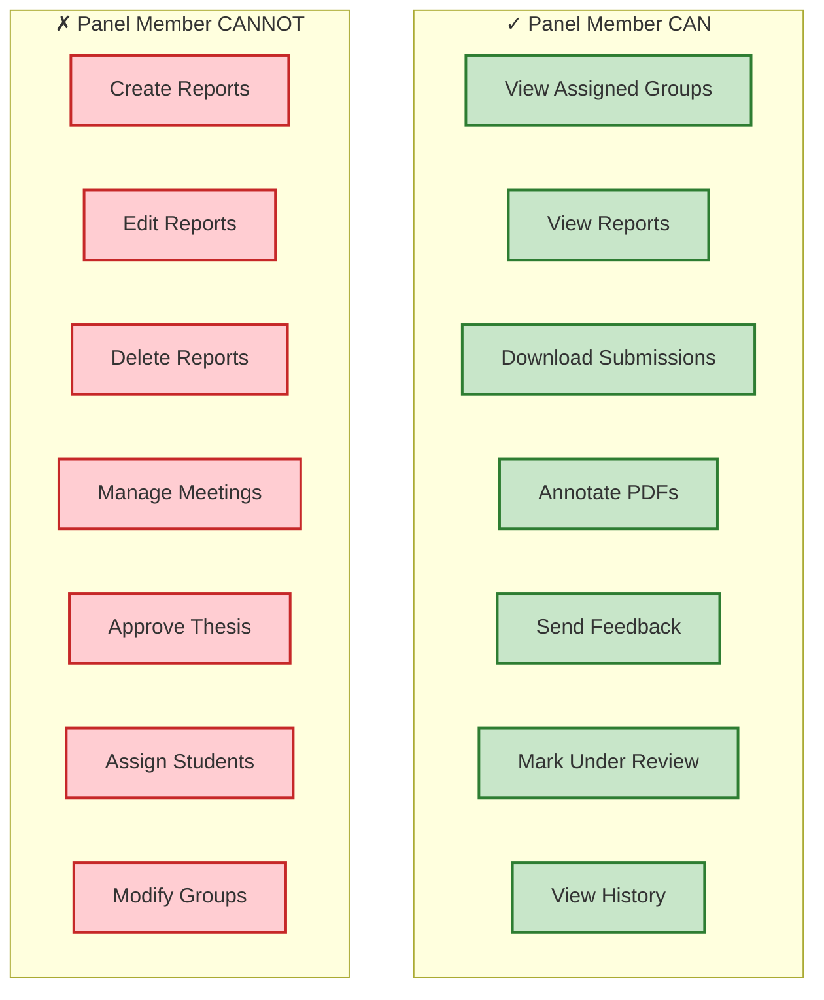
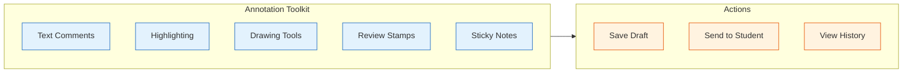
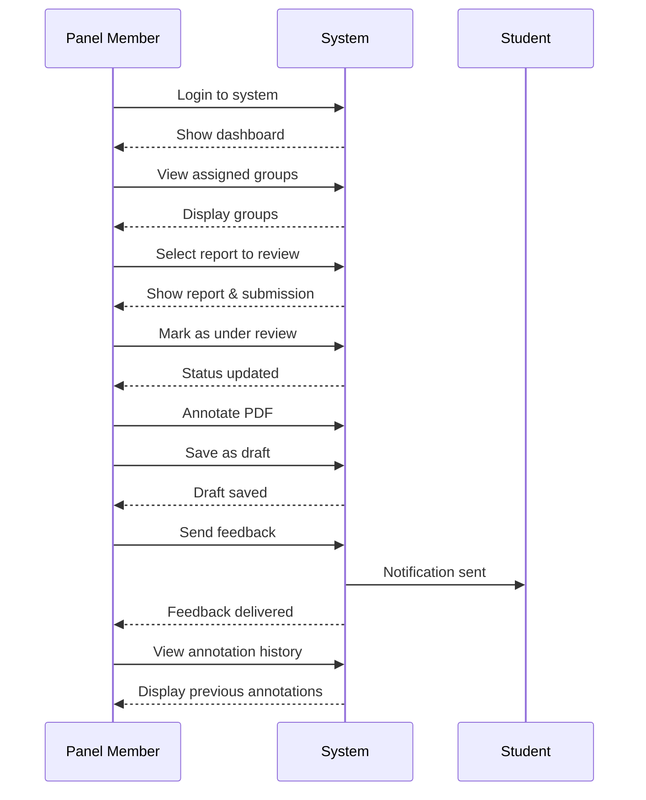

# Panel Member Use Case Diagram

## Overview
Panel Members serve as reviewers for thesis groups, providing feedback through annotations without management responsibilities.

## Use Case Diagram (Reference Design Style)

## Detailed Use Case Diagram

```mermaid
graph TB
    %% Actor
    PanelMember[("👤 Panel Member")]
    
    %% System Boundary
    subgraph System["Thesis Management System - Panel Member Module"]
        %% Group Access
        subgraph Groups["Group Access"]
            UC1["View Assigned Groups"]
            UC2["View Group Details"]
            UC3["View Student Information"]
        end
        
        %% Report Review
        subgraph Reports["Report Review"]
            UC4["View Report Details"]
            UC5["View Student Submissions"]
            UC6["Mark as Under Review"]
            UC7["View Inline Documents"]
            UC8["Download Submissions"]
            UC9["Track Review Status"]
        end
        
        %% Report Annotations
        subgraph Annotations["Report Annotations"]
            UC10["Annotate PDF Submissions"]
            UC11["Save Draft Annotations"]
            UC12["Send Feedback to Students"]
            UC13["Trigger Student Notifications"]
            UC14["View Annotation History"]
            UC15["Review Previous Feedback"]
        end
    end
    
    %% Connections
    PanelMember --> UC1
    PanelMember --> UC2
    PanelMember --> UC3
    PanelMember --> UC4
    PanelMember --> UC5
    PanelMember --> UC6
    PanelMember --> UC7
    PanelMember --> UC8
    PanelMember --> UC9
    PanelMember --> UC10
    PanelMember --> UC11
    PanelMember --> UC12
    PanelMember --> UC13
    PanelMember --> UC14
    PanelMember --> UC15
    
    %% Include relationships
    UC12 -.includes.-> UC13
    UC10 -.includes.-> UC11
    
    %% Styling
    classDef actor fill:#e1bee7,stroke:#7b1fa2,stroke-width:3px
    classDef usecase fill:#e8eaf6,stroke:#5e35b1,stroke-width:1px
    classDef subsystem fill:#f5f5f5,stroke:#616161,stroke-width:2px
    
    class PanelMember actor
    class UC1,UC2,UC3,UC4,UC5,UC6,UC7,UC8,UC9,UC10,UC11,UC12,UC13,UC14,UC15 usecase
```

## Simplified Version for Better Readability

## Review Workflow Diagram

## Key Use Cases

### Group Access
- **View Only**: Read-only access to assigned groups
- **Group Details**: View group composition and areas of interest
- **Student Information**: Access student details for context

### Report Review
- **Comprehensive View**: Access all report details for assigned groups
- **Submission Access**: View submissions inline or download for offline review
- **Status Tracking**: Mark reports as "under review" to indicate progress
- **Multiple Formats**: Support for PDF, PPT, and PPTX submissions

### Annotation & Feedback
- **PDF Annotation**: Full annotation toolkit for PDF documents
- **Draft System**: Save work in progress before finalizing
- **Feedback Delivery**: Send completed annotations to students
- **Automatic Notifications**: Students receive instant notifications
- **History Tracking**: Access complete annotation history

## Limitations & Restrictions

## Comparison with Other Reviewer Roles

| Feature | Panel Member | Co-Supervisor | Supervisor |
|---------|--------------|---------------|------------|
| View Groups | ✓ | ✓ | ✓ |
| View Reports | ✓ | ✓ | ✓ |
| Annotate Submissions | ✓ | ✓ | ✓ |
| Mark Under Review | ✓ | ✓ | ✓ |
| Manage Meetings | ✗ | Conditional | ✓ |
| Create Reports | ✗ | ✗ | ✓ |
| Delete Reports | ✗ | ✗ | ✓ |
| Final Approval | ✗ | ✗ | ✓ |

## Annotation Features

## Access Paths
- `/panel-member/dashboard` - Main panel member dashboard
- `/panel-member/groups` - View assigned groups
- `/panel-member/reports` - Access reports for review

## System Interaction Flow

## Best Practices for Panel Members

1. **Timely Review**: Complete reviews within designated timeframes
2. **Constructive Feedback**: Provide detailed, actionable feedback
3. **Draft Management**: Save work regularly to prevent loss
4. **Clear Communication**: Use clear annotations and comments
5. **Status Updates**: Mark reports as "under review" when starting

## Notes
- Panel Members have the most limited role, focused solely on review
- No management capabilities for meetings, groups, or reports
- All feedback automatically triggers student notifications
- Review history is maintained for accountability
- Access is restricted to assigned groups only